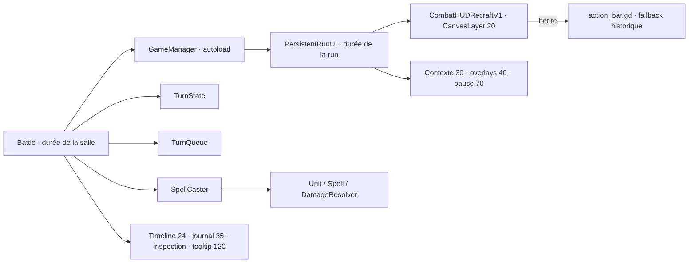

# Architecture HUD actuelle

## Chaîne réelle

`GameManager._ensure_persistent_run_ui()` crée l'UI persistante (`core/game_manager.gd:481`), puis `Battle._setup_ui()` la lie (`battle/battle.gd:567`). Si aucune run active ne fournit ce HUD, Battle instancie le `action_bar_scene` exporté ou construit le CanvasLayer historique : deux chemins complets restent donc possibles.

## Autorités

| Responsabilité | Autorité réelle | Producteurs → consommateurs | Fichiers / durée de vie | Risque |
|---|---|---|---|---|
| Unité active / tour | TurnQueue | Battle/EnemyTurnRunner → HUD, timeline | Battle | faible |
| PA / PM / PV | Unit | SpellCaster, mouvement, dégâts → HUD | Unit/run | faible |
| Capacités, coût, cooldown/limites | Unit + Spell + SpellCaster | gameplay → action bar | données/run | moyen : logique d'affichage dupliquée |
| Bouton disponible | action bar appelle `Unit.can_use_*` | Unit → HUD | HUD | moyen |
| Action sélectionnée | TurnState; miroir `_active_mode/_active_spell` dans HUD | Battle → HUD | salle + HUD run | P1 : état doublé de présentation |
| Cibles légales | SpellCaster/Pathfinder; Battle revalide | Battle → grille | salle | faible pour règle, UX faible |
| Previews | Battle/InspectPanel/VFX | hover → grille/panneau | salle | moyen, dispersé |
| Tooltip | KeywordTooltipLayer | HUD/inspect → layer global | salle | P1 overlay |
| Input lock | TurnState + Battle + bool HUD | Battle/overlay → handlers | distribué | P1 incohérent |
| Animation/VFX | Battle, Unit view, VFXManager | gameplay async → Battle | action | moyen |
| Timeline | TurnQueueTimeline | TurnQueue → layer 24 | salle | moyen, test dérivé |
| Pause/inventaire/arbre/évolution | PersistentRunUI + écrans | input/requests → HUD/tree | run | moyen : arbitre par gardes dispersées |
| Victoire/défaite | Battle puis GameManager | unités → outcome/scene | salle/run | moyen : victoire sans overlay local |
| Transition de scène | GameManager | Battle/post-combat → scènes | global | moyen, test 9/10 |

## Réponses aux dix questions

1. **Légalité** : SpellCaster/Unit/Pathfinder; Battle revalide avant résolution.
2. **Disponibilité d'un bouton** : ActionBar/Recraft dérive `Unit.can_use_*` et l'état `_player_controls_enabled`.
3. **Action sélectionnée** : TurnState est l'autorité logique; le HUD garde un miroir visuel.
4. **Cases/cibles légales** : SpellCaster ou Pathfinder, consommés par Battle.
5. **Verrouillage pendant animation** : distribué entre TurnState `ANIMATING`, `_spell_resolution_pending` et HUD disabled. Les sorts appliquent les trois; déplacement/attaque de base pas uniformément.
6. **Restauration après overlay** : PersistentRunUI avec snapshots booléens indépendants par overlay.
7. **Arbitrage overlays** : gardes procédurales de PersistentRunUI; aucune pile/modale centrale.
8. **Passage joueur → ennemi** : TurnQueue et `Battle._finish_active_turn()` (`battle/battle.gd:968`).
9. **Présentation du passage** : `Battle._on_turn_started()` (`battle/battle.gd:890`), HUD et timeline; bannière principalement joueur.
10. **Parité persistante/fallback** : aucun contrat typé ne la garantit; l'héritage et les tests Recraft servent de pont implicite.

## Layers observés

| Layer | Contenu | Provenance | Statut |
|---:|---|---|---|
| défaut (~1) | InspectPanel, déploiement dynamiques | Battle | risque d'ordre implicite |
| 10 | titre | `TitreEcran.tscn:439` | observé |
| 20 | CombatHUDRecraftV1 | scène HUD | observé |
| 24 | timeline | `turn_order_timeline.tscn:6` | observé |
| 30 | contexte non-combat | PersistentRunUI | observé |
| 35 | journal | `player_combat_log.gd:14` | observé |
| 40 | inventaire, arbre, évolution | PersistentRunUI | observé |
| 70 | pause | `dark_pause_menu.tscn:13` | observé |
| 120 | tooltip | `keyword_tooltip_layer.gd:12` | bug reproduit au-dessus pause |
| 128 | fondu | `Fondu.tscn:6` | observé |

## Audit de l'héritage `action_bar.gd`

Classement : **DETTE_A_EXTRAIRE**.

- Signaux hérités : mouvement, attaque, fin de tour, capacité.
- Champs hérités utilisés : `_hbox`, `_info_label`, `_spell_box`, boutons, `_spell_buttons`, `_current_unit`, `_player_controls_enabled`.
- Méthodes héritées utilisées : `build_spell_buttons`, `_clear_spell_buttons`, état des boutons, signaux et contrat `update_info`.
- Overrides principaux : `_ready`, `_add_spell_button`, `build_spell_buttons`, `update_info`, `_refresh_button_states`, `set_active_mode` (`combat_hud_recraft_v1.gd:141,332,361,508,577,628`).
- Invariant implicite : `_ready()` du Recraft doit initialiser manuellement tous les champs attendus et ne doit pas appeler `super._ready()`, sinon le HUD historique code-built serait construit.
- Le `super.build_spell_buttons()` historique appelle des méthodes virtuelles remplacées : le lien paraît court, mais porte un contrat large, non typé et sensible aux noms de nœuds.
- La fallback historique reste utile hors run active, mais mélange compatibilité, présentation et décision de disponibilité.
- Couverture : Recraft 6/6 et PersistentRunUI 2/2 passent; aucune suite ne formalise exhaustivement la parité des deux chemins.

Conclusion : conserver les scènes et le rendu, mais extraire progressivement un contrat/adaptateur commun. Une reconstruction totale n'est pas justifiée par le code observé.
