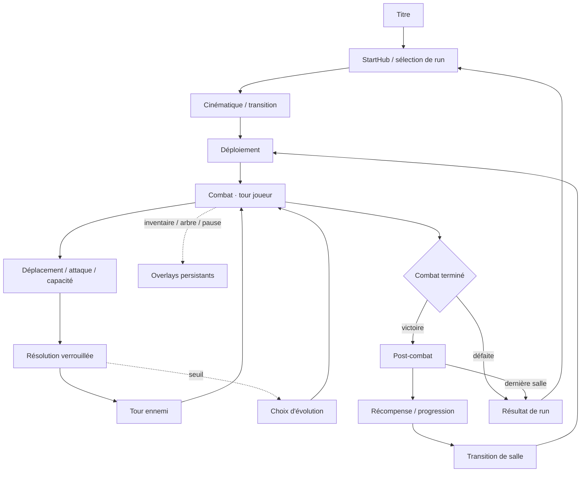

# Flow actuel des écrans

SHA observé : `52921204c5e4b52f195f0bf0269c1530f9b59b3f`.

## Inventaire runtime

| Écran / état | Racine et contrôleur | Autorité / entrée → sortie | Layer / modalité / Échap | Risques et preuves |
|---|---|---|---|---|
| Titre | `ui/TitreEcran.tscn`, scripts de titre | scène principale → StartHub | layer 10; focus boutons | vérifié statiquement |
| Hub / sélection | StartHub, `GameManager` | choix RunData → cinématique/bataille | scène pleine | captures Odyssey 1280/1920 |
| Transition | `ui/Transitionsalle.tscn`, `GameManager` | outcome/room index → nouvelle scène | plein écran | test lifecycle 9/10 |
| Déploiement | Battle + DeploymentController | Battle `_setup_deployment` → `deployment_completed` | CanvasLayer implicite; modal combat | captures First Run et Odyssey |
| Joueur au repos | Battle, TurnQueue, TurnState | `_on_turn_started` → sélection/fin tour | HUD 20; non modal | captures réelles Odyssey |
| Déplacement | TurnState `MOVE`, Pathfinder/Battle | bouton → case / annulation | grille colorée; clic droit seulement | pas de capture dédiée réelle |
| Attaque de base | TurnState `TARGET_MELEE` | bouton → cible / annulation | grille colorée | absente dans Odyssey par décision |
| Capacité sélectionnée | TurnState `TARGET_SPELL`; HUD conserve miroir visuel | bouton → cible / annulation | libellé « Échap » erroné | capture action Achille |
| Ciblage / cible légale | SpellCaster + Battle | `get_targetable_cells` → clic | bleu/orange, couleur seule | code + capture action |
| Cible illégale | Battle | clic hors liste → retour silencieux | aucune raison contextuelle | OBSERVÉ code |
| Résolution | Battle + SpellCaster + Unit/VFX | clic légal → fin async | lock fort pour spell, faible pour move/melee | runner Achille réel |
| Tour ennemi | TurnQueue + EnemyTurnRunner | queue → runner → advance | contrôles désactivés | réel mais capture dédiée absente |
| Timeline | `turn_order_timeline.tscn/.gd` | TurnQueue | layer 24, bande gauche | captures combat |
| Inspection | InspectPanel créé par Battle | hover/sélection | CanvasLayer défaut; panneau droit | 326 px, recouvrement important |
| Journal | PlayerCombatLog créé par Battle | EventBus | layer 35; bas gauche | déborde en 720p |
| Tooltip | KeywordTooltipLayer | hover/clic droit | layer 120; épinglable | chevauche pause reproduit |
| Inventaire | InventoryScreen / PersistentRunUI | bouton/raccourci → fermer | overlay 40, ALWAYS; fermeture dédiée | capture fixture 1280/1920 |
| Arbre | SkillTreeScreen / PersistentRunUI | bouton → Escape/fermer | overlay 40, ALWAYS | captures 1280/1920 |
| Évolution | SkillTreeScreen + EvolutionRequest | safe point → choix obligatoire | overlay 40; combat verrouillé | tests 13/13; runner capture dérivé cassé |
| Pause | DarkPauseMenu / PersistentRunUI | Escape → resume/fermer | layer 70, ALWAYS; focus visible | tooltip 120 passe au-dessus |
| Post-combat | PostCombatScreen / GameManager | victoire → phases → transition | NON_COMBAT, plein écran | Odyssey réel, tests 19/21 |
| Récompense | phase du post-combat | choix → progression/transition | modal | pool First Run en divergence de tests |
| Victoire | Battle puis post-combat | Battle attend 1,5 s → GameManager | aucun overlay victoire dans Battle | capture post-combat, manque de feedback immédiat |
| Défaite | Battle `_show_end_screen(false)` | mort équipe → résultat | overlay code « DÉFAITE » | capture réelle dédiée |
| Résultat de run | RunResultScreen | résultat → hub | plein écran | captures Odyssey victoire |

## Flow victoire mesuré qualitativement

`combat gagné → attente Battle → GameManager → reveal victoire post-combat → statistiques/progression → récompense éventuelle → transition → salle suivante`. Les phases de choix bloquent correctement l'avance générique. Le runtime Odyssey utilise un post-combat sans récompense; le flow First Run de récompense est actuellement couvert par des tests en échec et n'est pas déclaré vert.
