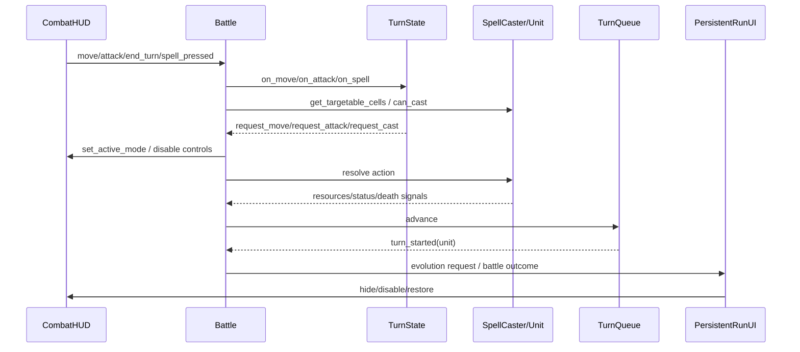
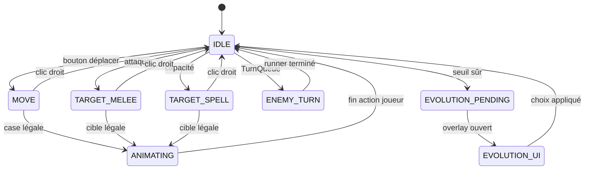

# Carte des signaux et états

## Signaux principaux

## Machine actuelle

## États visuels distribués

| État conceptuel | Représentation actuelle | Évaluation |
|---|---|---|
| PLAYER_IDLE | TurnState IDLE + HUD enabled | central logique, présentation dérivée |
| PLAYER_HOVER | Battle hover + tooltip + InspectPanel | distribué, pas d'état explicite |
| PLAYER_TARGETING | TurnState MOVE/TARGET_* + HUD mirror | doublé |
| PLAYER_CONFIRMING | absent | incomplet |
| RESOLVING_ACTION | ANIMATING + bool sort + HUD disabled | contradictoire selon action |
| ENEMY_TURN | TurnState + HUD disabled + timeline | présent, signal visuel faible |
| EVOLUTION_PENDING | TurnState + queue Battle + PersistentRunUI | présent, distribué |
| BATTLE_ENDING | booléens Battle/GameManager | non représenté dans TurnState |
| Overlay ouvert | bool/visibility par écran | pas de pile modale globale |

## Contrats d'entrée observés

- Battle n'interprète `ui_cancel` que par clic droit dans `_unhandled_input()` (`battle/battle.gd:1149`), alors que le HUD sélectionné affiche « Échap pour annuler ».
- PersistentRunUI consomme Échap pour inventaire/pause (`persistent_run_ui.gd:261`); il peut donc ouvrir la pause pendant un ciblage au lieu de l'annuler.
- Le sort verrouille TurnState, `_spell_resolution_pending` et le HUD (`battle/battle.gd:1464`). Le mouvement et l'attaque passent à `ANIMATING` sans appliquer systématiquement le même verrou HUD (`battle/battle.gd:1022-1036`).
- Les overlays mémorisent et restaurent `_player_controls_enabled`, mais pas l'intention sélectionnée : la capture montre la sélection revenir après inventaire.

## Risque de cycle de vie

GameManager conserve PersistentRunUI sur toute la run. Battle crée timeline, inspection, journal et tooltip par salle. Les connexions de contexte du Recraft sont explicitement déliées/reliées et les tests couvrent ce point, mais les sorties runtime signalent encore des fuites ObjectDB/ressources/GPU; leur attribution à l'UI n'a pas été profilée et reste **INCONNUE**.
