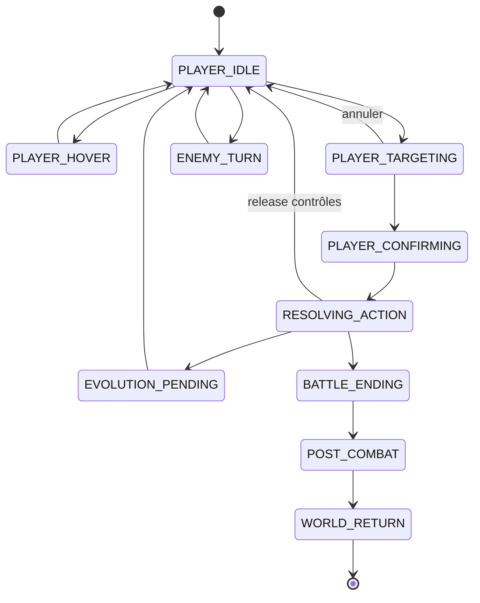

# Contrat cible du HUD

Ce contrat est indépendant de l'implémentation. Il ne change ni le gameplay, ni 6 PA/3 PM, ni les quatre capacités.

## Structure persistante

- Toujours visible en combat : unité active, PV, 6 PA/3 PM actuels/max, quatre capacités, fin de tour, ownership du tour.
- Variable par personnage : portrait, thème, capacités, états actuels et valeurs.
- Variable par run : densité/layout et éléments autorisés, pilotés par données; pas de fork de règles.
- Hors plateau : bande d'actions et informations durables. Inspection, journal et timeline ne doivent jamais recouvrir une case tactique critique; ils sont repliables/contextuels à faible résolution.

## États contextuels

- Hover donne nom, coût, résultat exact pour l'action du joueur et raison d'indisponibilité.
- Sélection diffère du hover par forme + libellé + focus; un seul propriétaire d'intention.
- Cooldown, coût insuffisant et lock sont annoncés par texte/icône et pas seulement couleur/opacité.
- Ciblage expose portée, AoE et résultat permis; une cible illégale reçoit une raison courte.
- Annulation : clic droit et Échap déclenchent la même intention prioritaire.

## États globaux

- `PLAYER_IDLE`, `PLAYER_HOVER`, `PLAYER_TARGETING`, `PLAYER_CONFIRMING`, `RESOLVING_ACTION`, `ENEMY_TURN`, `EVOLUTION_PENDING`, `BATTLE_ENDING`, `POST_COMBAT` et `WORLD_RETURN` forment le contrat de présentation, même si le modèle interne diffère.
- Tous les widgets dérivent d'un snapshot immuable/cohérent de cet état; aucun booléen local ne doit réactiver seul les contrôles.

## Focus

- Assombrir légèrement la périphérie lors d'un ciblage, jamais la grille/cible utile.
- Mettre en avant action active, cases légales, cible survolée, aperçu exact et voie d'annulation.
- Déprioriser journal/inspection non pertinents; ne pas masquer PA/PM ni ownership.
- La couleur est redondée par contour/motif/texte.

## Modalité

- Plein écran : pause, arbre complexe, inventaire/build, choix d'évolution obligatoire, post-combat majeur.
- Panneau : inspect, journal, détails d'unité, tooltip non épinglé.
- Feedback bref : tour, coût refusé, impact, victoire avant post-combat.
- Un contrôleur modal arbitre une seule pile; priorité `transition > fin combat > évolution > pause > inventaire/arbre > tooltip`.
- Ouvrir une modale masque/désépingle les tooltips et suspend/cancel l'intention selon politique explicite. Échap ferme la couche supérieure avant d'ouvrir pause.

## Résolution

1. Confirmation atomique : revalidation gameplay puis verrou global.
2. Le HUD affiche immédiatement l'engagement; aucune nouvelle intention n'est acceptée.
3. Animation et VFX atteignent un marqueur d'impact.
4. Gameplay, dégâts/états et nombres sont attribuables à la source.
5. Cleanup VFX/tweens et mise à jour du snapshot.
6. Contrôles libérés une seule fois, uniquement si tour joueur, aucune modale, aucun combat ending.
7. Un impact létal passe par `BATTLE_ENDING`; l'issue locale est visible avant `POST_COMBAT`, puis le flow existant décide du retour monde.

## Ennemis

- Montrer unité active, PV/états/règles actuels, silhouette/action réalisée et attribution des effets.
- Ne montrer aucune cible future, aucune case future, aucune intention télégraphiée.
- L'apprentissage vient du feedback de l'action exécutée et de règles consultables.

## First Run / Odyssey

- Mêmes composants, intents, règles, état et tests de contrat.
- First Run : densité trio, changement de personnage et timeline plus riche.
- Odyssey : densité solo, quatre capacités d'Achille, aucune attaque de base si la RunData l'interdit.
- Variations par `RunData`, thème et layout data; aucun fork silencieux des autorités.

## Critères de validation

- À 1280×720 et 1920×1080 : aucune case active/tooltip essentiel hors écran, bande responsive, textes français non tronqués.
- Un screenshot isolé permet d'identifier joueur/ennemi/résolution/modal.
- La matrice Échap/clic droit/modal possède un résultat déterministe.
- Chaque action (move, melee, spell) partage le même lock/release contract.
