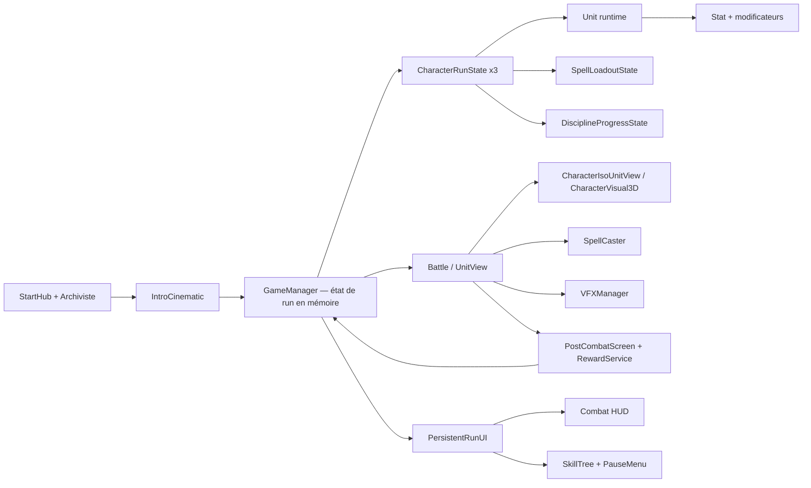

# Audit du système d’inventaire et d’équipement — Dungeon Draft

**Date de l’audit :** 3 août 2026  
**Dépôt audité :** `C:\Users\p.montebello\Documents\GitHub\dungeon-draft-v-2`  
**Périmètre :** lecture du dépôt, inspection structurelle des trois GLB, exécution ciblée de tests existants.  
**Hors périmètre :** aucune correction de code, aucun changement d’asset, aucun `git add`, commit ou push.

## 1. Résumé exécutif

Dungeon Draft possède déjà une base solide pour introduire un inventaire de run et des équipements : les données de gameplay sont majoritairement des ressources Godot, les héros vivent durant toute la run, toutes leurs statistiques importantes sont encapsulées dans `Stat`, le HUD possède une icône d’inventaire réservée, et le système visuel commun sait attacher un `Node3D` à chaque main.

Le projet ne possède cependant encore aucun modèle d’objet, inventaire, loadout d’équipement, drop, transaction d’équipement ou sauvegarde durable. `GameManager` est aujourd’hui le RunState de fait, uniquement en mémoire. Les snapshots existants ne couvrent que la progression de disciplines ; ils ne couvrent ni les PV et statistiques courants, ni les sorts équipés, ni un futur inventaire. Une fermeture du processus ne peut donc pas restaurer une run.

Le verdict de faisabilité est le suivant :

- **inventaire partagé, équipement logique et bonus de statistiques : faisabilité élevée** ;
- **intégration HUD, post-combat et persistance entre salles : faisabilité élevée** ;
- **arme visible dans la main : faisabilité moyenne à élevée**, à condition de fournir de vraies scènes d’armes et de calibrer leurs transforms ;
- **arc réellement tenu et aligné à deux mains : faisabilité moyenne**, avec davantage de travail d’animation et d’asset que pour une épée à une main ;
- **armures visuellement remplaçables : faisabilité faible avec les modèles actuels**, car chaque héros est livré comme un unique maillage skinné/une primitive, sans pièces d’armure adressables ;
- **sauvegarde/reprise de run : faisabilité moyenne**, mais elle nécessite un contrat de snapshot versionné avant de multiplier les états runtime.

La cible recommandée sépare strictement :

1. `ItemDefinition` — donnée immuable et éditable en `.tres` ;
2. `ItemInstance` — état unique d’un exemplaire durant la run ;
3. `RunInventory` — stockage partagé de l’équipe ;
4. `EquipmentLoadout` — équipement propre à un héros ;
5. `EquipmentService` — transactions et règles ;
6. `EquipmentStatService` — application idempotente des bonus ;
7. UI d’inventaire — présentation et intentions utilisateur uniquement ;
8. `EquipmentVisualController` — représentation 3D uniquement.

Le premier vertical slice recommandé est une **arme à une main du Guerrier** : gain post-combat, apparition dans l’inventaire partagé, équipement dans le slot Arme, bonus d’attaque, apparition sur `RightHand`, conservation à la salle suivante, puis retrait propre à la fin de run. L’arc de l’Elfe doit être la deuxième tranche visuelle, après livraison d’un modèle d’arc et validation du grip à deux mains.

## 2. Méthode, niveau de preuve et limites

L’audit a combiné :

- lecture des scripts, scènes et ressources textuelles avec références de lignes ;
- inventaire des fichiers de données et recherches globales de symboles ;
- inspection en lecture seule du chunk JSON des trois fichiers GLB 2.0 ;
- exécution d’une sélection de neuf scripts GUT couvrant le run, le HUD, le post-combat et les trois profils visuels ;
- comparaison de l’état Git avant et après validation.

Pour les GLB, une structure à un seul maillage/une seule primitive prouve qu’aucune arme ou pièce d’armure n’est **séparément adressable**. Elle ne permet pas, à elle seule, de reconnaître visuellement chaque triangle du maillage. Les conclusions « aucune arme » sont donc distinguées des conclusions « aucun nœud d’arme séparé » et recoupées avec les audits artistiques existants lorsqu’ils le permettent.

Le dépôt était déjà fortement modifié au début de l’audit. Les constats décrivent donc **l’état de travail observé**, et non une baseline propre garantie par `HEAD`.

## 3. État Git exact

| Élément | Valeur observée |
|---|---|
| Branche | `main` |
| Upstream | `origin/main` |
| Divergence affichée | aucune avance/retard affiché par `git status --branch` |
| HEAD | `94aa1ea1ab5cbb8c7f7866d9c8ed60eb43daaec0` |
| Dernier commit | `94aa1ea` — `2026-08-03T00:06:10+02:00` — `terrain sur la bonne run` |
| Index/stage | vide |
| Worktree | sale avant l’audit |

Fichiers suivis modifiés avant l’audit :

- `README.md`
- `battle/iso/mountain_pass_blockout_lab.gd`
- `battle/iso/mountain_pass_blockout_lab.tscn`
- `data/rooms/first_run_room_01.tres`
- `data/rooms/room_data.gd`
- `data/runs/first_run.tres`
- `docs/maps/mountain_pass_blockout.md`
- `test/unit/test_fixed_trio_mage_contract.gd`
- `test/unit/test_forest_room_iso.gd`
- `test/unit/test_recraft_combat_hud_v1.gd`
- `test/unit/test_start_hub_vertical_slice.gd`
- `test/unit/test_three_character_party_construction.gd`
- `tests/room_transition/room_transition_full_run_observer.gd`
- `tools/export_mountain_pass_blockout.gd`
- `tools/export_mountain_pass_blockout.ps1`
- `tools/start_hub_intro_flow_observer.gd`
- `tools/verify_intro_cinematic.gd`

Le diff suivi préexistant représentait 17 fichiers, 899 insertions et 342 suppressions. Il portait notamment sur le run et sur un test du HUD, deux zones qui chevaucheront le futur système d’inventaire.

Chemins non suivis déjà présents :

- `asset/map/painted/`
- `battle/iso/mountain_pass_blueprint_view.gd` et son `.uid`
- `battle/painted/`
- `data/maps/painted/`
- `data/rooms/maps/painted_battle.tscn`
- `data/rooms/room_05_volcano.tres`
- `data/rooms/room_06_space.tres`
- `docs/maps/painted_run_integration.md`
- `test/unit/test_mountain_pass_blueprint.gd` et son `.uid`
- `test/unit/test_painted_run_integration.gd` et son `.uid`
- `tools/UnitPresenceAudit.tscn`
- `tools/export_painted_run_integration.py`
- `tools/unit_presence_audit_launcher.gd`
- `tools/unit_presence_audit_observer.gd`

Les tests ont généré deux `.uid` supplémentaires à côté de ces deux derniers scripts. Ils ont été supprimés après vérification, car ils n’existaient pas dans l’état initial. Aucun changement utilisateur n’a été retiré.

**Conséquence :** avant de développer l’inventaire, il faut isoler ou intégrer les travaux de cartes en cours. Sinon, les modifications de `RunData`, `RoomData`, du HUD et de leurs tests rendront les revues et bisects ambigus.

## 4. Carte d’architecture existante

Godot 4.7 et le renderer Forward Plus sont déclarés dans `project.godot:13-15`. Les autoloads `EventBus`, `GameManager`, `AudioManager` et `VFXManager` sont enregistrés dans `project.godot:20-26`. Le projet se décrit comme un tactique roguelite data-driven, avec un trio fixe Elfe/Mage/Guerrier (`README.md:5-11`).

## 5. RunState et sauvegarde

### 5.1 `GameManager` est le RunState de fait

Il n’existe pas de classe `RunState` dédiée. `GameManager`, autoload global, revendique explicitement la responsabilité de transporter l’état entre les salles et de conserver les héros, leurs PV et leur progression (`core/game_manager.gd:3-14`).

Son agrégat runtime contient :

- `heroes`, les trois `Unit` persistantes ;
- `character_states`, indexés par `character_id` ;
- `rooms`, `current_room_index` et `run_active` ;
- rapport de combat, service de récompenses et boucliers différés ;
- référence à l’UI persistante.

Références : `core/game_manager.gd:38-57`.

La préparation d’une run valide les identifiants uniques, crée chaque `Unit` depuis son `UnitData`, réinitialise ses ressources de combat, crée un `CharacterRunState`, puis remplace atomiquement l’ancien trio (`core/game_manager.gd:109-154`). La liste des salles est dupliquée et les compteurs sont remis à zéro dans `core/game_manager.gd:183-200`. Le nettoyage libère les états, héros, salles et UI dans `core/game_manager.gd:203-233`.

Cette durée de vie est un bon point d’ancrage :

- `RunInventory` doit appartenir au run, donc à l’agrégat contrôlé par `GameManager` ;
- chaque `EquipmentLoadout` doit appartenir au `CharacterRunState` correspondant ;
- `cleanup_run_state()` doit disposer les loadouts, retirer les bonus et vider l’inventaire.

### 5.2 Définition de run, pas état de run

`RunData` est une ressource de configuration ne contenant que `run_name` et une liste de `RoomData` (`data/runs/run_data.gd:8-12`). La ressource de production référence actuellement six salles (`data/runs/first_run.tres:4-15`). Elle ne doit pas être transformée en sauvegarde mutable : une définition de contenu et un snapshot de partie ont des cycles de vie différents.

### 5.3 Snapshots incomplets et absence de sauvegarde durable

`CharacterRunState` contient l’identité, la `Unit`, le loadout de sorts et les disciplines (`characters/progression/character_run_state.gd:1-10`). Son snapshot ne couvre que les disciplines (`characters/progression/character_run_state.gd:74-109`). `DisciplineProgressState` sait capturer et restaurer XP et choix d’amélioration (`characters/progression/discipline_progress_state.gd:114-151`).

Il manque dans les snapshots :

- salle courante et identifiant stable de la run ;
- PV, PA/PM pertinents, bouclier et statistiques/modificateurs persistants ;
- sorts connus et slots équipés ;
- inventaire, piles et identifiants d’instances ;
- loadouts d’équipement par personnage ;
- récompenses différées et éventuels rolls/durabilité ;
- version du schéma et migration.

Une recherche dans les scripts de production ne trouve aucun `FileAccess`, `ConfigFile`, `JSON`, `ResourceSaver`, `user://`, `SaveGame` ou API équivalente. Les méthodes nommées « snapshot » restantes servent à des rapports ou à des contrôles visuels, pas à une reprise de run.

**Décision recommandée :** créer un contrat `RunSnapshot` sérialisable et versionné avant d’ajouter les instances d’objets. L’écriture disque peut venir après le vertical slice, mais le round-trip `runtime -> Dictionary -> runtime` doit exister dès la première tranche pour éviter de concevoir des références impossibles à sauver.

## 6. Modèles runtime des héros

### 6.1 Données immuables : `UnitData`

`UnitData` étend `Resource` (`data/unit_data.gd:12-13`) et expose :

- identité et équipe (`data/unit_data.gd:19-24`) ;
- stats de base, force et direction (`data/unit_data.gd:30-41`) ;
- défenses, résistances et critique (`data/unit_data.gd:47-68`) ;
- sprite, scène 3D de combat et scène de preview (`data/unit_data.gd:74-84`) ;
- disciplines, nombre de slots et sorts (`data/unit_data.gd:96-103`).

Les trois héros ont des `unit_id` stables — `elf`, `mage`, `warrior` — et référencent des scènes de combat et de preview distinctes :

- Elfe : `data/units/alliés/elfe.tres:34-45` ;
- Mage : `data/units/alliés/mage.tres:33-46` ;
- Guerrier : `data/units/alliés/Guerrier.tres:29-44`.

Ces identifiants conviennent aux règles de compatibilité d’équipement. Les chemins, eux, ne conviennent pas comme identité métier : le dépôt mélange accents, casse et plusieurs arborescences de sorts. `ItemDefinition.item_id` doit donc être obligatoire et indépendant de `resource_path`.

### 6.2 État mutable : `Unit`

`Unit` est un `RefCounted` runtime (`units/unit.gd:9-10`). Les statistiques calculables sont des objets `Stat` : PV max, initiative, PA, PM, attaque, défenses, critique, force et résistances (`units/unit.gd:26-46`). Les valeurs de combat courantes restent séparées (`units/unit.gd:54-60`). Les scènes visuelles et sorts sont conservés sur la `Unit` (`units/unit.gd:111-121`).

`Unit.from_data()` construit une nouvelle instance et copie les valeurs de `UnitData` dans de nouveaux `Stat` (`units/unit.gd:171-209`). C’est la bonne séparation pour que plusieurs runs ou héros ne partagent pas des bonus mutables.

### 6.3 `CharacterRunState`

Chaque héros possède déjà un conteneur de run approprié. Son initialisation crée un `SpellLoadoutState` indépendant, un état pour chaque discipline, puis synchronise sorts et modificateurs vers la `Unit` (`characters/progression/character_run_state.gd:15-37`). `dispose()` nettoie les références et modificateurs (`characters/progression/character_run_state.gd:40-51`).

**Extension recommandée :** ajouter `equipment_loadout: EquipmentLoadout` ici, et faire de `dispose()` le dernier filet de sécurité pour retirer tous les bonus d’équipement. Ne pas placer un loadout mutable dans `UnitData`.

## 7. Statistiques et modificateurs

### 7.1 Système existant

`Stat` supporte deux types de bonus, `FLAT` et `PERCENT`, une valeur de base, une liste de modificateurs et un signal `changed` (`units/stats.gd:30-56`). Un modificateur est aujourd’hui un dictionnaire contenant valeur, type, source et durée (`units/stats.gd:94-108`). Il peut être retiré par chaîne de source (`units/stats.gd:110-121`) ou expirer par tour (`units/stats.gd:129-142`).

La formule est :

`(base_value + somme_flat) * (1 + somme_percent)`, puis application des bornes (`units/stats.gd:149-168`).

Le code anticipe explicitement reliques et équipements pour les résistances élémentaires (`units/unit.gd:243-255`). Le post-combat prouve déjà qu’un bonus permanent de run peut être ajouté à `max_hp` avec une source stable (`data/post_combat/post_combat_reward_service.gd:148-168`).

### 7.2 Deux familles de modificateurs à ne pas confondre

Le projet possède aussi `SpellModifier`, une ressource à hooks de pipeline (`core/spell_modifier.gd:16-84`). `SpellCaster` rassemble les modificateurs définis sur le sort et ceux issus de la progression (`core/spell_caster.gd:381-395`) avant d’appeler les hooks de coût, cible, dégâts, terrain, mouvement et fin de cast (`core/spell_caster.gd:345-376`).

Un équipement pourra donc affecter :

- des `Stat` numériques — attaque, PV max, armure, critique, résistances ;
- des `SpellModifier` comportementaux — par exemple appliquer un statut ou changer une zone.

La première version doit limiter les objets aux `Stat`. Ajouter immédiatement des hooks de sorts sur les objets augmente fortement les combinaisons et les tests. L’architecture doit néanmoins réserver un fournisseur de `SpellModifier` pour ne pas bloquer la suite.

### 7.3 Dette et règles nécessaires

Le système actuel n’empêche pas deux ajouts avec la même source. Il retire tous les modificateurs partageant exactement cette chaîne. Il n’existe ni handle typé, ni politique de stack, ni transaction ou rollback.

`EquipmentStatService` doit donc :

- générer une source unique, par exemple `equipment:<instance_id>:<stat_id>` ;
- retirer la même source avant toute réapplication ;
- conserver la liste des stats touchées pour un retrait exhaustif ;
- préserver les ratios lors d’un changement de PV max selon une règle explicitement choisie ;
- ne jamais modifier `base_value` ;
- empêcher qu’un refresh UI ou une reconstruction visuelle réapplique un bonus ;
- tester equip, replace, unequip, reconstruction et dispose.

## 8. HUD, icône réservée et UI réutilisable

### 8.1 Icône d’inventaire

Le HUD raffiné contient bien `InventoryButton` (`ui/recraft_hud_v1/combat/combat_hud_recraft_v1.tscn:570-578`). Son tooltip est « Inventaire — indisponible » et le bouton est désactivé (`:574-576`). Le script possède sa référence et lui affecte l’icône du thème du héros (`ui/recraft_hud_v1/combat/combat_hud_recraft_v1.gd:93`, `:576-580`).

L’icône est déclarée dans `CharacterHudThemeData` (`ui/combat/character_hud_theme_data.gd:20`) et fournie aux trois thèmes raffinés (`data/ui/elf_hud_theme_refined.tres:11-25`, `data/ui/mage_hud_theme_refined.tres:11-25`, `data/ui/warrior_hud_theme_refined.tres:11-26`).

Il manque :

- un signal `utility_inventory_requested(character_id)` ;
- une connexion `pressed` dans `_ready()` — les connexions actuelles couvrent déplacement, attaque, fin de tour et compétences (`ui/recraft_hud_v1/combat/combat_hud_recraft_v1.gd:144-148`) ;
- la sélection du héros source ;
- les règles d’ouverture durant une animation, un ciblage, une transition ou une pause ;
- l’overlay d’inventaire.

### 8.2 Menu pause

Le menu pause possède déjà un bouton « ÉQUIPEMENTS », mais il est explicitement indisponible (`ui/menus/dark_pause_menu.gd:7-12`, `:49-53`; scène à `ui/menus/dark_pause_menu.tscn:134-137`). Son API sait rendre une action disponible dynamiquement (`ui/menus/dark_pause_menu.gd:135-144`). Il peut devenir un second point d’entrée vers le même écran, pas une implémentation séparée.

### 8.3 Hôte recommandé : `PersistentRunUI`

`PersistentRunUI` possède déjà deux couches, contextuelle et overlay, ainsi que l’arbre de compétences et le menu pause (`ui/run/PersistentRunUI.tscn:19-36`, `:108-112`; `ui/run/persistent_run_ui.gd:13-19`). Il lie/délie le HUD de la salle active (`ui/run/persistent_run_ui.gd:60-78`) et gère déjà l’exclusion mutuelle entre combat, pause et arbre de compétences (`ui/run/persistent_run_ui.gd:138-223`).

Il est donc le meilleur propriétaire de `InventoryScreen` pendant une run. Le nouvel écran doit réutiliser le même protocole modal : désactivation des contrôles combat, focus clavier/manette, fermeture par annulation, restauration de l’état précédent et nettoyage lors des transitions.

### 8.4 Composants réutilisables

Éléments exploitables :

- `ui/components/dark_menu_button.tscn` pour les actions cohérentes avec le menu sombre ;
- portraits, badges de ressources et boutons de sort sous `ui/recraft_hud_v1/components/` ;
- `ui/party/CharacterPresentationCard.tscn` pour la sélection des héros ;
- `ui/characters/CharacterPreview3D.tscn` pour une preview d’équipement ;
- patterns de panneaux et tooltips de `ui/progression/components/` ;
- construction de cartes, sélection unique et confirmation du post-combat (`ui/post_combat/post_combat_screen.gd:589-668`).

Les cartes post-combat sont construites en code, pas encapsulées dans une scène de carte réutilisable. Pour l’inventaire, préférer de petites scènes `InventorySlot`, `ItemTooltip`, `EquipmentSlot` et `HeroEquipmentPanel` afin de limiter la logique programmatique et faciliter les tests d’accessibilité/focus.

## 9. Flux hub, combat et post-combat

### 9.1 Hub et démarrage

L’Archiviste référence la première run et les trois ressources de héros (`hub/data/lanternbound_archivist.tres:4-12`). Le contrôleur du hub ouvre le panneau d’Archiviste, bascule en `UI_LOCKED`, peut ouvrir le panneau de commerce, puis passe en `TRANSITIONING` lors du lancement (`hub/start_hub_controller.gd:235-288`). L’intro résout la run et les héros, puis appelle `GameManager.start_preconfigured_run()` (`cinematics/intro/intro_cinematic.gd:477-492`).

`TradePanel` ne contient aujourd’hui qu’un message et les méthodes ouvrir/fermer (`hub/ui/trade_panel.gd:1-24`). Il offre une coque UI et un état de verrouillage du hub, mais aucun stock marchand, prix, monnaie ou transaction. Il ne faut donc pas coupler le premier inventaire à un faux système marchand.

### 9.2 Combat et changement de salle

`GameManager._go_to_next_room()` incrémente l’index, termine la run après la dernière salle, valide la `battle_scene` puis change de scène (`core/game_manager.gd:408-431`). Les mêmes `Unit` et `CharacterRunState` traversent les salles, ce qui garantit naturellement la persistance mémoire des équipements si ceux-ci sont placés dans cet agrégat.

### 9.3 Post-combat

Après victoire, `GameManager` finalise le rapport, signale la salle nettoyée et ouvre `PostCombatScreen` (`core/game_manager.gd:574-590`). L’écran construit trois cartes de récompense data-driven et envoie la sélection à `GameManager` (`ui/post_combat/post_combat_screen.gd:589-668`). La récompense doit réussir avant d’autoriser la salle suivante (`ui/post_combat/post_combat_screen.gd:123-148`, `:329-352`).

`PostCombatRewardData` couvre soin d’équipe, PV max d’un héros et bouclier du combat suivant (`data/post_combat/post_combat_reward_data.gd:1-21`). `PostCombatRewardService` garantit déjà une application unique par rapport (`data/post_combat/post_combat_reward_service.gd:44-81`).

**Insertion recommandée pour le loot :** ne pas transformer immédiatement les trois récompenses actuelles en objets. Ajouter un `LootGrantService` qui crée des `ItemInstance` et les remet à `RunInventory`, puis permettre à une future option de récompense de référencer une table de loot. Le service de récompense doit orchestrer le gain ; l’inventaire reste autoritaire sur capacité et empilement.

## 10. Structure 3D des trois personnages

### 10.1 Enveloppe de rendu commune

Chaque héros en combat est un `Node2D` contenant :

`SubViewport -> CharacterWorld -> Camera3D -> CharacterPivot -> <Hero>Visual3D`.

Références :

- Elfe : `characters/elf/ElfIsoUnitView.tscn:25-65` ;
- Mage : `characters/mage/MageIsoUnitView.tscn:29-69` ;
- Guerrier : `characters/warrior/WarriorIsoUnitView.tscn:29-69`.

Chaque wrapper 3D instancie un GLB :

- `assets/characters/elf/elf_character_v01.glb` via `characters/elf/ElfVisual3D.tscn:4` ;
- `assets/characters/mage/mage_godot_baseline.glb` via `characters/mage/MageVisual3D.tscn:4` ;
- `assets/characters/warrior/warrior_character_v01.glb` via `characters/warrior/WarriorVisual3D.tscn:4`.

### 10.2 Résultat de l’inspection structurelle des GLB

| Héros | Taille | Nœuds | Mesh / skin / matériau / primitive | Animations du GLB | Conclusion équipement |
|---|---:|---:|---|---|---|
| Elfe | 33 955 284 octets | 26 | 1 / 1 / 1 / 1 | 9 clips source : Cast End/Full/Hold/Start, Death, Hit, Idle, Run, Walk | aucune arme ou armure séparée ; audit artistique confirme l’absence d’arme |
| Mage | 7 480 836 octets | 26 | 1 / 1 / 1 / 1 | 6 clips : Cast, Death, Hit, Idle, Run, Walk | aucun nœud d’arme séparé ; tout accessoire visible éventuel est fusionné au maillage |
| Guerrier | 31 351 800 octets | 26 | 1 / 1 / 1 / 1 | 9 clips : Attack, Death, HeavyAttack, Hit, Idle, Parry, Run, SpinAttack, Walk | aucune arme ou armure séparée ; audit Blender confirme que la source ne contient ni arme ni socket |

Les trois GLB partagent 24 os :

`Hips`, `LeftUpLeg`, `LeftLeg`, `LeftFoot`, `LeftToeBase`, `RightUpLeg`, `RightLeg`, `RightFoot`, `RightToeBase`, `Spine02`, `Spine01`, `Spine`, `LeftShoulder`, `LeftArm`, `LeftForeArm`, `LeftHand`, `RightShoulder`, `RightArm`, `RightForeArm`, `RightHand`, `neck`, `Head`, `head_end`, `headfront`.

Les deux autres nœuds sont le rig et le maillage. Les noms exacts de mesh observés sont `EXP_Elf_Mesh`, `char1__DD_NORMALIZED` et `EXP_Warrior_Mesh`.

Les audits existants recoupent ces résultats :

- la scène d’import Elfe ne contient ni `AnimationTree`, ni `BoneAttachment3D`, ni arme (`tests/characters/elf/ELF_IMPORT_VALIDATION.md:126`) ;
- aucun faux arc n’a été créé (`characters/elf/ELF_VISUAL_SETUP.md:155-161`) ;
- le modèle source Guerrier ne contient ni arme ni socket (`characters/warrior/WARRIOR_BLENDER_AUDIT.md:85-89`).

**Implication :** une épée, un bâton, un arc, un casque ou un sac peuvent être ajoutés comme scènes externes attachées à des os. En revanche, remplacer la cuirasse, les manches, gants ou bottes exige de nouveaux meshes modulaires skinnés sur le même squelette, des variantes complètes du personnage, ou une refonte du pipeline artistique. Le code seul ne peut pas séparer la géométrie actuelle.

### 10.3 Sockets existants et possibles

L’Elfe possède des `BoneAttachment3D` déclaratifs sur `LeftHand` et `RightHand`, chacun avec un `WeaponMount` identité (`characters/elf/ElfVisual3D.tscn:52-82`). Les transforms réels ne sont volontairement pas calibrés tant que les armes finales n’existent pas (`characters/elf/ELF_VISUAL_SETUP.md:135-151`, `:272-273`).

Le Mage crée à l’exécution :

- `ProjectileMount` sur `RightHand` avec offset `0.085` ;
- `CastSupportMount` sur `LeftHand` avec offset `0.075`.

Référence : `characters/mage/mage_visual_3d.gd:35-67`.

Le Guerrier crée à l’exécution les attachements de main droite et gauche ainsi qu’un `ImpactMount` (`characters/warrior/warrior_visual_3d.gd:158-219`).

`CharacterVisual3D` fournit déjà `attach_to_left_hand`, `attach_to_right_hand`, `clear_left_hand` et `clear_right_hand` (`characters/character_visual_3d.gd:298-327`). L’implémentation mémorise parent et transform d’origine, reparente sous le mount, applique l’identité, puis sait restaurer l’objet (`characters/character_visual_3d.gd:400-454`). Les tests Elfe vérifient explicitement attachement, remplacement et restauration (`tests/characters/elf/elf_visual_component_validation.gd:214-229`, `:286-292`).

Sockets techniquement envisageables avec le rig commun :

| Usage | Os candidat | Confiance | Travail restant |
|---|---|---:|---|
| Arme une main / focus | `RightHand`, `LeftHand` | élevée | asset, orientation, échelle, clipping |
| Casque | `Head` | moyenne | créer le socket et tester coiffure/oreilles |
| Cape / sac / carquois | `Spine`, `Spine01` ou `Spine02` | moyenne | choisir un os commun, offset par héros, clipping et ordre de rendu |
| Ceinture | `Hips` | moyenne-faible | mouvements extrêmes et pénétration du corps |
| Bottes externes | `LeftFoot`, `RightFoot` | faible | deux pièces, clipping ; préférable en mesh skinné |
| Armure de torse | aucun socket suffisant | faible | nécessite une géométrie modulaire skinnée ou un modèle complet alternatif |

Seules les mains sont prouvées en production. Les autres restent des candidats à valider dans une scène de calibration dédiée.

L’Elfe hérite d’un rig à échelle globale `0.01`. Une scène d’équipement doit respecter cette convention ou encapsuler sa compensation dans ses propres enfants (`characters/elf/ELF_VISUAL_SETUP.md:149-151`). Un transform unique partagé entre les trois héros est donc déconseillé ; il faut un profil visuel par couple objet/héros.

## 11. Animations et événements d’attaque/tir

### 11.1 Pas d’`AnimationTree`

Aucun `AnimationTree` n’est utilisé dans les trois profils de héros. `CharacterVisual3D` découvre l’`AnimationPlayer` et le `Skeleton3D` importés par recherche dans le GLB (`characters/character_visual_3d.gd:334-349`) et pilote directement les clips.

Cela simplifie le premier équipement visuel, mais limite les blends, overlays haut/bas du corps, variantes par type d’arme et transitions complexes. Un `AnimationTree` n’est pas requis pour le vertical slice ; il deviendra pertinent lorsqu’un même héros devra partager locomotion et plusieurs familles d’armes.

### 11.2 Contrat générique d’impact

`CharacterVisual3D` émet `cast_release_reached` (`characters/character_visual_3d.gd:4-8`). Le moment de libération est surveillé dans `_process()` à partir de la position de l’`AnimationPlayer` et d’un temps absolu ou normalisé (`characters/character_visual_3d.gd:70-86`). Il n’existe pas de method track d’animation servant d’événement d’impact.

`UnitView.prepare_spell_visual()` et `prepare_basic_attack_visual()` jouent l’action, attendent ce signal avec un garde-fou, puis rendent la main au gameplay (`battle/unit_view.gd:207-329`). Le combat joueur applique l’attaque après le point visuel et attend ensuite la récupération (`battle/battle.gd:871-900`). Le flux de sort suit le même principe avant de résoudre ou planifier l’impact (`battle/battle.gd:938-1000`). Les ennemis utilisent le même contrat (`battle/enemy_turn_runner.gd:117-150`, `:187-208`).

Le visuel ne doit donc jamais infliger lui-même des dégâts. Une nouvelle arme peut choisir le clip et l’origine d’effet, mais `Battle`/`SpellCaster` doivent rester autoritaires.

### 11.3 Profils par héros

**Elfe.** Le wrapper expose neuf animations normalisées et ajoute une animation externe de tir à l’arc (`characters/elf/elf_visual_3d.gd:4-29`, `:53-70`). Le tir libère à environ 60 % du clip. `ElfIsoUnitView` affiche temporairement un arc magique **2D**, positionné entre les projections des deux mains, uniquement pour le tir précis (`characters/elf/elf_iso_unit_view.gd:32-52`, `:85-126`). Ce n’est pas un arc 3D persistant équipé.

**Mage.** Six clips, aucun basic attack, et un release absolu à `0.933333 s` (`characters/mage/mage_visual_3d.gd:4-30`). Le projectile part de la main droite ; le test le vérifie (`test/unit/test_mage_visual_profile.gd:97-145`). Une arme équipée ne doit pas supposer l’existence d’un clip d’attaque physique.

**Guerrier.** Neuf clips, dont attaque, attaque lourde, tourbillon et parade (`characters/warrior/warrior_visual_3d.gd:4-12`). Une table associe les IDs stables des sorts à leurs clips (`characters/warrior/warrior_visual_3d.gd:56-67`) et une autre calibre le point d’impact de chaque animation (`:26-39`). C’est le meilleur candidat pour le premier test d’arme visible.

### 11.4 Risque d’événements temporels

Le polling par position fonctionne et est testé, mais il est fragile lors de changements de vitesse, remplacement de clip, interruptions et variantes d’armes. À moyen terme, ajouter des method tracks non destructifs dans une bibliothèque d’animations dérivées, ou un profil d’événements explicite par clip. La migration doit conserver `cast_release_reached` comme contrat public afin de ne pas réécrire `Battle`.

## 12. Projectiles, VFX et audio

`Spell` contient icône, `vfx_scene`, placement, `sound_cast` et délai d’impact (`data/spell.gd:10-21`). `VFXManager` écoute les casts et statuts, instancie la scène, choisit l’origine main/torse et la couche VFX (`core/vfx_manager.gd:13-47`, `:49-87`). Les sorts retardés sont pris en charge par le scheduler de combat (`battle/battle.gd:974-978`).

Le projectile magique de l’Elfe est un `Node2D` purement visuel : tween vers la cible, impact, puis `queue_free()` (`asset/sorts/elfe_arc_magique/elf_magic_arrow_projectile.gd:9-41`). Le projectile du squelette documente explicitement la même séparation visuel/gameplay (`battle/vfx/skeleton_ranged_projectile_vfx.gd:20-35`).

Ce pipeline est réutilisable pour :

- origine d’attaque issue du socket de l’arme ;
- projectile ou traînée définis par l’objet ;
- VFX d’équipement au moment du release ;
- impacts sans autorité de dégâts.

L’audio est plus incomplet. `AudioManager` possède un lecteur musique, un unique lecteur SFX global et peut créer un lecteur spatial temporaire (`core/audio_manager.gd:10-53`). `sound_cast` est renseigné sur certaines ressources de sort, notamment la boule de feu, mais aucune logique de production ne le lit. Les seuls appels globaux observés concernent des sons du post-combat. Une arme sonore demanderait donc un `EquipmentAudioProfile` ou, plus simplement, l’activation préalable du champ `Spell.sound_cast` et un pool SFX pour éviter que chaque son global coupe le précédent.

## 13. Ressources `.tres` et « bases de données » existantes

Le dossier `data/` contient 131 ressources `.tres`, réparties ainsi au moment de l’audit :

| Domaine | Nombre de `.tres` |
|---|---:|
| `characters` | 60 |
| `maps` | 8 |
| `post_combat` | 3 |
| `rooms` | 12 |
| `runs` | 4 |
| `spells` | 11 |
| `status` | 7 |
| `terrain` | 6 |
| `ui` | 9 |
| `units` | 11 |

Le pattern dominant est sain : classes `Resource` typées avec champs exportés, puis `.tres` référencés par d’autres ressources. Exemples : `RunData`, `RoomData`, `UnitData`, `Spell`, `DisciplineData`, `SkillUpgradeData`, `StatusData` et `PostCombatRewardData`.

Il n’existe pas de base de données centrale. Les contenus sont atteints par références directes, preloads ou tableaux de chemins. Cette approche reste viable pour quelques dizaines d’objets, mais un inventaire a besoin d’une résolution stable `item_id -> ItemDefinition`, surtout pour restaurer des snapshots. Recommandation : un `ItemCatalog` explicite, lui-même ressource, plutôt qu’un scan de dossier implicite en production.

Dettes de conventions pertinentes :

- mélange de casse dans `data/spells/Mage`, `data/spells/Guerrier` et fichiers ;
- sorts Elfe placés sous `data/characters/elf/spells`, contrairement aux deux autres héros (`data/units/alliés/elfe.tres:5-9`, `data/units/alliés/mage.tres:5-10`, `data/units/alliés/Guerrier.tres:6-9`) ;
- accent dans `data/units/alliés/` ;
- plusieurs ressources se rabattent sur `resource_path` si un ID explicite manque.

Pour les objets, imposer dès le départ : identifiant non vide, unicité validée, dossiers minuscules sans accent, et références de sauvegarde par ID — jamais par chemin seul.

## 14. Comparaison à l’architecture cible

| Composant cible | Existant réutilisable | Écart principal | Propriétaire recommandé |
|---|---|---|---|
| `ItemDefinition` | pattern `Resource` de `Spell`/`PostCombatRewardData` | aucune classe, aucun item ID, catégorie, rareté, compatibilité ou visuel | `data/items/item_definition.gd` + `.tres` |
| `ItemInstance` | pattern runtime `RefCounted` de `Unit`/états | aucun ID unique, pile, roll, durabilité ou snapshot | créé par `ItemInstanceFactory`, propriété du run |
| `RunInventory` | durée de vie de `GameManager` | aucun stockage, capacité, empilement, ajout/retrait transactionnel | agrégat du run dans `GameManager` |
| `EquipmentLoadout` | `CharacterRunState` + pattern `SpellLoadoutState` | aucun slot d’objet, règle de compatibilité ni snapshot | un par `CharacterRunState` |
| `EquipmentService` | services de progression/récompense | aucune transaction atomique ou validation | service runtime pur, sans UI ni 3D |
| `EquipmentStatService` | `Stat` + sources de modificateur | pas d’idempotence dédiée, de rollback ou de registre de stats | appelé uniquement par `EquipmentService` |
| UI inventaire | bouton réservé, `PersistentRunUI`, composants sombres | aucun écran, signal, slot, tooltip, focus ou drag/drop | overlay de `PersistentRunUI` |
| `EquipmentVisualController` | mounts et API attach/clear | aucun mapping item/héros, asset final ou contrôle de clipping | enfant du wrapper visuel, abonné au loadout |
| Snapshot/sauvegarde | snapshots de disciplines | couverture très partielle, aucune écriture durable | `RunSnapshotCodec` puis `SaveGameService` |

### 14.1 Contrats recommandés

#### `ItemDefinition extends Resource`

Champs minimaux :

- `item_id: StringName` obligatoire et stable ;
- nom, description, icône, rareté, tags ;
- catégorie : arme, armure, accessoire, consommable, parchemin ;
- `stack_limit` ;
- slots autorisés ;
- héros/tags compatibles ;
- liste typée de bonus de statistiques ;
- éventuel effet actif ;
- profils visuels par héros ;
- `schema_version` si la donnée doit évoluer.

La définition est immuable durant la run. Ne jamais stocker quantité, durabilité ou rolls directement sur la ressource partagée.

#### `ItemInstance extends RefCounted`

Champs minimaux :

- `instance_id: StringName` unique dans le snapshot ;
- `definition_id: StringName` ;
- quantité pour les piles ;
- rolls/durabilité/métadonnées uniquement si réellement nécessaires ;
- `to_snapshot()` et restauration validée via l’`ItemCatalog`.

Pour la V1, ne pas ajouter de rolls ni de durabilité : une instance unique et une quantité suffisent.

#### `RunInventory extends RefCounted`

Inventaire partagé pour le trio. API intentionnelle : `try_add`, `try_remove`, `try_move`, `try_split`, `contains_instance`, `get_slots_snapshot`. Le service doit contrôler les piles et la capacité ; l’UI ne modifie jamais directement le tableau.

Une capacité initiale de 24 slots reste cohérente avec une run à trois héros, mais elle doit être une constante/configuration testée, pas codée dans la scène UI.

#### `EquipmentLoadout extends RefCounted`

Slots de première version : `WEAPON`, `ARMOR`, `ACCESSORY`. Deux raccourcis consommables peuvent être ajoutés ensuite comme références vers des instances de l’inventaire ; il faut éviter de dupliquer la propriété d’un même objet entre sac et barre rapide.

Le loadout émet `changed(character_id, slot, old_instance_id, new_instance_id)` et fournit un snapshot défensif. Il ne décide pas seul si une transaction est valide.

#### `EquipmentService`

Transaction recommandée :

1. résoudre instance, définition, héros et slot ;
2. valider compatibilité et présence dans l’inventaire ;
3. préparer le remplacement ;
4. retirer les bonus de l’ancien objet ;
5. déplacer atomiquement les instances ;
6. appliquer les nouveaux bonus ;
7. émettre un seul événement métier ;
8. rollback complet en cas d’échec avant notification.

Le service retourne un résultat structuré avec code d’erreur localisable ; il ne dépend ni de boutons ni de `Node3D`.

#### `EquipmentStatService`

Mappe les IDs de stats autorisés vers les propriétés `Stat` de `Unit`. Il refuse les stats inconnues, applique des sources uniques et sait reconstruire l’état depuis zéro. À terme, un `EquipmentSpellModifierProvider` distinct alimentera `SpellCaster` ; ne pas mélanger les deux dans un tableau de dictionnaires non typé.

#### UI d’inventaire

L’écran reçoit un modèle de vue immuable : slots d’inventaire, héros sélectionné, loadout, stats avant/après et actions autorisées. Il envoie des commandes au service. Le drag/drop peut venir après une V1 au clic ; clavier et manette doivent fonctionner dès le début.

#### `EquipmentVisualController`

Responsabilités uniques :

- observer le loadout du héros affiché ;
- résoudre le profil visuel de l’objet pour ce héros ;
- instancier/détruire uniquement les scènes visuelles qu’il possède ;
- attacher au mount demandé et appliquer le transform calibré ;
- choisir éventuellement une variante d’animation ou une origine de VFX ;
- rester tolérant à l’absence d’asset.

Il ne donne aucun bonus, ne retire aucun item et n’inflige aucun dégât. Le même loadout doit pouvoir exister en test headless sans `EquipmentVisualController`.

Un `EquipmentVisualProfile` devrait contenir : `visual_scene`, `mount_id`, `local_transform`, échelle, règle main secondaire, variante d’animation et origine VFX. Les profils doivent pouvoir différer par héros.

## 15. Matrice de faisabilité

| Capacité | Faisabilité | Confiance | Dépendances / raison |
|---|---|---:|---|
| Inventaire partagé en mémoire | élevée | 95 % | durée de vie de run déjà centralisée |
| Instances, piles et capacité | élevée | 90 % | nouveaux modèles purs et testables |
| Slots Arme/Armure/Accessoire | élevée | 90 % | `CharacterRunState` est un propriétaire naturel |
| Bonus de statistiques | élevée | 90 % | `Stat` couvre flat/percent et signaux |
| Persistance entre salles | élevée | 95 % | mêmes états runtime traversent les salles |
| Snapshot runtime round-trip | moyenne-élevée | 80 % | contrat à créer, IDs stables disponibles |
| Sauvegarde disque/reprise après relance | moyenne | 65 % | aucun service existant, migrations à concevoir |
| Ouverture via icône HUD | élevée | 95 % | bouton et icône déjà présents |
| Écran modal inventaire en combat | élevée | 85 % | `PersistentRunUI` fournit le pattern, focus à tester |
| Loot post-combat | élevée | 85 % | récompenses data-driven et application unique déjà présentes |
| Consommables potion/parchemin | moyenne | 70 % | demande ciblage, consommation atomique et effets |
| Commerce au hub | moyenne | 65 % | coque UI existante, aucune économie/transaction |
| Épée/masse visible sur Guerrier | moyenne-élevée | 80 % | main et animations prêtes ; asset/calibration manquants |
| Bâton/focus visible sur Mage | moyenne | 70 % | mains prêtes ; aucun basic attack et risque de clipping de cast |
| Arc persistant visible sur Elfe | moyenne | 60 % | sockets et clip existent ; modèle 3D, grip à deux mains et corde manquent |
| Casque/sac/carquois externe | moyenne | 60 % | os candidats communs ; sockets et calibration à créer |
| Armure modulaire visible | faible | 25 % | un seul mesh skinné par héros, aucune pièce détachable |
| Variantes d’animation par famille d’arme | moyenne-faible | 50 % | pilotage direct `AnimationPlayer`, peu de clips par héros |
| Audio d’arme superposable | moyenne | 60 % | manager existe, mais un seul lecteur SFX global et `sound_cast` inutilisé |

## 16. Dettes techniques et risques de régression

### 16.1 Bloquants/gates à traiter avant ou pendant la fondation

| Priorité | Risque | Effet | Mesure recommandée |
|---|---|---|---|
| P0 | UID invalide du sort `frappe_lourde` | 13 tests ciblés échouent sur warning, baseline rouge | réimport/UID propre dans une tâche séparée, puis baseline verte |
| P0 | aucun snapshot complet | inventaire perdu à la fermeture et migrations impossibles | contrat versionné + tests round-trip avant extension du contenu |
| P0 visuel | aucune arme 3D finale séparée | impossible de livrer la promesse « je vois l’arme équipée » avec les assets actuels | fournir une scène d’épée calibrable pour le premier slice |
| P1 | worktree préexistant très sale | conflits et attribution de régressions difficiles | isoler/intégrer le travail cartes avant développement transversal |
| P1 | GLB monolithiques | armure visuelle non remplaçable | décider tôt entre accessoires externes, variantes complètes ou modularisation DCC |

### 16.2 Risques de code

- **Double application de bonus.** Un rebuild UI ou visuel ne doit jamais appeler l’application de stats. Service idempotent obligatoire.
- **Références partagées.** `ItemDefinition` est partagée ; `ItemInstance`, inventaire et loadout doivent être propres à la run.
- **PV max.** Équiper/déséquiper des PV max demande une règle : conserver les PV absolus ou le ratio, et ne jamais laisser `current_hp` hors bornes.
- **Équipement pendant une action.** Ouvrir le sac pendant ciblage/animation peut laisser des connexions one-shot et états de contrôle incohérents. L’ouverture doit annuler proprement le ciblage ou être refusée jusqu’au retour neutre.
- **Équipement d’un héros mort.** Décider si autorisé entre combats et en combat ; tester les deux politiques.
- **Capacité lors d’un remplacement.** Remplacer une arme doit être atomique même si le sac est plein ; l’ancien objet peut reprendre la place libérée par le nouveau.
- **Stacks et raccourcis.** Split/consommation ne doivent pas laisser une barre rapide pointant vers une instance détruite.
- **Ordre de signaux.** Les stats doivent être cohérentes avant d’émettre `equipment_changed`, afin que HUD et preview lisent le nouvel état.
- **Échelle et transforms 3D.** L’Elfe utilise `0.01`; les offsets doivent vivre dans les profils, pas être dispersés dans les scripts héros.
- **Clipping et deux mains.** Un arc attaché à une seule main ne garantit pas que l’autre main, la corde et la flèche suivent.
- **Timing pollé.** Une variante d’animation plus courte peut libérer trop tôt/tard si son profil n’est pas calibré.
- **Audio.** `play_sfx()` remplace le stream de l’unique lecteur global ; plusieurs sons simultanés se couperont.
- **Chemins comme identités.** Renommer un `.tres` casserait une sauvegarde fondée sur `resource_path`; utiliser des IDs stables.
- **Dictionnaires non typés.** `Stat` et rapports utilisent beaucoup de dictionnaires ; les modèles d’objets doivent être plus typés pour détecter tôt les erreurs de contenu.

### 16.3 Risques de contenu et production

- coût de production multiplié si chaque arme exige un clip spécifique par héros ;
- absence de convention d’axe, d’échelle et de point d’origine pour les scènes d’armes ;
- armures externes rigides peu convaincantes sur un personnage skinné ;
- absence de budgets de rareté, courbe de puissance et règles de compatibilité ;
- inflation d’objets « +N % » qui ne changent pas les décisions ;
- charge QA combinatoire entre trois héros, slots, salles et animations.

## 17. Tests et conventions

### 17.1 Convention existante

Les tests unitaires utilisent GUT dans `test/unit/` (`README.md:19-32`). `.gutconfig.json:1-8` configure ce dossier, les sous-dossiers, le préfixe `test_` et la sortie automatique. La CI Godot 4.7 fait un double import à cache chaud puis exécute toute la suite GUT (`.github/workflows/ci.yml:41-60`).

Le dépôt possède aussi des scènes/runners d’intégration visuelle sous `tests/characters/` et `tests/room_transition/`. Ils complètent les tests headless pour les sockets, clips, captures et nettoyages.

Couverture directement réutilisable :

- indépendance et cycle de vie du trio : `test/unit/test_three_character_party_lifecycle.gd:62-183` ;
- loadout indépendant et copies défensives : `test/unit/test_character_progression_foundation.gd:65-157` ;
- HUD persistant : `test/unit/test_recraft_combat_hud_v1.gd:26-55` et `test/unit/test_persistent_run_combat_hud.gd` ;
- récompenses et bonus persistants : `test/unit/test_post_combat_flow.gd` ;
- mains/impacts Guerrier : `test/unit/test_warrior_first_playable_integration.gd:49-99` ;
- main projectile Mage : `test/unit/test_mage_visual_profile.gd:97-179` ;
- tir, arc magique et projectile Elfe : `test/unit/test_elf_precise_shot_bow_vfx.gd:20-176`.

### 17.2 Validation exécutée

Commande GUT ciblée : neuf scripts couvrant progression/run, HUD/pause, post-combat et profils visuels des trois héros, sans correction ni import complet.

Résultat :

- **88 tests exécutés** ;
- **74 réussis** ;
- **14 échoués** ;
- **26 770 assertions réussies sur 26 785** ;
- durée GUT : environ 27 secondes.

Détail utile :

- fondation progression : 17/17 ;
- cycle de vie trio : 0/6, tous à cause du même warning UID ;
- HUD recraft : 2/4, deux échecs UID ;
- HUD persistant : 2/2 ;
- menu pause : 13/18, quatre échecs UID et un test de textures distinctes ;
- post-combat : 15/15 ;
- Guerrier : 6/7, un échec UID ;
- Mage : 9/9 ;
- Elfe arc/VFX : 10/10.

Treize échecs ne sont pas des échecs d’assertion métier de l’inventaire : GUT traite comme erreur inattendue le warning `uid://0flkpto1jkby` invalide sur `data/units/alliés/Guerrier.tres:6`. La cible `data/spells/Guerrier/frappe_lourde.tres:1` n’a pas d’UID déclaré, et Godot se rabat sur le chemin texte.

Le quatorzième échec est indépendant : `test_theme_uses_distinct_texture_states_and_focus_style` compare des textures de style nulles à `test/unit/test_dark_pause_menu.gd:107-125`.

Godot a aussi signalé des ressources/RID encore utilisées à la sortie. Cela ressemble au bruit de teardown déjà documenté pour certains runners, mais doit rester surveillé si l’inventaire instancie des scènes 3D et tooltips dynamiques.

### 17.3 Tests à ajouter

Minimum avant merge du vertical slice :

1. unicité et validation de toutes les `ItemDefinition` du catalogue ;
2. indépendance de deux `ItemInstance` de même définition ;
3. empilement, split, plein, ajout/retrait et copies défensives de `RunInventory` ;
4. compatibilité héros/slot ;
5. equip, replace et unequip atomiques avec inventaire plein ;
6. application exacte une fois, retrait exact et reconstruction des stats ;
7. règle de PV max ;
8. cycle trois héros -> solo -> trois héros sans bonus orphelin ;
9. conservation entre deux salles et nettoyage de fin de run ;
10. round-trip snapshot avec IDs inconnus/version antérieure ;
11. ouverture/fermeture HUD, focus et blocage pendant transition ;
12. contrôleur visuel tolérant à asset/mount manquant ;
13. instanciation et libération de l’arme sans orphan ;
14. une attaque équipée produit exactement un release et un seul dégât métier ;
15. test de scène de calibration à quatre orientations pour chaque arme réelle.

## 18. Décisions recommandées

### Décisions à prendre maintenant

1. **Inventaire partagé par l’équipe.** Le trio et le flux rapide de run favorisent un sac commun ; les équipements restent individuels.
2. **Trois slots d’équipement V1.** Arme, armure et accessoire. Les deux consommables viennent ensuite comme raccourcis vers le sac.
3. **Définitions en `.tres`, instances runtime.** Aucune quantité ou durabilité sur les ressources partagées.
4. **IDs métier obligatoires.** Une sauvegarde ne dépend jamais uniquement d’un chemin.
5. **Services autoritaires.** UI et 3D n’écrivent ni inventaire ni stats directement.
6. **Bonus simples d’abord.** Flat/percent sur `Stat`; les `SpellModifier` d’objet arrivent après stabilisation.
7. **Snapshots dès la fondation.** Même si l’écriture disque est reportée.
8. **Arme une main Guerrier comme premier asset visible.** C’est le chemin le moins risqué pour prouver la chaîne entière.
9. **Arc Elfe comme deuxième slice visuel.** Nécessite un asset 3D, grip, corde/flèche et calibration à quatre directions.
10. **Pas de promesse d’armure modulaire avec les GLB actuels.** Limiter la V1 aux armes et accessoires externes, ou financer un pipeline DCC modulaire.

### Décisions de design à formaliser avant le code UI

- capacité du sac et comportement quand il est plein ;
- objets au sol, perte ou coffre de secours si le loot ne rentre pas ;
- restrictions par héros, tags ou familles d’animation ;
- règle de PV max à l’équipement ;
- équipement autorisé en plein combat ou seulement hors tour/entre combats ;
- stacking des bonus pourcentages ;
- sort des instances dont la définition n’existe plus au chargement ;
- politique de migration de sauvegarde ;
- place des potions/parchemins : consommation immédiate, barre rapide, ciblage ;
- niveau de fidélité visuelle attendu pour arc, carquois, corde et flèche.

## 19. Vertical slice réaliste

### Objectif

Prouver de bout en bout : **loot -> inventaire partagé -> équipement d’un héros -> bonus -> visuel -> attaque -> salle suivante -> nettoyage**.

### Contenu

- un catalogue avec une définition `warrior_training_sword` ;
- une instance unique gagnée via une récompense post-combat contrôlée ;
- inventaire partagé de 24 slots ;
- slot `WEAPON` du Guerrier ;
- compatibilité `warrior` et famille d’animation « one_handed » ;
- bonus simple, par exemple `attack_power +3` ;
- vraie scène 3D d’épée avec origine et axe documentés ;
- profil visuel Guerrier -> `RightHand` ;
- écran inventaire au clic, sans drag/drop obligatoire ;
- panneau affichant stat avant/après ;
- conservation à la salle suivante ;
- snapshot round-trip en mémoire ;
- unequip et cleanup sans bonus ni nœud orphelin.

### Critères d’acceptation

- le gain échoue proprement si le catalogue ou la définition est invalide ;
- l’objet apparaît une seule fois ;
- équiper retire l’instance du sac et remplace atomiquement l’ancienne arme ;
- le bonus est présent exactement une fois après plusieurs ouvertures UI ;
- l’épée est visible dans les quatre orientations et ne se détache pas pendant Idle, Run, Attack, HeavyAttack, Hit et Death ;
- le point d’impact reste émis une seule fois et les dégâts restent appliqués par le gameplay ;
- l’arme et le bonus persistent dans la salle suivante ;
- la fin/annulation de run nettoie tout ;
- le snapshot restauré reconstruit inventaire, loadout et bonus sans doublon ;
- tous les tests de baseline et du slice sont verts.

### Ce qui reste explicitement hors slice

- drag/drop avancé ;
- tri, filtres, comparaison multi-objets complexe ;
- rolls aléatoires, durabilité, crafting ;
- marchand et économie ;
- potion/parchemin ciblable ;
- arc à deux mains ;
- armure modulaire ;
- transmogrification ;
- `AnimationTree` et variantes complètes de moveset.

## 20. Plan d’implémentation ordonné

### Phase 0 — Baseline et contrats

1. Isoler/intégrer le travail cartes et obtenir un worktree lisible.
2. Corriger dans une tâche dédiée l’UID du sort Guerrier et le test de thème pause.
3. Rejouer import chaud + suite GUT complète.
4. Écrire une courte ADR : inventaire partagé, slots V1, règle de PV, équipement en combat, stratégie de sauvegarde.
5. Obtenir l’asset d’épée V1 et sa convention d’axe/échelle.

**Sortie :** baseline verte et décisions non ambiguës.

### Phase 1 — Modèles de données

1. Créer `ItemStatModifierData`, `EquipmentVisualProfile` et `ItemDefinition`.
2. Créer `ItemCatalog` avec validation d’unicité.
3. Ajouter les premières `.tres` et un validateur de contenu.
4. Tester IDs, compatibilité, stats inconnues et profils manquants.

**Sortie :** définitions immuables et résolubles par ID.

### Phase 2 — Runtime et snapshots

1. Créer `ItemInstance`, générateur d’ID et codec snapshot.
2. Créer `RunInventory` avec capacité/piles.
3. Créer `EquipmentLoadout` et l’ajouter à `CharacterRunState`.
4. Étendre l’agrégat de `GameManager` avec l’inventaire.
5. Étendre cleanup et round-trip du snapshot.

**Sortie :** état d’inventaire indépendant de toute UI et de toute scène.

### Phase 3 — Services d’équipement et statistiques

1. Créer `EquipmentStatService` avec sources uniques.
2. Créer `EquipmentService` transactionnel.
3. Implémenter equip/replace/unequip et rollback.
4. Formaliser la règle de PV max.
5. Tester reconstruction et cycle de vie multi-runs.

**Sortie :** équipement logique fiable et headless.

### Phase 4 — Gain d’objet et post-combat

1. Créer `LootGrantService`/factory.
2. Ajouter une récompense contrôlée donnant l’épée.
3. Gérer sac plein et application unique.
4. Ajouter le gain au rapport de combat si nécessaire.

**Sortie :** boucle d’acquisition complète sans UI inventaire.

### Phase 5 — UI inventaire

1. Créer les petites scènes slot/tooltip/panneau héros.
2. Créer `InventoryScreen` sous `PersistentRunUI`.
3. Ajouter le signal du HUD et activer le bouton.
4. Brancher le bouton Équipements du menu pause sur le même écran.
5. Implémenter focus clavier/manette, fermeture et comparaison avant/après.
6. Commencer par sélection/clic ; ajouter le drag/drop seulement après stabilité.

**Sortie :** boucle utilisable et testable sans dépendance 3D.

### Phase 6 — Visuel d’équipement

1. Créer `EquipmentVisualController` et le profil Guerrier.
2. Instancier l’épée sous `RightHand`.
3. Calibrer transform dans une scène dédiée à quatre orientations.
4. Tester toutes les animations du Guerrier et le cleanup.
5. Vérifier que l’origine VFX/impact reste correcte.

**Sortie :** première arme réellement visible.

### Phase 7 — Sauvegarde disque

1. Créer `SaveGameService` sous `user://` avec écriture atomique.
2. Ajouter `schema_version`, validation et migrations.
3. Sauver/restaurer run, héros, PV, progression, loadouts, inventaire et récompenses différées.
4. Tester fichier incomplet, ancienne version, définition manquante et corruption.

**Sortie :** reprise de run robuste.

### Phase 8 — Deuxième tranche : arc Elfe

1. Fournir un arc 3D séparé, flèche et convention de grip.
2. Choisir main propriétaire et stratégie pour la main secondaire.
3. Aligner le clip externe de tir, la flèche et le projectile 2D/3D.
4. Décider si l’arc magique 2D disparaît, devient skin/VFX ou coexiste.
5. Tester quatre orientations, release, interruption, mort et changement d’arme.

### Phase 9 — Consommables et hub

1. Ajouter pile et consommation atomique.
2. Définir ciblage des potions/parchemins et raccourcis.
3. Connecter seulement ensuite `TradePanel` à une économie et des transactions réelles.

## 21. Blocages critiques et prochaines étapes

### Blocages critiques

1. **La baseline ciblée n’est pas verte.** L’UID invalide de `frappe_lourde` provoque 13 échecs et peut masquer une vraie régression future.
2. **Aucune sauvegarde de run complète n’existe.** Sans contrat de snapshot, les instances d’objets risquent d’être conçues autour de références non sérialisables.
3. **Aucune arme 3D finale séparée n’est disponible dans les trois modèles.** Les sockets de main sont prêts, mais ils n’ont rien de final à afficher.
4. **Les armures sont fusionnées dans un maillage skinné monolithique.** Une armure visuelle modulaire n’est pas réaliste sans travail DCC/artistique dédié.
5. **Le worktree est déjà sale sur des zones transversales.** Il faut clarifier la baseline avant une branche d’inventaire.

### Prochaines étapes proposées

1. Stabiliser la baseline Git et remettre la suite de tests verte sans inclure le système d’inventaire.
2. Valider les dix décisions de la section 18, surtout règle de PV, équipement en combat et périmètre visuel.
3. Commander/préparer une épée une main avec axe, origine, échelle et licence documentés.
4. Implémenter les phases 1 à 3 en headless avec snapshots avant toute UI.
5. Brancher le loot post-combat et l’UI.
6. Ajouter le contrôleur visuel seulement lorsque la chaîne métier est couverte par tests.
7. Traiter l’arc Elfe comme une tranche dédiée, pas comme une simple variante d’icône.

## 22. Conclusion

Le projet n’a pas besoin d’une refonte générale pour accueillir un inventaire. Son agrégat de run, ses ressources data-driven, ses `CharacterRunState`, ses `Stat`, son HUD réservé et son API générique d’attachement constituent un socle crédible. La réussite dépend surtout de trois disciplines d’architecture : séparer définitions et instances, rendre toutes les transactions d’équipement idempotentes et sérialisables, et maintenir une frontière absolue entre gameplay et représentation 3D.

La promesse « l’objet équipé se voit et se ressent » est atteignable pour les armes et accessoires externes. Elle ne l’est pas, avec le même coût, pour des armures modulaires sur les GLB actuels. Un vertical slice Guerrier permet de prouver rapidement la chaîne entière sans engager prématurément le projet dans un système de loot massif ou une refonte des trois personnages.
