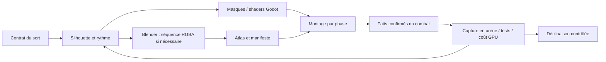

# VFX Cartes — sens, direction artistique et production

**DA historique : le choix utilisateur du 22 septembre 2026 retient désormais
[Animation cel](cards_vfx_cel_2026-09-22.md).** Cette fiche conserve la description
de la passe éthérée du 21 septembre et de ses branchements existants.

Périmètre validé : **recherche, règles visuelles et premiers sorts retravaillés**. Direction C : transparence, lumière, volutes. Cette passe traite quatre cartes et leurs états/sols associés ; les autres cartes et sorts adverses conservent la bibliothèque précédente. Un catalogue entièrement couvert par des familles n'est pas un catalogue entièrement dirigé artistiquement.

## Ce que montrent les sources de production

Sources primaires consultées le 21 septembre 2026. Les décisions Catabase ci-dessous sont notre adaptation, pas des prescriptions attribuées aux studios.

| Source | Enseignement utile | Application proposée |
|---|---|---|
| [Riot — Art Education, Visual Effects](https://www.riotgames.com/vi/artedu/visual-effects) et [critères de portfolio](https://www.riotgames.com/en/portfolio-and-reel-suggestions) | L'effet doit communiquer l'action et son identité ; forme, valeur, couleur et timing travaillent ensemble. | Valider d'abord une silhouette et un rythme reconnaissables, avant la variation de couleur. |
| [Riot — Behind the Scenes of VFX Updates, 2022](https://www.leagueoflegends.com/en-au/news/dev/dev-behind-the-scenes-of-vfx-updates/) | Les problèmes de clarté et de cohérence avec les zones précèdent l'embellissement. Le kit de base passe par des retours VFX/design/audio, puis les variantes, la QA et les retours des joueurs. | Corriger le rapport entre événement et effet ; stabiliser quatre pilotes ; décliner ensuite par famille avec contrôle individuel. |
| [Blizzard — Diablo IV, mise à jour de décembre 2021, Daniel Briggs](https://news.blizzard.com/en-gb/article/23746639/diablo-iv-quarterly-updatedecember-2021) | Hiérarchie visuelle, synchronisation des zones et du contact, impact dirigé. L'intensité peut modifier émission, vitesse, couleur et densité dans des plages artistiques. | Un gros coup a un pic plus net ou une extinction plus longue ; il ne multiplie pas systématiquement la taille du sprite. Réserver la lumière maximale à l'événement utile. |
| [Riot — VALORANT, Shaders and Gameplay Clarity](https://www.riotgames.com/en/news/valorant-shaders-and-gameplay-clarity) | La lisibilité des limites utiles et le coût minimal acceptable font partie de la conception des shaders. | Les détails décoratifs peuvent diminuer avec la qualité, jamais le signal de présence d'une zone active. |
| [Simon Trümpler — Stylized VFX in RiME](https://simonschreibt.de/gat/stylized-vfx-in-rime/) | L'auteur présente trois effets du jeu et partage, avec l'accord de Tequila Works, un matériau de feu de David Miranda qui utilise notamment bruit et masque. | Séparer les masques de forme, le mouvement de matière et l'enveloppe temporelle. La page contient aussi des travaux externes : ils ne sont pas tous attribuables à RiME. |
| [SideFX — Labs Flipbook Textures](https://www.sidefx.com/docs/houdini/nodes/out/labs--flipbook_textures-1.0.html) | Un effet construit hors moteur peut être rendu en atlas ; couleur, émission, alpha et passes complémentaires peuvent être séparées. | Blender peut produire une matière ou une animation complexe, puis Godot assure le montage et le déclenchement réel. Les passes avancées sont optionnelles. |
| [Julien Pingault / Deeamo — FX réalisés pour Dofus](https://deeamo.fr/dofus-x-deeamo-lanimation-de-fx-dans-le-jeu-dankama/) | Témoignage direct d'un animateur FX chez Ankama et exemples par classe. | Référence de personnalité et de mouvement. Cette source ne décrit **pas** le pipeline interne complet de Dofus 3 ; nous ne prétendons pas l'avoir reconstitué. |

## Diagnostic du système actuel

Le routeur utilise déjà les faits confirmés, le maintien des états et les surfaces réelles. C'est le bon socle. Le manque principal était artistique et sémantique : silhouettes voisines, durées largement dérivées de la famille, variation par graine, trajectoire générique. L'origine du coup était enregistrée mais inutilisée dans l'impact.

Deux confusions concrètes ont été corrigées pour les pilotes : les cases vides d'un terrain recevaient un impact vertical de cible ; une brûlure pouvait additionner l'impact du sort, l'application générique du statut et son maintien. L'accumulation de couches augmentait la lumière sans préciser l'information.

## Grammaire éthérée retenue

1. **Le contour raconte l'action.** Perforation = pointe et fragments orientés ; brûlure = filaments qui s'accrochent et montent ; terrain = empreinte basse sur ses cellules ; ralentissement = matière aux pieds. Une aura circulaire n'est pas une solution universelle.
2. **La couleur renforce un sens déjà lisible.** Acier pâle/cyan pour la dague ; braise ambrée avec base rouille ; givre bleu froid et veines claires. Ne pas compter sur la couleur seule pour séparer brûlure et feu de sol.
3. **Le vide fait partie de l'effet.** Conserver le centre du personnage et des espaces entre les langues de matière. Le maintien est moins dense qu'un impact. Les nouveaux pilotes utilisent un mélange alpha pour garder une matière colorée ; la traînée brève de dague garde un apport lumineux.
4. **Le rythme distingue l'événement.** Contact bref, propagation plus lente, maintien continu sans repiquer à chaque seconde, impulsion seulement quand les règles produisent un tick. Une expiration retire/dissout la matière au lieu de rejouer une explosion.
5. **L'importance vient du jeu.** Plus de puissance peut renforcer le noyau, les débris ou la durée du sillage dans une plage maîtrisée. La portée et l'aire visuelle informative ne s'agrandissent jamais arbitrairement. Les profils pilotes ne modulent pas encore l'intensité selon les dégâts appliqués.
6. **La boucle suit le fait.** Les secondes du lecteur ne retirent aucun tour. Une suppression, une mort, un remplacement de surface ou une fin de combat enlèvent le maintien. Les compteurs existants restent la source précise de durée.

## Quatre fiches de production

Les secondes ci-dessous sont les durées artistiques des queues d'effet. Elles ne retardent pas la résolution des règles. Les durées de terrain sont celles du service terrain ; elles ne sont pas interchangeables avec les activations d'un porteur de statut.

| Carte / contrat actuel | Lecture recherchée | Construction et séquençage |
|---|---|---|
| **Dague lancée** `a_dagger` : 1 PA, portée 2–3, frappe physique monocible, résolution immédiate | Une pointe traverse dans la direction du lanceur vers la cible. Faible encombrement, coup vif. | Après confirmation : afterimage de trajectoire 0,18 s ; pointe à la cible, noyau court et trois fragments asymétriques ; queue d'impact 0,32 s. Pas de projectile arrivant après les dégâts. |
| **Braise tenace** `t_burn` : 2 PA, portée 1–3, dégâts feu et brûlure de durée 2 | La chaleur s'accroche à un corps et continue à le consumer. | Ignition locale 0,68 s ; filaments bas et braises montantes attachés au porteur ; tick local lors d'un dégât positif ; extinction au retrait de la dernière source. Le maintien n'est pas un second brasier de pleine intensité. |
| **Bûcher des ombres** `t_flamewall` : 3 PA, portée 1–4, croix de rayon 1, feu de sol 2 tours ; dégâts aux unités sur la dalle au début de leur tour | Le danger demeure à un endroit, y compris lorsque la cible le quitte. | Apparition sur les seules cellules réellement posées ; veines chaudes et petites langues verticales ; impact bref de 0,50 s seulement sur les ennemis réellement touchés par le lancer ; sol actif jusqu'au retrait/remplacement, dissolution 0,45 s. Le sol peut affecter les deux camps. |
| **Jardin de givre** `t_glacier` : 3 PA, portée 1–4, croix de rayon 1, terrain 2 tours ; malus de 2 PM à la prochaine activation d'une unité entrant sur le sol | Un givre se ramifie et gêne les pieds ; il ne paralyse pas le corps. | Croissance de veines dissymétriques sur environ 0,65 s, brume basse ; contact de 0,58 s pour une cible touchée ; état Engourdi localisé aux pieds. Aucune prison de glace ni signal de tour sauté. |

Les valeurs sont issues de `class_card_catalog.gd`, `card_ecosystem_catalog.gd` et `card_ecosystem_effects.gd`. Les coefficients de dégâts dépendent des rangs/statistiques et ne sont pas recalculés par les VFX.

Le service terrain applique aussi Engourdi à une unité déjà présente lorsque le givre est posé sous elle ; ce cas est visible dans la capture réelle. Le statut retire des PM, pas une activation complète.

## Pipeline reproductible : de la fiche au combat



**1 — Contrat de règles.** Pour chaque identifiant de carte ou sort adverse, renseigner : ce qui déclenche, ce qui est visé, les cas sans effet (esquive, immunité, échec), les dégâts initiaux/périodiques, les états, la durée et son unité, la forme de zone, les réactions, les conditions d'arrêt. Distinguer par exemple la stase qui saute un tour de son cas particulier sur Paris qui retire seulement un PA. Une couleur identique ne justifie pas une animation identique.

**2 — Fiche artistique.** Une intention en une phrase, une forme dominante, une direction, deux couleurs utiles, une courbe d'intensité, une taille en fractions de cellule, et un critère observable de réussite. Dessiner trois moments : contact, résidu, disparition. Vérifier la reconnaissance en silhouette avant de produire les détails.

**3 — Production des éléments.** Pour les pilotes actuels : formes dirigées, champs de distance et bruit partagé dans des shaders Godot ; cela permet d'ajuster immédiatement le sens et les rythmes. Blender devient utile pour une spirale volumique, une nappe complexe ou un éclatement difficile à obtenir ainsi : caméra orthographique calibrée sur l'arène, animation de courbes/meshes ou simulation, fond transparent, lumière contrôlée, rendu en séquence RGBA. Organiser ensuite en atlas avec marges et convention d'alpha documentée. Garder le `.blend`, la séquence, les réglages de caméra et un manifeste (FPS, nombre d'images, pivot aux pieds, taille d'une cellule, durée, mode de mélange). Le rendu Blender n'a pas à intégrer le personnage.

**4 — Montage Godot.** Séparer contact, matière, petits éléments secondaires, sol et maintien. Utiliser le lecteur/flipbook existant pour les atlas et des [particules 2D Godot](https://docs.godotengine.org/en/stable/tutorials/2d/particle_systems_2d.html) lorsque des éléments indépendants sont nécessaires. La [référence Godot 4.7](https://docs.godotengine.org/en/4.7/classes/class_gpuparticles2d.html) précise la configuration d'un atlas animé via `CanvasItemMaterial` ; la durée de vie d'une particule n'est pas la durée d'un statut. Un seul propriétaire par phase. Réutiliser un masque ou une texture ; ne pas confondre réutilisation technique et identité artistique. Les profils explicites des pilotes sont dans `class_card_vfx_profiles.gd`.

**5 — Application réelle.** Le routeur Cartes reçoit les faits du combat. Il utilise la position d'impact capturée avant déplacement forcé, l'origine réelle du lanceur, le statut actif et le polygone réel du sol. Un délai de vol n'est joué que s'il existe dans les règles. Les terrains sélectionnent leur profil avec le sort source **et** leur famille active, afin qu'une réaction en eau/vapeur ne conserve pas les flammes du sort initial. Le mode classique garde son routage.

**6 — Validation en contexte.** Inspecter à vitesse normale et à l'échelle de combat, puis en gros plan. Tester une cible, une case vide, plusieurs cibles, coexistence d'états, sol remplacé, fin de combat, échec et absorption. Mesurer ensuite le coût dans un scénario dense sur une configuration cible ; ce travail n'est pas remplacé par un FPS correct dans une capture à deux acteurs. La galerie isolée permet de régler ; seule l'arène permet d'approuver l'application.

**7 — Déclinaison.** Une fois les pilotes jugés convaincants, établir une fiche par carte et par sort adverse. Grouper les composants par mouvement physique (percer, trancher, pousser, attirer, envelopper, pousser depuis le sol) et distinguer les signatures. Priorité suivante : coup lourd/poussée, lien de marque/consommation, bouclier/absorption/rupture, invocation, télégraphe adverse et annulation. Les variantes nécessitent chacune leur inspection, même si les tests confirment leur couverture.

## Reproduire et examiner cette passe

```powershell
./dev.ps1 test cards
./tools/class_card_vfx/capture_combat.ps1 -Semantic
node tools/class_card_vfx/encode_semantics.cjs
```

La sonde lance les quatre vraies cartes avec `SpellCaster` dans la scène de production, main et positions préparées, IA suspendue via le Studio. Elle échantillonne uniquement la présentation, capture 60 images par sort à 30 images/s, puis une vue à l'échelle de combat et un état nettoyé. Les résultats se trouvent dans `artifacts/dev/class_card_vfx/semantics/`. Les compteurs de tests, limites et ajustements visuels sont consignés dans `docs/ai/CARDS_VFX_SEMANTICS_2026-09-21.md`.

Les GIF restituent l'horloge échantillonnée des VFX ; ils ne constituent pas une mesure du framerate ou du rythme complet du combat. Les animations corporelles continuent selon l'horloge de la scène pendant la capture. Les déclenchements de début/fin de tour sont contrôlés séparément, via les vraies fonctions de statut et de terrain, et illustrés par les captures de tick et d'expiration.

Limites assumées : premier lot, pas une approbation artistique des 112 cartes ; pas d'asset Blender fabriqué dans cette passe ; pas de son ni d'animation corporelle ajoutés ; pas encore de mesure GPU en combat dense. Les sols réutilisent leur dalle de base existante, dont la couleur influence le résultat final.
