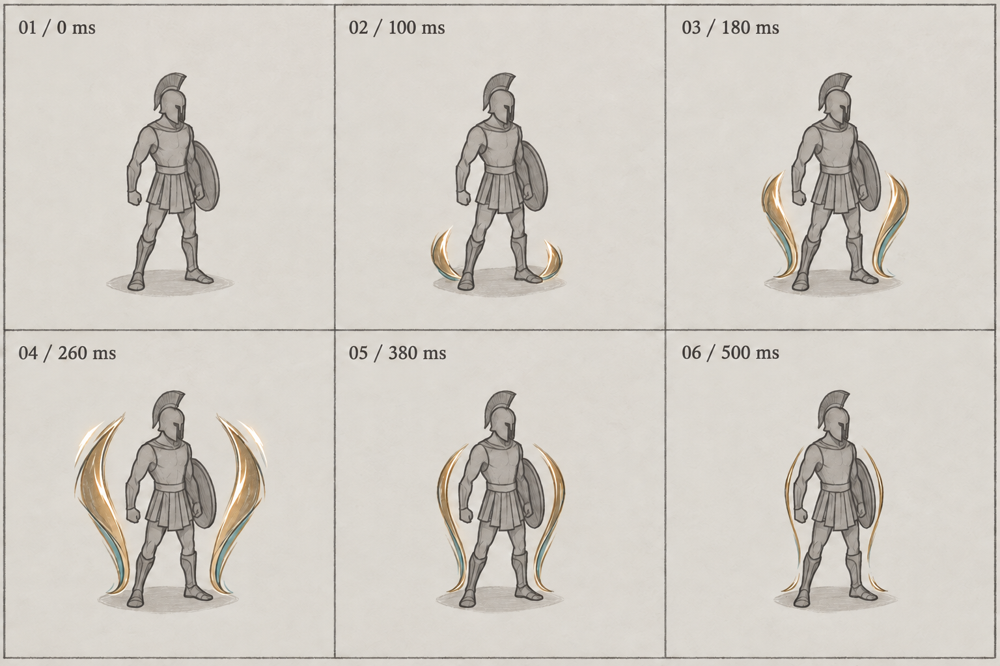

# Garde d’airain — fabrication FX par étapes

Date : 12 septembre 2026. Base Git examinée : `0bdfd5bf`, avec des modifications de travail préexistantes. Périmètre de cette passe : conception et poses clés de l’apparition d’un seul effet.

## Intention

Faire sentir qu’une protection de bronze se forme autour d’Achille : concentration près des appuis, déploiement rapide le long des flancs, accent de fermeture, retour à une présence discrète. Le visage, le torse et les appuis doivent rester lisibles. La forme principale doit porter cette lecture avant tout ajout de particules ou de shaders.

La démarche reprend les principes documentés de fabrication des FX 2D chez Ankama ; ce n’est pas une reproduction certifiée de leur chaîne interne. Sources de recherche : [Julien Pingault, travail Flash/Animate sur les sorts](https://www.behance.net/deeamo), [ses FX Dofus](https://deeamo.fr/dofus-x-deeamo-lanimation-de-fx-dans-le-jeu-dankama/), [séparation animation / FX sur Féca dans Wakfu](https://www.artstation.com/artwork/4KKL1). Les ressources graphiques d’Ankama ne sont pas importées.

## Pourquoi ce pilote

Garde d’airain a un cycle identifiable et un contrôleur existant. Il permet de travailler la qualité artistique sans concevoir simultanément une trajectoire de projectile, une attaque de zone et plusieurs animations corporelles.

Vérifications dans les sources actuelles :

- [bronze_guard.tres](../../../data/spells/achilles/bronze_guard.tres) référence la scène de garde ; coût de 2 PA, bouclier calculé sur PV maximum et Prouesse. L’ancienne capture avec « +10 » ne représente pas la formule actuelle.
- [vfx_manager.gd](../../../core/vfx_manager.gd) conserve la scène de garde dans la résolution de la famille `guard`, en plus du burst de présentation. Vérifier ce cumul au futur essai en combat pour ne pas doubler le pic lumineux.
- [vfx_shield_sprite_effect.gd](../../../vfx/runtime/vfx_shield_sprite_effect.gd) refuse l’activation sans bouclier positif, rattache l’effet à la vue, observe les changements de bouclier et la mort. Le maintien est fixe.
- [guard_profile.tres](../../../vfx/profiles/achilles_guard_bronze_v1/guard_profile.tres) fixe apparition à 0,50 s, impact absorbé à 0,25 s et fin à 0,30 s.
- [activation_asset.tres](../../../vfx/profiles/achilles_guard_bronze_v1/activation_asset.tres) lit huit images ; mode MIX, alpha STRAIGHT, pivot normalisé `(0.5, 0.82)`. La scène définit une taille de toile de 130, adaptée ensuite à l’échelle de présentation.

Ces constats viennent de lectures du code. Aucun nouvel essai moteur n’a été exécuté dans cette passe. La capture de référence inspectée, `artifacts/guard_sprite_validation_v1/visual/guard_activation.png`, est historique.

## Étape 1 — intention et poses clés

Livrable retenu pour préparer l’animatique : [storyboard V2](../../../art/source/vfx/guard_pipeline_study_v1/storyboard_v2.png).

| Pose | Temps proposé après gain confirmé | Fonction visuelle |
|---|---:|---|
| 01 | 0 ms | État initial, personnage visible, effet absent |
| 02 | 100 ms | Deux traits comprimés aux pieds : concentration |
| 03 | 180 ms | Montée intermédiaire à la taille : accélération |
| 04 | 260 ms | Déploiement maximal, dépassement de la forme au repos et accent ivoire |
| 05 | 380 ms | Retrait des contours vers le corps : amortissement |
| 06 | 500 ms | Traits plus fins : lecture du maintien futur |

Les temps sont une hypothèse de montage, pas une cadence validée. La concentration est une anticipation visuelle après le gain de bouclier, pas un retard ajouté à son application. La pose 06 décrit seulement la destination de l’apparition ; les phases impact absorbé et dissipation ne sont pas dessinées dans cette passe.

Le mannequin gris sert de repère conceptuel. Il n’est ni une nouvelle apparence d’Achille ni un élément à découper pour le jeu. Le papier, les textes et les repères ne sont pas des textures de production. Cette planche ne peut pas être utilisée directement comme atlas transparent.

## Contrôle de l’étape 1

Inspection visuelle de V1 et V2 en sortie de génération :

| Contrôle | Observation et décision |
|---|---|
| Progression des silhouettes | V1 rejetée sur ce point : pose 03 déjà presque à hauteur du pic. V2 corrige la pose 03 à hauteur de taille ; petit départ, montée, maximum, retrait désormais distincts. |
| Personnage lisible | Tête et centre du torse dégagés sur les six poses. Les traits restent latéraux. |
| Pic puis repos | Pose 04 plus large et plus lumineuse ; poses 05–06 plus fines. À confirmer en mouvement. |
| Cohérence graphique | Bronze, ivoire et petite sous-teinte turquoise conservés. Pas de nuage de particules ni de halo diffus. |
| Format de travail | Six poses et six temps présents. V2 conservée avec son prompt et V1 comme preuve de correction. |
| Ancrage | Appuis cohérents à l’œil sur la planche ; aucune certification pixel à pixel. Le recalage sera contrôlé dans l’animatique. |
| Lecture en combat | Non vérifiée : mannequin et fond papier seulement. La lecture « protection » plutôt que « flammes latérales » reste à éprouver sur le vrai personnage à petite taille. |

Décision : **conception suffisamment définie pour un animatique de travail**. Ce statut n’est ni une approbation artistique de l’utilisateur ni une validation d’animation ou d’intégration.

## Étape 2 — animatique de travail livré

Réalisée le 12 septembre 2026, base Git toujours `0bdfd5bf`. Le [lecteur autonome](../../../artifacts/dev/guard_animatic_v1/review.html) propose poses, curseur, pause/reprise, trois vitesses, fonds clair/sombre et affichage à l’échelle du profil ou agrandi 2×. Les [GIF normal](../../../artifacts/dev/guard_animatic_v1/animatic_normal.gif) et [ralenti](../../../artifacts/dev/guard_animatic_v1/animatic_slow.gif) sont aussi disponibles.

Fabrication : [outil et guide](../../../tools/guard_animatic/README.md). Source originale et source de détourage restent dans `art/source/vfx/guard_pipeline_study_v1/`, avec les prompts exacts de l’étape 2. Génération et correction par imagegen intégré ; traitement déterministe par Node/Sharp.

### Corrections réellement effectuées

- L’extraction initiale est rejetée : image RGB avec damier dessiné et traces de mannequin, sans canal alpha. Une deuxième source sur fond magenta uni permet une extraction contrôlée. La dérivation imagegen a légèrement changé les traits ; elle n’est pas une extraction exacte du storyboard.
- Les équations de détourage reprennent le pipeline d’Achille peint existant. Aucun pixel de forme nouvelle n’est dessiné par code. L’alpha reconstruit et les franges sont conservés sans gommage par seuil.
- Le premier redimensionnement Lanczos introduisait des pixels roses faibles sur les bords. La réduction linéaire corrige ce dépassement de couleur ; le contrôle n’en détecte plus selon le critère chromatique conservé dans le script.
- Les origines des pointes basses sont identifiées explicitement, puis recalées par translation avec une seule échelle nominale. L’erreur d’arrondi maximale est de **0,419 px** sur la toile de 256×256 ; ce chiffre n’est pas une mesure de la précision des repères choisis à l’œil.

### Preuves et observation

La [planche comparative](../../../artifacts/dev/guard_animatic_v1/contact.png) a été inspectée : six états sur deux fonds, avec la première vraie pose `idle_E` d’Achille peint à l’échelle de son profil. Le visage et le torse restent dégagés. Le maximum est nettement plus étendu que la montée, puis les contours s’amincissent. À petite taille, le pic reste spectaculaire mais les deux arcs évoquent encore des flammes ou des ailes ; la lecture de coque protectrice n’est pas acquise. Le bord gauche rencontre visuellement le bouclier physique : le placement avant/arrière devra être traité lors de l’essai moteur.

Le [rapport de vérification](../../../artifacts/dev/guard_animatic_v1/verification.json) contient **22 contrôles réussis** : fichiers RGBA décodés, état vide, marges, recalage, échelle nominale, six états distincts, durées GIF encodées et syntaxe JS. Le [manifeste](../../../artifacts/dev/guard_animatic_v1/manifest.json) conserve empreintes, pivots et temps.

L’apparition couvre bien **500 ms**, suivie d’une pose fixe. Les GIF ajoutent seulement un temps de repos et de maintien pour observer la boucle ; leur durée totale est 1 900 ms à vitesse normale et 3 400 ms au ralenti. Les poses sont tenues : aucune interpolation ne prétend remplacer les futurs dessins intermédiaires.

**Limite de vérification :** l’outil navigateur a interdit l’URL locale. Aucun contournement n’a été tenté. Les interactions du lecteur ne sont donc pas validées par une exécution navigateur ; sa syntaxe et ses fichiers sont vérifiés hors navigateur. L’observation effectuée ici porte sur les poses et le montage encodé, pas sur une revue humaine continue du mouvement. Aucun essai Godot ni test de combat n’a été exécuté pour cette étape artistique isolée.

**Décision : montage technique prêt, validation artistique encore réservée.** Avant le nettoyage et l’ajout d’intervalles, renforcer la lecture de protection au pic (moins de pointes de flamme, contour plus enveloppant), puis comparer de nouveau les silhouettes à l’échelle du profil. Ne pas ajouter particules ou shaders pour masquer cette réserve. Préserver pour l’instant les temps du storyboard ; leur qualité perceptive reste à valider en lecture continue.

## Étapes suivantes et conditions de passage

1. **Animatique de l’apparition.** Utiliser les poses comme références pour des dessins FX isolés, recaler sur un même repère et tester le montage de 0,50 s, au ralenti et image par image. Comparer à la taille réelle du personnage. Passage seulement si la montée est compréhensible, le pic distinct, le retour calme et les appuis stables. Ne pas confondre agrandissement d’une image fixe et animation dessinée.
2. **Animation dessinée propre.** Dessiner les intervalles nécessaires, vérifier continuité des contours, volumes et alpha sur fonds clair et sombre. Choisir le nombre d’images après validation du rythme. Préparer le maintien compatible avec la dernière pose ; réserver les réactions et la dissipation à des passes séparées.
3. **Préparation technique.** Réutiliser les opérations de découpe/recalage/manifeste de [guard_sprite_pipeline](../../../tools/guard_sprite_pipeline/README.md) et les ressources VFX existantes. Lire les services réellement appelés par le compositeur Studio avant toute modification d’édition de contenu. Exporter dans un nouveau dossier, conserver les sources, vérifier dimensions, pivots, marges et empreintes.
4. **Essai moteur isolé.** Charger le profil candidat dans le laboratoire existant : taille, vitesse, pause, nettoyage, lecture devant et derrière le personnage. Contrôler aussi la transition vers le maintien ; éviter un raccord brutal avec l’ancienne forme.
5. **Enrichissement ciblé, si utile.** Ajouter séparément un reflet puis quelques poussières, avec comparaison activé/désactivé. Conserver uniquement ce qui renforce la lecture déjà obtenue.
6. **Intégration et preuve de combat.** Contrôler gain réel, absorption, fin, mort, déplacement, zoom et réduction des animations ; supprimer les doublons visuels. Exécuter les tests ciblés du contrôleur, du runtime et des raccordements modifiés, les validations CI applicables et les captures sur décors clairs/sombres. Un résultat absent ou incomplet reste non validé.

Chaque étape produit son propre contrôle avant la suivante. Aucun changement de gameplay, de profil actif ni de code de production dans cette passe.

## Sources et reprise

- Source de palette inspectée : `art/source/vfx/achilles_guard_bronze_v1/guard_source_v2.png`.
- Génération et correction : outil imagegen intégré, sans CLI.
- [Prompt initial exact](../../../art/source/vfx/guard_pipeline_study_v1/prompt_stage01.txt).
- [Prompt de correction exact](../../../art/source/vfx/guard_pipeline_study_v1/prompt_stage01_revision.txt).
- [Storyboard V1 conservé](../../../art/source/vfx/guard_pipeline_study_v1/storyboard_v1.png).
- [Storyboard V2 retenu](../../../art/source/vfx/guard_pipeline_study_v1/storyboard_v2.png).

À la reprise : vérifier l’état Git et les références de garde, ouvrir l’animatique de l’étape 2 et traiter sa réserve de silhouette avant le nettoyage. Ne pas considérer les résultats du 5 septembre, les contrôles de fichiers ou l’inspection statique comme une preuve du rendu moteur courant.
