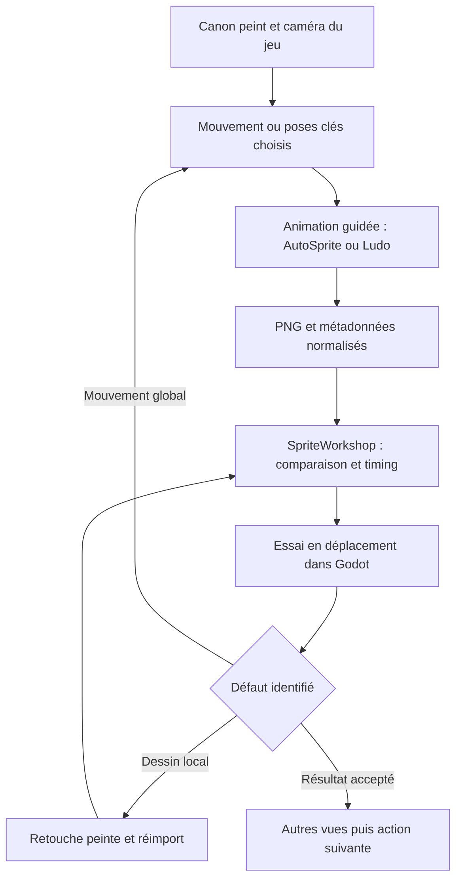

# Workflows IA pour les personnages peints de Catabase

## Recommandation

**Évaluer d'abord le lot AutoSprite d'Achille déjà présent, puis éprouver le transfert du canon peint retenu — notamment la nouvelle proposition Passe-rive une fois acceptée. Comparer Ludo sur le même mouvement si nécessaire, et conserver PixelLab comme essai secondaire.** La correction locale doit faire partie du pilote. SpriteWorkshop et Godot restent les outils de préparation et de décision. Le bénéfice recherché est de réduire le travail nécessaire pour obtenir une animation acceptée, puis pour la corriger et la décliner.

AutoSprite rassemble génération, transfert de mouvement, storyboard, extraction et export ; Ludo documente particulièrement bien l'emploi d'une bibliothèque de mouvements ou d'une vidéo de référence. PixelLab possède des contrôles intéressants, mais sa spécialisation pixel art et ses formats d'animation réduits justifient une priorité moindre pour le style peint retenu. Ces positions sont des **recommandations de sélection pour un pilote**, pas un classement de qualité mesurée sur Catabase. [1](https://www.autosprite.io/) [9](https://ludo.ai/docs/sprite-generator) [13](https://www.pixellab.ai/docs/tools/animate-with-text-new)

Le choix artistique reste le dessin peint : silhouettes lisibles, volumes simples, couleurs maîtrisées, matières et contours conservés. Une apparence 3D de remplacement ou une conversion en pixel art ne répondrait pas à cet objectif. La 3D peut cependant servir de référence de mouvement et de caméra.

Le périmètre est celui des informations publiques vérifiées le **13 septembre 2026**, confrontées à Git `c98436df` et aux modifications locales en cours, relues avant livraison. Aucun job de génération AutoSprite, PixelLab, Ludo ou Scenario n'a été exécuté pour cette étude. Le dépôt contient toutefois un lot AutoSprite fourni séparément, son assembleur et une intégration en cours. Leur présence ne constitue pas une validation artistique ou moteur supplémentaire. Aucun gain de temps n'est encore mesuré.

## 1. Le problème concret de Catabase

L'état local comprend désormais **56 planches AutoSprite d'Achille**, des ressources pour huit directions et un adaptateur dédié. Il comprend aussi une nouvelle proposition de Passe-rive, moins étirée, préparée pour AutoSprite, dont l'acceptation artistique n'est pas établie. La priorité pratique est de réutiliser ce travail et de vérifier son résultat. [Intégration en cours](C:/Users/paolo/Documents/dungeon-draft-v-2/docs/ai/achilles_autosprite_integration.md) [Proposition Passe-rive](C:/Users/paolo/Documents/dungeon-draft-v-2/art/source/characters/achilles/passe_rive_redesign_v1/README.md)

L'essai simple du Veilleur demeure un **témoin historique**, avec sept dessins dans chacune des quatre vues, lus à 10 images par seconde. Le retour conservé est précis : le reste est correct, mais le passage des pieds pose problème. Il fournit un cas de diagnostic utile, sans relancer ses retouches comme priorité. Une génération qui améliore les jambes en dégradant les proportions ou le costume ne constitue pas un progrès. [Essai et retour local](C:/Users/paolo/Documents/dungeon-draft-v-2/art/source/characters/achilles/veilleur_walk_simple_v1/README.md)

La référence du Veilleur présente notamment des bottes rigides, une longue silhouette et une étoffe asymétrique attachée sur une épaule. Le déplacement doit faire vivre bassin, thorax et bras sans transformer ces éléments. Les premières passes peuvent être jugées sans arme ; une action équipée doit ensuite éprouver les mains, les prises et les occultations. [Canon visuel](C:/Users/paolo/Documents/dungeon-draft-v-2/art/source/characters/achilles/serment_cendre_concept_v1/candidate_c.png)

Les essais précédents ont montré deux choses différentes : un contrôle technique peut être complet alors que le mouvement reste peu convaincant ; un mouvement cohérent sur mannequin peut perdre ses appuis lors du transfert en peinture. Le contrôle doit donc porter sur les pixels effectivement affichés en déplacement, pas uniquement sur des repères de squelette. [Mémoire d'animation](C:/Users/paolo/Documents/dungeon-draft-v-2/docs/ai/animation_memory.md)

Le projet possède déjà un atelier qui importe des PNG ou des SpriteFrames, conserve les sources, règle les durées et les placements, compare les clips et exporte atlas, SpriteFrames et événements. Cet investissement est réutilisable quel que soit le générateur retenu. Il reste à obtenir de meilleurs dessins et une meilleure continuité entre eux. [Atelier existant](C:/Users/paolo/Documents/dungeon-draft-v-2/tools/sprite_workshop/README.md)

### Critères de choix

| Critère | Preuve recherchée sur le pilote |
| --- | --- |
| Fidélité au canon peint | Même silhouette, casque, palette, bottes et asymétrie après génération et après retouche. |
| Mécanique du mouvement | Alternance des appuis, passage des jambes, transfert du poids et coordination du corps visibles. |
| Direction | Quatre vues pilotes conformes à la caméra réelle ; huit directions à vérifier pour le lot AutoSprite actuel. |
| Correction | Un défaut identifié se corrige sans remettre en cause les parties acceptées. |
| Boucle et transitions | Plusieurs cycles, démarrage, arrêt et changement de direction restent convaincants. |
| Intégration | PNG transparents, dimensions et ancre stables, ordre et durées explicites, événements raccordables. |
| Coût de production | Dépense et temps humain jusqu'à une version acceptée, en comptant les essais rejetés. |

## 2. Comparaison des solutions

Les appréciations ci-dessous expriment leur pertinence pour **ce projet peint**, d'après leurs interfaces et documents publics.

| Solution | Apport principal | Limite déterminante | Place recommandée |
| --- | --- | --- | --- |
| **AutoSprite** | Pipeline intégré ; images de référence, animation personnalisée, transfert de mouvement, exports et API. | Pack isométrique fondé en partie sur des miroirs ; disponibilité de certaines fonctions divergente entre pages. | Premier candidat avec vues personnalisées. |
| **Ludo** | Transfert depuis un mouvement choisi ; contrôle par poses clés ; préparation des exports. | Retouche qui régénère la séquence ; boucle non garantie. | Premier candidat pour guider les appuis. |
| **PixelLab** | Animation depuis référence, animation guidée, retouche de plusieurs images, API/MCP et éditeurs. | Spécialisation pixel art ; animation et retouche limitées selon la taille. | Petit essai de fidélité avant investissement. |
| **Scenario** | Références de personnage et de style, modèles personnalisés, combinaison image/vidéo. | Plus de préparation et d'assemblage dans le workflow documenté. | Piste de série après stabilisation artistique. |
| **EbSynth + Krita** | Propagation de retouches peintes sur un mouvement existant. | Dépend de la qualité du mouvement guide et du suivi, particulièrement aux occultations. | Complément de correction à éprouver. |
| **Blender / Meshy → rendu guide** | Caméra et mouvements réutilisables dans toutes les vues. | L'habillage peint reste à réussir ; un rig automatique ne garantit pas une bonne animation. | Référence de mouvement, selon besoin. |
| **Wan-Animate / ToonComposer** | Transfert et guidage accessibles dans des projets de recherche publiés. | Installation, calcul, préparation et finition supplémentaires. | Recherche secondaire, sans retarder le pilote. |

Sources des fonctions : AutoSprite [1–7], Ludo [9–12], PixelLab [13–19], Scenario [20–22], EbSynth/Krita [23–24], Meshy [26], Wan/ToonComposer [27–28]. Les implications pour Catabase sont une analyse, pas des résultats d'essai.

## 3. AutoSprite : un pipeline prometteur, à utiliser avec précision

### Ce qui est documenté

AutoSprite annonce une chaîne depuis une image jusqu'aux animations, une bibliothèque de mouvements, un transfert depuis vidéo et un storyboard avec plusieurs poses clés. Son guide d'animation personnalisée permet d'imposer les images initiale et finale. Cela donne deux essais utiles : la marche avec référence de mouvement, puis une attaque dont les poses décisives sont préparées. [1](https://www.autosprite.io/) [2](https://www.autosprite.io/docs/guide-advanced-creation)

Les formats annoncés comprennent le PNG transparent, l'atlas JSON et les images individuelles. L'interface décrit des extractions allant jusqu'à 144 images en mode MAX et une résolution native possible ; l'API décrite limite ses paramètres à 64 images et 512 pixels. Il faut distinguer le mode de génération, l'extraction et le chemin d'accès : une option de l'interface n'est pas automatiquement un paramètre API. [3](https://www.autosprite.io/docs/reference-export-formats) [4](https://www.autosprite.io/docs/api-spritesheets)

### La limite des directions change la stratégie

La référence API décrit cinq vues isométriques générées : haut, nord-est, droite, sud-est et bas. Les trois vues occidentales sont obtenues par retournement horizontal dans le jeu. La promesse commerciale de huit directions ne signifie donc pas huit dessins anatomiquement distincts. Pour nos personnages asymétriques, le pack standard ne remplit pas le contrat. [4](https://www.autosprite.io/docs/api-spritesheets)

**Cela ne permet pas de conclure que les fichiers locaux fournis sont des miroirs.** Ils comprennent effectivement des planches gauche, nord-ouest et sud-ouest ; l'assembleur les lit individuellement. Leur fabrication amont et la cohérence anatomique doivent être examinées sur les images. La restriction décrit le chemin API standard documenté, pas tous les exports possibles ni une anomalie déjà démontrée du lot reçu. [Assembleur local](C:/Users/paolo/Documents/dungeon-draft-v-2/tools/achilles_autosprite/build.py)

Une voie personnalisée est documentée : `poseId`, `lastFramePoseId` et `rawPrompt` permettent de partir de poses imposées et d'éviter le gabarit textuel orienté vers la droite. Il faudra vérifier qu'elle conserve réellement une vue arrière opposée avec le bon équipement. Le mode `ultra` ne prend pas en charge l'image finale ni le bouclage ; son prix supérieur n'en fait pas le choix naturel pour une marche. [4](https://www.autosprite.io/docs/api-spritesheets)

### Les fonctions de correction demandent une preuve

La FAQ distingue régénération d'une pose ou vidéo, édition de l'animation et travail image par image dans le Frame Strip Editor. Elle reconnaît aussi des changements possibles dans les détails du personnage. Cette documentation ne prouve pas qu'une correction des pieds laissera exactement intact tout le haut du corps. Le pilote doit conserver l'original et vérifier ce point avec un défaut concret. [5](https://www.autosprite.io/docs/faq)

Protocole proposé : prendre une marche E, identifier le moment où la botte traverse ou masque mal l'autre jambe, corriger uniquement ce passage, puis comparer les versions synchronisées. Si l'édition globale altère le casque ou l'écharpe, conserver les meilleures images et effectuer une retouche locale dans Krita. Un changement général de style ne doit pas servir de solution à une erreur d'appui.

### Une incohérence commerciale vérifiée

La page tarifaire affichée dans le navigateur place API/MCP sur **Pro à 29 USD/mois**, et l'extension Godot y figure **« coming soon »**. La référence des crédits attribue pourtant API/MCP dès Starter, tandis qu'une page d'intégration décrit l'extension comme disponible. La base prudente de planification est Pro pour l'automatisation et PNG/JSON pour l'import ; l'accès réel du compte doit être vérifié avant souscription. [6](https://www.autosprite.io/pricing) [7](https://www.autosprite.io/docs/reference-credits) [8](https://www.autosprite.io/docs/integration-godot-extension)

Plusieurs pages techniques AutoSprite ne rendent que leur titre et navigation en consultation directe ; leurs corps détaillés restent accessibles dans l'index de recherche. Le comportement de l'API n'a pas été testé. Cette différence d'accès réduit la certitude sur l'actualité des détails techniques, même lorsque leurs informations sont cohérentes entre plusieurs pages.

### Décision pour Catabase

AutoSprite vaut un essai, notamment parce qu'il regroupe plusieurs étapes aujourd'hui dispersées. Le test décisif porte sur **une vue personnalisée peinte et sa correction**, suivi d'une vue opposée authentique. Il serait prématuré d'acheter une capacité de production en lots avant de savoir si ces deux cas passent.

## 4. PixelLab : les bonnes idées, avec des contraintes pour la peinture

### Distinguer les générations d'outils

Les documents présentent simultanément des outils anciens et récents. La limite de 64 × 64 de l'ancien créateur automatique ne décrit pas tout PixelLab. L'outil « Animate with text (New) » conserve l'image initiale et accepte 4 à 16 images, en nombre pair, avec une référence maximale de 256 × 256. Un budget global de 524 288 pixels limite cependant un carré de 256 pixels à huit images. [13](https://www.pixellab.ai/docs/tools/animate-with-text-new)

Le catalogue API ajoute PixMiniMax, expérimental à partir du Tier 2, jusqu'à 256 × 256 et de 4 à 40 images par multiples de quatre. C'est une raison de ne pas exclure PixelLab uniquement parce que ses premières démonstrations sont pixelisées. Le service reste spécialisé en pixel art ; la conservation de notre peinture doit être démontrée sur la sortie, même lorsqu'une image non pixelisée est acceptée en entrée. [14](https://www.pixellab.ai/pixellab-api)

### Ce qui pourrait simplifier notre travail

« Animation to animation » utilise une animation et des références d'apparence ; sa documentation décrit des formats jusqu'à 128 × 128 et prévoit du nettoyage manuel. Cela correspond à notre idée de mouvement guide, mais pas directement à une source peinte de grande taille. [15](https://www.pixellab.ai/docs/tools/animation-to-animation)

« Edit animation Pro » traite plusieurs images avec une instruction commune. Sa page d'extension précise cependant qu'à 171–256 pixels, quatre images seulement sont traitées ensemble. « Transfer outfit Pro » limite cette même tranche à trois images de mouvement, la référence d'habit occupant une place supplémentaire. Une formule générale « jusqu'à seize images » masquerait donc le coût réel d'une retouche en haute résolution. [16](https://www.pixellab.ai/docs/tools/edit-animation-pro) [17](https://www.pixellab.ai/docs/tools/transfer-outfit-pro)

L'API et le MCP officiels permettent création, animation, récupération et retouche depuis un agent. Les pages des extensions et le catalogue API n'exposent pas toujours la même présentation des limites ; il faut préparer les requêtes d'après le schéma de l'endpoint effectivement utilisé. Le MCP réduit les manipulations, mais ne constitue pas un contrôle artistique. [18](https://www.pixellab.ai/mcp) [19](https://api.pixellab.ai/v2/docs)

### Pourquoi ce n'est pas le premier choix

Notre profil peint G utilise déjà un canevas de 512 × 384, et les sources du Veilleur sont plus grandes. Une génération à 256 pixels peut rester lisible à la taille du jeu ; cela ne suffit pas à savoir si les contours, le métal, les bottes et l'étoffe garderont leur qualité. Un agrandissement ultérieur ne récupère pas automatiquement les formes perdues. [Profil local](C:/Users/paolo/Documents/dungeon-draft-v-2/data/visuals/achilles/achilles_painted_g_sprite_profile.tres)

L'essai proposé est réduit : même vue E du personnage peint retenu pour le comparatif, réduction uniforme sur une copie, une animation de huit images, puis affichage à la même taille que son témoin. Si le service impose visiblement une grille pixel art, une simplification excessive ou une autre matière, arrêter cette voie pour le héros. Elle pourra rester utile sur de petits assets uniquement si leur apparence s'accorde réellement au jeu.

## 5. Ludo : le candidat le mieux documenté pour guider le mouvement

Ludo propose un transfert depuis des presets avec choix de caméra et de direction, ou depuis une vidéo importée. Le guide recommande Forge pour les presets et Tango pour une vidéo personnelle ; le transfert est limité à 36 images. Les animations personnalisées peuvent être guidées par trois images : début, milieu et fin. La boucle reste incertaine, le mode True Size conserve le cadrage de l'entrée, et l'édition régénère toute la séquence avec un risque de dérive cumulative. Le gratuit ajoute un filigrane aux exports. [9](https://ludo.ai/docs/sprite-generator)

Le journal de l'éditeur confirme l'évolution récente de ces workflows, notamment le transfert moins coûteux introduit en juillet et Forge/Forge Pixel en août 2026. Les noms de modèles sont donc des options de produit à recontrôler, et non des recettes figées. [10](https://ludo.ai/whats-new)

### Application proposée à la marche

Le pilote devrait présenter **le même canon peint** à deux approches : un preset humain correspondant à notre caméra, puis, si nécessaire, une courte référence issue de notre mannequin Blender. Pour cette seconde approche, le transfert doit reprendre le mouvement et non adopter l'apparence du mannequin. Le changement de modèle ne doit pas coïncider avec un changement du canon, sans quoi la comparaison devient ambiguë.

La référence doit montrer un cycle complet, les pieds entiers et une caméra fixe. Avant de transférer l'apparence, lire le guide animé seul dans la projection choisie : si ses appuis ou sa personnalité ne conviennent pas, changer de référence. La transformation visuelle ne doit pas être chargée d'inventer simultanément un meilleur mouvement.

Pour une attaque, employer les poses de repos, d'engagement maximal et de récupération, puis vérifier la préparation et le contact obtenus entre ces repères. Une pose intermédiaire imposée peut réduire l'ambiguïté d'un geste. Le moteur gardera néanmoins la responsabilité de l'instant d'impact et du déplacement réel.

### Réserve de production

Ludo est particulièrement intéressant si le mouvement doit rester commun à plusieurs personnages. Ce gain reste conditionné à la morphologie et à la tenue : une marche sans arme ne prouve ni la qualité d'un port de lance ni celle d'un costume très différent. Réutiliser un mouvement doit conserver une intention corporelle crédible pour chaque personnage.

L'API/MCP commence sur Pro à 50 USD/mois, avec 1 000 crédits ; les appels restent facturés en crédits. Un premier test par l'interface évite de payer l'accès à l'automatisation avant d'avoir choisi le résultat artistique. [11](https://ludo.ai/api-mcp-integration)

## 6. Les compléments qui répondent à des besoins distincts

### Scenario pour stabiliser une série

Scenario documente des modèles de personnage entraînés sur une sélection d'images, et un workflow qui produit des vues cohérentes avant de les utiliser comme images de départ ou d'arrivée d'une vidéo. Son tutoriel de spritesheets passe ensuite par la sélection des poses et leur assemblage dans un outil d'image. Ces fonctions peuvent aider à conserver un canon sur une série, mais ne verrouillent pas à elles seules les contacts des pieds. [20](https://help.scenario.com/articles/4280773511-train-a-consistent-character-model) [21](https://help.scenario.com/articles/3407278578-integrate-video-generation-into-scenario-workflows) [22](https://help.scenario.com/articles/9088582240-create-spritesheets-with-scenario)

Cette piste devient pertinente quand des dessins corrects du personnage existent dans plusieurs poses et vues. Entraîner un modèle sur nos défauts actuels risquerait de les rendre plus faciles à reproduire. Pour un seul cycle encore en discussion, la préparation d'un modèle personnalisé ajoute une étape dont le bénéfice n'est pas établi.

### EbSynth et Krita pour la correction peinte

EbSynth propage des images clés peintes le long d'une vidéo guide. Son mécanisme de propagation est une synthèse de texture, distincte d'un modèle génératif entraîné sur des images externes. Sa documentation recommande des pistes séparées et des images clés transparentes pour isoler les retouches ; elle signale des déformations lorsque les formes peintes et le guide ne correspondent pas. [23](https://ebsynth.com/)

Krita apporte timeline, calques animés et pelure d'oignon pour dessiner et contrôler une correction image par image. Cela correspond à la finition de bottes, de tissu ou de contour peints. Le fichier éditable doit devenir une véritable source réexportable ; un document produit une seule fois sans être relu par le pipeline n'apporte pas ce retour de correction. [24](https://docs.krita.org/en/user_manual/animation.html)

Application proposée : sur une bonne marche guide, peindre le passage problématique d'une jambe sur quelques images clés, propager la correction sur un segment court, puis recomposer seulement la zone concernée. Le croisement des jambes est le cas le plus difficile : si le suivi perd la jambe cachée, arrêter la propagation à cette occultation et fournir une nouvelle clé après le croisement. Cette méthode est à éprouver ; elle n'a pas réparé le Veilleur dans le cadre de l'étude.

Aseprite reste pratique pour les séquences, les tags et les exports automatisés en PNG/JSON. Sa ligne de commande peut soutenir un pipeline reproductible si cet éditeur est retenu, sans obliger à modifier l'esthétique en pixel art. Pour la brosse et les sources peintes, Krita est le premier complément à considérer. [25](https://www.aseprite.org/docs/cli/)

### Blender et Meshy pour la référence spatiale

Meshy propose génération 3D, rigging et motions préétablies avec sorties GLB/FBX. Son aide distingue humanoïdes, quadrupèdes et Smart Rig : la bibliothèque de mouvements n'est pas équivalente pour chaque catégorie. Cela peut accélérer la constitution d'une référence, mais la cohérence du rig, les mains et le sol restent à contrôler. [26](https://help.meshy.ai/en/articles/16231707-how-to-create-3d-animation-with-auto-rigging)

Catabase possède déjà des mannequins Blender. Les réutiliser avec une caméra constante est préférable à reconstruire une base de mouvement sans raison. Un rendu guide peut fixer l'ordre des membres et leur projection, puis alimenter le transfert peint. Si l'apparence produite ressemble à un mannequin 3D habillé au lieu de retrouver le canon, le transfert doit être corrigé ou abandonné.

### Recherche ouverte : Wan-Animate et ToonComposer

Wan-Animate accepte une image de personnage et une vidéo, avec préparation des données de mouvement ; le dépôt distingue animation et remplacement. ToonComposer combine image couleur, croquis clés et masques de mouvement ; sa configuration documentée pour 61 images en 480p demande environ 57 Go de VRAM. Ces travaux montrent que le guidage est une voie réelle, mais ne constituent pas un importeur de personnages Godot prêt à l'emploi. [27](https://github.com/Wan-Video/Wan2.2) [28](https://github.com/TencentARC/ToonComposer)

Les garder comme pistes d'expérimentation si les services spécialisés ne répondent pas au besoin. Ne pas lancer d'installation ou de location GPU avant d'avoir défini le défaut que cette infrastructure doit résoudre. Le code ouvert, les poids, les dépendances et les sorties ont chacun des conditions à examiner ; le dépôt seul ne prouve pas une licence commerciale uniforme.

## 7. Workflow de production recommandé

### Préparer une fiche de personnage réutilisable

Conserver les références choisies, une fiche d'asymétrie, la caméra et une taille de corps commune. Distinguer les règles persistantes — casque, proportion, côté de l'étoffe — de l'intention temporaire — marcher, armer, frapper. Cela évite de devoir redéfinir le personnage à chaque requête.

Pour les quatre vues, établir une table de correspondance entre direction du fournisseur, direction écran et suffixe local N/E/S/W. Une appellation « isométrique » ne donne ni l'élévation de caméra ni cette correspondance. L'export d'une vue fournisseur appelée E ne doit donc pas devenir mécaniquement `walk_E` sans contrôle sur la grille.

### Produire des gestes qui ont une intention

Le cycle de marche doit montrer les phases nécessaires au passage d'une jambe, au contact et au transfert de poids. Une attaque doit donner à lire préparation, engagement, contact et récupération. Le nombre de dessins est choisi ensuite : augmenter la densité d'images d'un mouvement rigide ne lui donne pas de personnalité.

Commencer par une action claire et un prompt court, accompagné du canon ou du guide. Exemple de consigne à adapter à la direction réelle : « Même personnage peint. Caméra fixe trois-quarts. Marche sur place détendue, transfert du poids et passage net des pieds. Bottes rigides, proportions et étoffe inchangées. Corps entier dans le cadre. » Les indications textuelles expriment l'objectif ; seul le résultat permet de constater qu'elles sont respectées.

### Séparer corps, effets et déplacement

Préparer le mouvement du corps sans fumée ou éclat qui cacherait ses défauts. Les traînées, projectiles et flashes sont ajoutés en couches au moment utile. Leur profondeur devant ou derrière le personnage doit suivre la pose. Le déplacement entre cases appartient au contrôleur de jeu : une vidéo dont le personnage traverse déjà l'image demande un traitement différent d'une boucle sur place.

Pour les grandes actions, élargir le canevas sans réduire automatiquement le corps. Une lance ou un arc qui dépasse ne justifie pas de rapetisser le personnage uniquement sur l'attaque. Le retour au repos doit conserver l'ancre, la taille et la position attendues.

### Corriger avant de décliner

Pour une nouvelle production, faire une marche E convaincante, prouver une correction, puis compléter les trois autres vues pilotes de cette même marche. Étendre aux huit directions si le contrat écran du nouvel adaptateur est retenu. Ajouter ensuite repos et transitions, une action expressive, enfin le reste du kit. Les directions déjà fournies sont à évaluer, sans les régénérer par principe.

Si deux corrections ciblées échouent à améliorer un défaut, modifier localement la méthode : autre guide, pose repeinte ou autre outil. Cela constitue un seuil pratique de pilote, pas une propriété des modèles. Une nouvelle génération complète n'est justifiée que si le mouvement global ou l'identité est réellement irrécupérable.

## 8. Intégration réelle dans Godot

### Ce que le code possède déjà

Le service `sprite_clip_service.gd` est partagé entre l'atelier et les commandes sans interface. Il accepte 1 à 64 dessins et un canevas de 1 à 1024 pixels par côté. Les PNG sources, régions et placements sont référencés avec empreintes ; une modification rend la revue précédente obsolète. Les exports conservent les durées et les événements. Ces fonctions doivent rester le point de passage des nouveaux assets. [Service Studio](C:/Users/paolo/Documents/dungeon-draft-v-2/addons/dungeon_draft_arena_studio/services/sprite_clip_service.gd)

Le backend d'Achille applique une ancre de pied, une échelle commune et le filtrage linéaire. Il force les inversions horizontale et verticale à faux, pilote les actions et émet la release une seule fois. Son mode de marche lié à la distance répartit les appuis sur deux moitiés du cycle. Un importeur générique de spritesheets ne connaît aucune de ces conventions. [Backend](C:/Users/paolo/Documents/dungeon-draft-v-2/characters/achilles/2d/achilles_sprite_2d_backend.gd)

Le profil valide les noms `idle_N`, `walk_N`, `attack_N` et leurs variantes E/S/W. Il contrôle canevas, durées, boucles et nombre d'images pour certaines actions ; la marche exige un nombre pair. Des paramètres d'actions permettent de décrire les comptes et les releases des gestes concernés. [Profil et validations](C:/Users/paolo/Documents/dungeon-draft-v-2/data/visuals/achilles/achilles_sprite_visual_profile.gd)

**Conséquence pour le profil classique : les sept dessins du laboratoire Veilleur ne peuvent pas y être branchés tels quels.** La nouvelle intégration AutoSprite illustre précisément l'intérêt d'un contrat distinct : son adaptateur gère une phase continue, y compris une course de sept images, tandis que son profil fixe une marche de douze images. Ce support n'autorise pas à injecter n'importe quel cycle impair sans vérification. Ajouter arbitrairement une image dupliquée pour satisfaire l'ancien contrôle masquerait le problème.

### Intégration AutoSprite déjà présente dans le travail local

L'assembleur lit 56 PNG de 1280 × 1280, découpés en cellules de 256 × 256. Il conserve les fichiers sources, enregistre leurs empreintes et construit les SpriteFrames. Le nouveau profil déclare huit directions écran ; le backend ajoute repos animé et course native, en réutilisant le contrat de release et d'annulation. Les fichiers et leur code ont été lus, mais leurs tests n'ont pas été exécutés dans cette étude. [Assembleur](C:/Users/paolo/Documents/dungeon-draft-v-2/tools/achilles_autosprite/build.py) [Backend AutoSprite](C:/Users/paolo/Documents/dungeon-draft-v-2/characters/achilles/2d/achilles_autosprite_backend.gd) [Profil AutoSprite](C:/Users/paolo/Documents/dungeon-draft-v-2/data/visuals/achilles/achilles_autosprite_profile.gd)

Des replis sont explicites : garde et réaction reprennent le repos accompagné d'effets, mort avec disparition progressive, ruée dérivée de la course, plusieurs tirs réutilisant la même source. La présence de tous les noms d'actions ne signifie donc pas que chacune possède un dessin dédié. La prochaine revue doit distinguer animations fournies, réemplois et gestes encore à produire. [Manifeste du lot](C:/Users/paolo/Documents/dungeon-draft-v-2/assets/characters/Achilles/autosprite_v1/manifest.json)

Le backend Passe-rive ajoute son propre manifeste d'actions, des timings et des effets devant/derrière le corps. L'intégration d'un nouveau personnage doit identifier le backend effectivement visé ; le remplacement d'une ressource isolée ne suffit pas toujours. [Adaptateur Passe-rive](C:/Users/paolo/Documents/dungeon-draft-v-2/characters/achilles/2d/passe_rive_sprite_backend.gd)

### Extension minimale du circuit existant

Pour le lot fourni, l'assembleur existe déjà : **ne pas le reconstruire**. Les besoins restants concernent la revue artistique, le retour de retouche et, si un autre format est choisi, une entrée fournisseur supplémentaire vers l'atelier. Le tableau suivant sert de contrat de contrôle et de complément, et non de liste de fonctions toutes absentes :

| Étape | Traitement attendu |
| --- | --- |
| Réception | Conserver ZIP, PNG, JSON et vidéo source disponible dans un dossier de recherche du personnage. |
| Décodage | Lire l'ordre, les régions, les durées, les tailles d'origine et les décalages de recadrage ; refuser les variantes inconnues. |
| Normalisation | Restaurer un canevas logique commun ; préserver l'échelle du corps, l'ancre et les couleurs. |
| Nommage | Appliquer la correspondance de directions contrôlée ; produire les noms de clips attendus. |
| Montage | Créer un document de l'atelier ou un SpriteFrames intermédiaire que le service sait importer. |
| Événements | Positionner les contacts, releases et prises utiles dans le contrat local, après lecture du mouvement. |
| Export | Réutiliser le service Studio et l'assembleur de la famille concernée. |
| Revue | Présenter original, candidat et retouche dans les mêmes conditions ; intégrer seulement la version retenue. |

L'adaptateur ne doit pas supposer que tous les « atlas JSON » partagent un schéma. Les champs de recadrage, de rotation dans un atlas ou de durée peuvent varier. Si un atlas compact rogne différemment chaque image, rétablir l'espace logique initial au lieu de recentrer chaque silhouette par sa boîte visible. Autrement, un simple bras levé peut déplacer tout le corps.

### Timing et appuis

Dans SpriteFrames, la durée d'une image est relative à la cadence de l'animation. Pour un import à vitesse de lecture 1, une durée source de 80 ms correspond à un poids 0,96 si l'animation est réglée à 12 images/s : `0,080 × 12`. Les millisecondes du fournisseur ne doivent donc pas être copiées comme des poids bruts. Le service de l'atelier gère déjà cette distinction. [29](https://docs.godotengine.org/en/stable/classes/class_spriteframes.html)

Une boucle sur place se règle avec la distance parcourue dans le jeu. Pendant l'appui, le pied recule dans l'image relativement au corps tandis que le personnage avance dans le monde. Les deux mouvements doivent se compenser visuellement. Une vitesse globale peut corriger un cycle uniformément trop rapide ; elle ne répare pas une jambe qui change de longueur ni un mauvais ordre d'occultation.

La première et la dernière image identiques facilitent un raccord de pose, mais ne garantissent pas la continuité du mouvement. Vérifier la vitesse du corps et des pieds au raccord, puis retirer une éventuelle image finale redondante lors du montage. Pour une attaque, contrôler séparément la pose visible à la release, l'événement de gameplay et la récupération. La ruée actuelle attend notamment l'arrivée du déplacement avant sa réception : cette attente ne provient pas de l'atlas.

### Qualité d'image et poids des assets

Choisir un export RGBA conservant les nuances peintes ; éviter la réduction de palette par défaut tant que son effet n'a pas été comparé. AutoSprite documente une option d'export compressé par palette et une sortie RGBA complète. L'augmentation artificielle de netteté peut aussi dégrader les contours ; elle mérite une comparaison à la taille d'affichage. [3](https://www.autosprite.io/docs/reference-export-formats)

Vérifier le détourage sur fond clair, sombre et sur les décors du jeu. Les zones ivoire du personnage ne doivent pas être confondues avec le fond. Conserver une ombre de contact séparée du dessin et traiter les halos sans rogner les parties fines. Le filtrage linéaire déjà employé pour Achille peint doit être jugé sur cette apparence, sans appliquer automatiquement les conseils de filtrage destinés au pixel art.

Les chiffres suivants sont des **calculs théoriques de pixels RGBA8**, sans compression GPU, mipmaps, marges d'atlas ou doublons en mémoire :

| Une action dans quatre directions | Volume brut |
| --- | --- |
| 16 images de 256 × 256 par direction | 16 Mio |
| 64 images de 512 × 512 par direction | 256 Mio |

La seconde configuration représente seize fois plus de pixels. Il faut conserver les sources de qualité, puis sélectionner les dessins et le format runtime utiles. La taille d'un PNG sur disque n'est pas la mémoire de texture réellement consommée ; celle-ci sera mesurée dans Godot.

### Automatisation après validation du pilote

Une connexion API/MCP permettrait de soumettre une demande bornée, suivre le job, télécharger les fichiers et ouvrir automatiquement la revue. Pour une utilisation répétée, conserver fournisseur, modèle, paramètres, référence et empreinte, identifiant de job, dépense et fichiers obtenus. Une seed aide au suivi, mais ne garantit pas une reproduction identique après mise à jour du service.

Les clés restent dans la configuration locale sécurisée ; les ressources distribuées avec le jeu contiennent les fichiers finis. Aucune génération réseau n'est nécessaire pendant le combat. Un timeout de consultation ne doit pas entraîner automatiquement un nouveau job payant : retrouver d'abord l'identifiant de la demande existante. L'import et le rapport peuvent être automatisés ; l'acceptation artistique demeure une décision séparée.

## 9. Coûts, accès et droits d'usage

### Tarifs publics relevés

Prix en USD, hors éventuels impôts et conversion ; affichage observé le 13 septembre 2026. Les générations, images et crédits n'ont pas la même valeur d'un service à l'autre.

| Service | Accès intéressant pour le pilote | Automatisation / limites à retenir |
| --- | --- | --- |
| AutoSprite | Gratuit : 15 crédits mensuels et deux déblocages de spritesheets ; Starter affiché 12 USD/mois, 500 crédits. | Pro affiché 29 USD/mois, 1 500 crédits ; API/MCP sur cette offre dans la page tarifaire. Extension Godot annoncée à venir. |
| Ludo | Essai 30 crédits ; Indie 20 USD/mois, 250 crédits. | Pro 50 USD/mois, 1 000 crédits pour API/MCP ; exports gratuits avec filigrane. |
| PixelLab | Essai : 40 générations rapides, puis cinq quotidiennes plus lentes ; Tier 1 à 12 USD/mois, 2 000 images. | Tier 2 à 24 USD/mois, 5 000 images et expérimental ; coût en générations variable selon outil et taille. |
| EbSynth | Gratuit pour explorer en MP4 720p. | Pro 20 USD/mois pour PNG avec alpha ; Studio 200 USD/mois/siège pour exécution locale. |
| Scenario | Starter affiché 15 USD/mois, 1 500 crédits. | Pro affiché 45 USD/mois, 5 000 crédits et entraînement de modèles ; vérifier période de facturation et modèles inclus. |

Sources : [AutoSprite](https://www.autosprite.io/pricing), [Ludo](https://ludo.ai/pricing), [accès Ludo](https://ludo.ai/api-mcp-integration), [PixelLab, section Subscription Tiers](https://www.pixellab.ai/#checkout), [EbSynth](https://ebsynth.com/), [Scenario](https://www.scenario.com/pricing). Les offres AutoSprite et PixelLab ont aussi été lues dans l'interface rendue, qui présente plus d'informations que certaines extractions textuelles.

Les prix API PixelLab de quelques centimes sont présentés comme des estimations dépendant du temps GPU. Ils ne signifient ni accès illimité ni coût garanti par personnage. Les limites du modèle, les abonnements éventuels et les tentatives rejetées doivent être comptés. [14](https://www.pixellab.ai/pixellab-api)

### Budget de comparaison proposé

Le premier tour peut employer les essais gratuits pour regarder le potentiel. Ils ne suffisent pas nécessairement à livrer tous les candidats sans filigrane ou en qualité finale. Si les sorties justifient un test complet, **un mois de Starter AutoSprite et d'Indie Ludo représente 32 USD au tarif affiché**, sous réserve que Starter permette les contrôles nécessaires au pilote. Si Pro AutoSprite est requis, cette paire représente 49 USD. Il s'agit d'une proposition budgétaire, sans achat effectué.

Tester d'abord dans l'interface évite d'ajouter immédiatement le coût de l'accès API. N'activer l'automatisation que pour le service retenu. L'outil de correction payant éventuel doit aussi attendre un défaut pour lequel il apporte une fonction précise.

Exemple de volume, calculé pour montrer l'effet des itérations : six actions × quatre vues × trois essais = **72 générations**. Au tarif AutoSprite turbo de cinq crédits, cela représente 360 crédits ; en pro quatre secondes, dix crédits donnent 720 crédits. Chez Ludo, un transfert Forge de deux secondes revient à quatre crédits, soit 288 crédits pour le même nombre de demandes. **Ces totaux ne comparent pas des résultats équivalents** : durée, mode, contrôle et qualité diffèrent. Les poses supplémentaires, retouches et essais abandonnés s'ajoutent. [7](https://www.autosprite.io/docs/reference-credits) [12](https://ludo.ai/docs/account)

La mesure économique utile est : dépenses de génération + temps de préparation + temps de sélection + temps de retouche + temps d'intégration, divisés par le nombre de clips acceptés. Pour le héros, il faut aussi mesurer le coût d'une modification tardive du costume et d'une nouvelle direction. Un premier clip rapide peut devenir coûteux à maintenir.

### Conditions pertinentes pour nos assets

AutoSprite prévoit les droits sur les entrées et sorties sous réserve des droits tiers, et déclare ne pas entraîner ses modèles avec les contenus utilisateurs au-delà de la fourniture du service. PixelLab autorise les usages commerciaux et interdit l'entraînement d'autres modèles sur ses générations sans permission ; ses conditions prévoient certaines conservations ou utilisations signalées dans l'interface. Ludo décrit une licence commerciale mondiale non exclusive sur les assets générés. [30](https://www.autosprite.io/terms) [31](https://www.pixellab.ai/termsofservice) [32](https://ludo.ai/docs/game-asset-generation)

Pour Catabase, conserver la provenance du canon, du mouvement de référence et de chaque sortie. Une vidéo publiquement visible n'accorde pas automatiquement un droit de réemploi comme matériau de production. Nos références propres ou des mouvements disposant d'une licence adaptée simplifient ce suivi. Ne pas utiliser les générations d'un fournisseur pour entraîner un autre modèle sans vérifier les conditions applicables, notamment si Scenario est envisagé.

## 10. Pilote concret et décision d'adoption

### Lot témoin et canon retenu

Examiner d'abord le lot AutoSprite déjà fourni, sans nouvelle génération. Repérer une marche exploitable et ses défauts ; éprouver sa boucle, ses directions et une correction. Pour la comparaison de génération, fixer ensuite un seul canon peint accepté. La nouvelle proposition Passe-rive est un candidat naturel d'après l'état local, mais ne doit pas être traitée comme déjà validée. Le Veilleur reste une référence diagnostique. Ne pas comparer AutoSprite sur Achille classique à Ludo sur Passe-rive pour en déduire une supériorité de modèle : les entrées doivent être identiques.

| Étape | Expérience | Condition pour continuer |
| --- | --- | --- |
| A. Marche E | Revue du lot fourni ; puis, si nécessaire, AutoSprite et Ludo depuis le même canon, jusqu'à deux candidats par voie. | Mouvement convaincant à taille de jeu, avec identité conservée. |
| B. Correction | Corriger un passage de pied ou un autre défaut réel sur le meilleur candidat. | Amélioration localisée et absence de régression visible ailleurs ; temps consigné. |
| C. Directions | Examiner les huit vues déjà fournies ; pour un nouveau canon, quatre vues pilotes puis les directions supplémentaires nécessaires au backend choisi. | Côtés anatomiques, volume, cadence et caméra cohérents, sans miroir interdit. |
| D. Repos et raccords | Ajouter idle et éprouver démarrage, arrêt et virages. | Pas de saut d'ancre, de taille ou de costume ; appuis lisibles. |
| E. Action expressive | Une attaque équipée avec préparation, impact et récupération. | Geste lisible, prise correcte, effet synchronisé et retour convaincant. |
| F. Automatisation | Compléter l'assembleur existant au besoin et rejouer une retouche via les services de l'atelier. | Réimport reproductible, profils valides, anciennes animations préservées. |

PixelLab peut rejoindre l'étape A avec **un unique essai de huit images à 256 pixels au plus**, si la fidélité peinte paraît plausible. Il ne faut pas multiplier les fournisseurs après qu'un candidat a déjà passé la correction et les directions : les étapes suivantes portent alors sur la livraison.

### Conditions de revue

Présenter les candidats sans leur marque en premier, à la même taille sur un décor de Catabase, avec caméra et vitesse identiques. Lire au moins dix cycles, puis le déplacement réel, un arrêt et un virage. Examiner ensuite le ralenti et la pelure d'oignon pour comprendre les défauts déjà repérés. Un agrandissement aide le diagnostic ; il ne doit pas remplacer le jugement à taille de jeu.

Suivre les pixels des pieds pendant les phases où ils sont visibles et en contact. Si le suivi se perd, consigner l'intervalle indéterminé. Pour une retouche strictement masquée, comparer les zones hors masque ; pour un déplacement global nécessaire, comparer après la transformation commune documentée. Ne pas transformer une mesure partielle en preuve de stabilité sur tout le cycle.

Les points éliminatoires sont simples : costume redessiné, mauvais côté d'accessoire, pied qui fusionne ou change de forme, mouvement qui coulisse dans le monde, ancre instable, impact illisible ou correction qui dégrade le résultat accepté. Les écarts mineurs de matière peuvent être examinés artistiquement plutôt que traités comme des échecs automatiques.

### Fiche de mesure à remplir pour chaque candidat

| Champ | Valeur à conserver |
| --- | --- |
| Identité | Canon, empreinte, direction, action, fournisseur et modèle. |
| Requête | Paramètres, images clés, référence de mouvement, seed si disponible. |
| Production | Identifiant de job, crédits, attente et temps actif de préparation. |
| Résultat | Fichiers bruts, nombre réel de dessins, durées, dimensions, alpha. |
| Correction | Défaut visé, méthode, images touchées, durée et régressions. |
| Revue artistique | Verdict sur mouvement, identité, appuis, raccords ; observations nominatives. |
| Intégration | Document de l'atelier, profil cible, rapports et capture du parcours joué. |

### Vérification technique lors de la future intégration

L'atelier doit d'abord contrôler le clip et son export. Les tests ciblés dépendront des fichiers réellement modifiés ; les suites pertinentes comprennent notamment le nouveau `test_achilles_autosprite`, `test_sprite_clip_workshop`, `test_achilles_sprite_runtime`, `test_achilles_sprite_stride`, `test_achilles_sprite_motion_sampling`, `test_achilles_sprite_advance_timing` et les tests de kit si ce backend est touché. Une adaptation du moteur partagé nécessite l'élargissement prévu par la CI. [Commandes et limites](C:/Users/paolo/Documents/dungeon-draft-v-2/tools/dev/README.md)

Les captures doivent montrer le personnage dans le parcours concerné, avec déplacement, release, interruption et retour au repos. Une scène de démonstration sans combat ne suffit pas pour valider l'action équipée. Aucune de ces validations moteur n'a été exécutée pour cette étude documentaire ; les résultats historiques ne sont pas présentés comme de nouvelles preuves.

### Décision à l'issue du pilote

Adopter le fournisseur qui livre une marche conservant le canon, dont la correction reste praticable, et qui passe les directions requises. Exploiter en priorité le lot et l'adaptateur AutoSprite déjà présents si leur revue le justifie. Utiliser ensuite le même contrat d'export pour les nouveaux personnages. Une deuxième morphologie servira de test de généralisation avant d'annoncer une cadence de production.

Si aucun candidat ne passe, conserver les meilleurs dessins et revenir au défaut dominant : référence de mouvement insuffisante, transfert d'apparence ou correction. Le résultat de la recherche resterait utile, car les dépenses suivantes cibleraient ce défaut précis. Pour le Veilleur actuel, une correction peinte de quelques passages peut alors être plus rentable qu'un remplacement complet du cycle.

## 11. Sources

Sources primaires consultées le 13 septembre 2026, sauf date propre indiquée. Les pages commerciales prouvent ce que l'éditeur propose ou annonce ; elles ne démontrent pas la qualité sur le Veilleur. Les prix et fonctions restent à recontrôler au moment de l'essai. Les sources locales liées dans le texte constituent les références du projet.

1. AutoSprite. [Présentation, Motion Control Library, storyboard et exports](https://www.autosprite.io/). Page non datée.
2. AutoSprite. [Custom Animations](https://www.autosprite.io/docs/guide-advanced-creation). Début/fin imposés ; corps détaillé lu via index de recherche.
3. AutoSprite. [Export Formats](https://www.autosprite.io/docs/reference-export-formats). Formats, paramètres de l'interface et modes d'export.
4. AutoSprite. [Spritesheets API](https://www.autosprite.io/docs/api-spritesheets). Paramètres, limites, directions et régénération des extractions ; corps détaillé lu via index.
5. AutoSprite. [FAQ](https://www.autosprite.io/docs/faq). Retouches, cohérence, résolution et limites reconnues.
6. AutoSprite. [Pricing](https://www.autosprite.io/pricing). Offres et extension Godot ; interface rendue inspectée.
7. AutoSprite. [Credits & Pricing](https://www.autosprite.io/docs/reference-credits). Coûts par modèle ; accès Starter divergent de la page tarifaire.
8. AutoSprite. [Godot Extension](https://www.autosprite.io/docs/integration-godot-extension). Présentation de l'intégration ; disponibilité non démontrée.
9. Ludo.ai. [Sprite Generator](https://ludo.ai/docs/sprite-generator). Références, modèles, poses clés, boucles, retouches, exports et filigrane.
10. Ludo.ai. [What's New](https://ludo.ai/whats-new). Entrées Motion Transfer du 9 juillet et Forge du 30 août 2026.
11. Ludo.ai. [API & MCP Integration](https://ludo.ai/api-mcp-integration). Accès, coût et intégration.
12. Ludo.ai. [User Account and Subscription](https://ludo.ai/docs/account). Barème de crédits par seconde.
13. PixelLab. [Animate with text (New)](https://www.pixellab.ai/docs/tools/animate-with-text-new). Cadres, budget de pixels et référence.
14. PixelLab. [PixelLab API : catalogue et prix estimés](https://www.pixellab.ai/pixellab-api). V3, PixMiniMax et familles d'outils.
15. PixelLab. [Animation to animation](https://www.pixellab.ai/docs/tools/animation-to-animation). Références, formats et nettoyage manuel.
16. PixelLab. [Edit animation Pro](https://www.pixellab.ai/docs/tools/edit-animation-pro). Limites selon taille dans les extensions.
17. PixelLab. [Transfer outfit Pro](https://www.pixellab.ai/docs/tools/transfer-outfit-pro). Référence d'habit et limites par lot.
18. PixelLab. [MCP / AI Toolkit](https://www.pixellab.ai/mcp). Outils exposés aux agents.
19. PixelLab. [Référence API v2](https://api.pixellab.ai/v2/docs). Endpoints et schémas.
20. Scenario. [Train a Consistent Character Model](https://help.scenario.com/articles/4280773511-train-a-consistent-character-model). Mise à jour affichée : 18 mai 2026.
21. Scenario. [Integrate Video Generation into Scenario Workflows](https://help.scenario.com/articles/3407278578-integrate-video-generation-into-scenario-workflows). Mise à jour affichée : 9 avril 2026.
22. Scenario. [Create Spritesheets with Scenario](https://help.scenario.com/articles/9088582240-create-spritesheets-with-scenario). Extraction de poses et assemblage ; date relative affichée.
23. Secret Weapons. [EbSynth : fonctionnement, limites et tarifs](https://ebsynth.com/). Page non datée.
24. Krita. [Animation with Krita](https://docs.krita.org/en/user_manual/animation.html). Documentation affichée 5.3.0.
25. Aseprite. [Command Line Interface](https://www.aseprite.org/docs/cli/). Séquences, données et exports automatisables.
26. Meshy. [How to Create 3D Animation with Auto Rigging](https://help.meshy.ai/en/articles/16231707-how-to-create-3d-animation-with-auto-rigging). Morphologies, bibliothèque et exports.
27. Wan-Video. [Wan2.2, section Wan-Animate](https://github.com/Wan-Video/Wan2.2). Dépôt et procédures officiels.
28. Tencent ARC et auteurs. [ToonComposer](https://github.com/TencentARC/ToonComposer). Publication 2025, dépôt marqué ICLR 2026 ; prérequis et guides.
29. Godot. [SpriteFrames](https://docs.godotengine.org/en/stable/classes/class_spriteframes.html). Documentation stable consultée ; code local ciblé Godot 4.7.1.
30. AutoSprite. [Terms of Service](https://www.autosprite.io/terms). Date d'effet affichée : 9 septembre 2026.
31. PixelLab. [Terms of Service](https://www.pixellab.ai/termsofservice). Dernière mise à jour affichée : 23 novembre 2025.
32. Ludo.ai. [Generating Game Assets](https://ludo.ai/docs/game-asset-generation). Usages commerciaux et conditions renvoyées.
33. Ludo.ai. [Pricing](https://ludo.ai/pricing). Prix mensuels et crédits.
34. PixelLab. [Subscription Tiers](https://www.pixellab.ai/#checkout). Tarifs et essai lus dans l'interface rendue.
35. Scenario. [Pricing](https://www.scenario.com/pricing). Offres et accès à l'entraînement.
