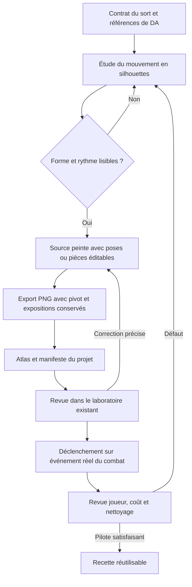

# Produire les effets de sorts de Catabase

## Décision proposée

La voie la plus réaliste est une **production hybride à dominante peinte** : quelques formes et textures originales, une animation courte dont le rythme est contrôlé, des éléments secondaires paramétrables et, lorsque cela apporte quelque chose, un shader simple. Godot reste le moteur d'intégration. Krita est le premier outil d'auteur à éprouver ; Blender, déjà présent sur le poste, sert aux besoins de volume, de perspective ou de géométrie réutilisable.

La priorité est de réussir un aller-retour complet : fabriquer un mouvement simple, le regarder dans le jeu, corriger une pose ou un paramètre, réexporter et constater que la correction conserve le reste. Une pipeline existe réellement lorsque cet aller-retour est fiable. Une belle image, un atlas techniquement valide et un éditeur de particules ne suffisent pas séparément.

Cette recommandation est une adaptation au projet, et non la description d'une pipeline interne unique d'Ankama. Les sources publiques documentent certaines productions avec précision, d'autres seulement partiellement. Les passages « fait documenté », « constat local » et « recommandation » distinguent ces niveaux. Le [plan des outils et compétences](vfx_tools_learning_plan_2026-09-12.md) traduit les conclusions en exercices et décisions d'équipement.

## Ce que recouvrent les techniques

« VFX », « shader » et « sprite » ne sont pas trois solutions concurrentes. VFX désigne l'effet visuel composé. Un sprite est un support d'image ; un système de particules distribue des éléments dans le temps et l'espace ; un shader détermine leur rendu. Un même effet peut employer les trois. Godot documente explicitement des particules utilisant une texture fixe ou un flipbook, c'est-à-dire plusieurs dessins contenus dans une texture.[^11]

| Élément | Fonction | Usage pertinent dans Catabase | Difficulté principale |
| --- | --- | --- | --- |
| Dessin fixe sur sprite | Fournir silhouette, couleur et matière | Éclat de bronze, feuille, trait de pinceau | Dessin lisible et alpha propre |
| Flipbook | Remplacer le dessin au fil du temps | Contact qui s'ouvre, fumée qui se défait | Continuité des formes et rythme |
| Particules | Répéter un élément avec des variations bornées | Poussière, étincelles, débris | Distribution, hiérarchie et nettoyage |
| Ruban ou maillage | Porter une texture sur une forme contrôlée | Traînée de lance, arc, onde au sol | UV, perspective et raccords |
| Shader de matériau | Faire varier couleur, opacité ou coordonnées de texture | Érosion d'une poussière, reflet, courant | Préserver le dessin tout en le transformant |
| Simulation puis rendu | Produire des images à partir d'un volume animé | Grosse fumée ou tourbillon complexe | Simulation, stylisation, export et mémoire |
| Composition et déclenchement | Ordonner l'ensemble et le relier au jeu | Impact au bon moment et sur la bonne cible | Sens du sort, ancrages et synchronisation |

Le mot « procédural » ne signifie pas nécessairement « simulation réaliste ». Trois éclats dont on choisit les trajectoires sont déjà une animation paramétrable. Inversement, une simulation complexe peut finir dans un simple atlas 2D. La documentation EmberGen décrit cette sortie en flipbook PNG avec couleur et alpha, ou en séquence d'images.[^17]

## Ankama : méthodes établies et inconnues

### Dofus historique : dessin animé et révision artistique

**Fait documenté.** Julien Pingault présente ses effets Huppermage comme des animations 2D réalisées sous Flash/Animate pour Dofus. La publication date du 12 janvier 2019 et se rapporte à la classe sortie en 2016 ; elle inclut des variantes et des propositions non retenues. C'est une preuve d'outil d'auteur et de travail d'animation pour cette production, pas une description du format runtime de tous les sorts actuels.[^1]

Son étude Xélor raconte une première refonte dont les animations fonctionnaient, mais dont les couleurs manquaient de variété et les sorts de détails. Une autre direction lui a ensuite été demandée. L'exemple montre que la réussite du mouvement ne clôt pas la revue artistique d'une famille de sorts.[^2]

**Transfert proposé.** Étudier les poses, les espacements et les ruptures de forme ; conserver plusieurs essais ; comparer les effets à l'échelle du kit. Reproduire une méthode d'observation et de correction est plus utile que chercher un réglage donnant automatiquement un « rendu Dofus ».

**Inconnu.** Ces portfolios ne publient pas les fichiers complets, les conventions d'export, les outils de validation, le format de conversion Unity ou la chaîne d'approbation actuelle. Rien ici ne permet d'affirmer que Dofus 3 utilise exclusivement des spritesheets, exclusivement des shaders ou un pourcentage précis de chaque technique.

### Nindash : un exemple de chaîne de production explicite

**Fait documenté.** Dans son post-mortem, le directeur artistique Romain Pergod décrit des animations découpées très économes en images, réalisées dans Adobe Animate, exportées en PNG puis importées dans Unity. Un boss devenant trop volumineux pour cette méthode est traité comme une marionnette animée dans Unity. Sylvain Guerrero apporte les FX, shaders et animations complexes ; les effets assemblent plusieurs systèmes de particules, parfois accompagnés de shaders.[^3]

Le noyau de trois personnes bénéficie de spécialistes et des autres services d'Ankama. Son journal de production identifie les rôles de game designer, développeur et graphiste, ainsi que l'appui d'un technical artist. Ce n'est donc pas la preuve que trois débutants isolés peuvent obtenir le même résultat dans le même délai.[^4]

**Transfert proposé.** Choisir la méthode par élément. Préserver une animation dessinée lorsqu'elle porte l'expression ; passer à des pièces animées lorsque les images deviennent disproportionnées ; associer art et technique dès les premiers essais.

### Cosmobot : particules et shaders dans une autre production Ankama

**Fait documenté.** Le post-mortem de Cosmobot nomme Unity Shuriken pour les effets et présente séparément un shader de vortex avec son code. Les crédits distinguent direction artistique et FX/technical art. Cette preuve concerne Cosmobot et confirme la diversité des techniques au sein du studio.[^5]

**Transfert proposé.** Une collection limitée de bonnes textures, quelques comportements et un matériau spécialisé peuvent constituer une bibliothèque utile. La cohérence dépend de leur direction artistique et de leur combinaison.

### Dofus Unity et Waven : limites de la connaissance publique

Jérémie Segura décrit son travail sur les nouveaux rendus et effets visuels de Dofus avec les développeurs et level designers ; son profil mentionne shaders, éclairage, outils d'éditeur et VFX. Ses publications portent notamment sur les animations de maps. Elles n'établissent pas le procédé de fabrication de chaque sort.[^6]

Le portfolio de Benjamin Philippot identifie un rôle VFX sur Waven et plusieurs compétences techniques. Une liste de logiciels maîtrisés ne prouve pas que chacun est utilisé dans la pipeline du jeu.[^7] Le projet « Waven Execution VFX » de Romain Maquoi est explicitement un test technique de recrutement : son délai de cinq jours et sa réalisation ne doivent pas être présentés comme un standard de production Ankama.[^8]

La fabrication de la série animée Wakfu constitue encore un autre contexte. Une technique de compositing pour une série ou une bande-annonce ne garantit ni le coût, ni la réactivité, ni l'intégration d'un effet de combat temps réel.

## Autres studios : principes transférables

### Riot : direction visuelle commune et boucle d'itération

Riot articule son guide VFX autour de la lisibilité du gameplay, de la limitation de l'encombrement, de l'identité du personnage et du plaisir visuel. Les axes cités sont gameplay, valeurs, couleurs, formes et timing. Le guide de 2017 est une référence de conception, pas un standard technique contemporain à transposer tel quel.[^9]

Son contenu pédagogique rappelle qu'il faut juger un effet à l'échelle d'un kit puis du jeu entier, et qu'aucune construction technique universelle ne convient à tous les VFX.[^10] **Application à Catabase :** une protection, une frappe et un soin doivent se distinguer également par leur silhouette et leur mouvement, même lorsqu'ils partagent des matières et des couleurs.

Le retour « Cleaning Up Data Debt in League » décrit un autre problème : des références ambiguës, des conventions multiples et des informations cachées ralentissaient les artistes. Des chemins explicites, le rechargement des textures et paramètres et une expérimentation sur un sous-ensemble ont rendu la production plus praticable. Le cas porte sur une migration de données, pas sur l'apprentissage du dessin.[^12]

**Application proposée :** un seul manifeste explicite et une voie d'export identifiable pour le pilote ; réutiliser les services du projet ; automatiser les opérations répétitives après avoir observé un vrai cycle de correction. Il n'est pas nécessaire de reproduire l'infrastructure de Riot pour bénéficier de cette leçon.

### RiME : des matériaux spécialisés, que l'on peut étudier

Simon Trümpler présente trois effets de RiME et publie, avec l'accord de Tequila Works, un matériau de feu attribué à David Miranda. Le fichier doit être accompagné de textures de bruit et de masque fournies séparément. La page renvoie aussi à des explications de réglage de matériau et de particules pour la fumée.[^13]

Cette source est utile parce qu'elle rapproche un résultat et un mécanisme concret. Elle contient également des contributions ultérieures et des hypothèses sur d'autres jeux ; il faut les distinguer des éléments de RiME. La conférence principale étant vidéo, la seule lecture de sa page ne permet pas de revendiquer l'analyse image par image de tout son contenu.

**Application proposée :** apprendre un petit matériau d'érosion sur une poussière Catabase. Sa texture doit déjà exprimer la bonne matière ; le shader règle la disparition. Le matériau Unreal publié sert de support d'étude, pas de fichier directement importable dans Godot.

## Comment fabriquer un effet en pratique

### Séparer le dessin, le mouvement et le rendu

Pour un impact, commencer par une silhouette presque monochrome. Elle permet d'évaluer la direction et la force sans que la texture ou l'éclairage compensent un mouvement confus. Définir les états déterminants : apparition, ouverture maximale, rupture, résidu. Les intervalles entre ces états comptent autant que les dessins.

Ensuite seulement, appliquer les matières. Pour Catabase, l'ivoire peut porter un accent de contact ; le bronze, une surface patinée ; le pétrole, les contours et les ombres ; la terre cuite, des revers. Ces rôles reprennent la [direction artistique locale](catabase_direction_artistique_v1.md). Une conversion systématique en jaune lumineux gommerait la différence entre peinture, métal et énergie.

Les secondaires doivent être évalués séparément. Couper temporairement poussières et éclats permet de vérifier si l'action principale reste compréhensible. Les réactiver permet de voir s'ils ajoutent du poids, une direction ou une matière. Ajouter des éléments uniquement parce que l'image paraît vide risque de surcharger le combat.

### Quatre voies d'auteur, avec des limites différentes

**Animation dessinée.** Chaque pose peut changer de silhouette et de topologie : une masse s'ouvre, se sépare puis se dissout. C'est adapté aux accents très expressifs. La charge se situe dans la création et la correction des poses ; un moteur ne peut pas inventer les intermédiaires artistiques manquants. Krita propose animation raster image par image, pelure d'oignon, timeline et transformations animées par masques.[^14]

**Pièces peintes animées.** Un éclat, une feuille ou une bande de tissu peut garder son dessin tout en changeant de position, taille, orientation et opacité. C'est une voie contrôlable pour un petit nombre d'éléments. Une pièce que l'on fait simplement tourner ne révèle cependant pas naturellement son revers ; il faut prévoir un dessin de remplacement si cette rotation est importante.

**Textures et matériaux.** Un masque définit où l'effet existe, une texture donne sa matière, un paramètre temporel règle une érosion ou un défilement. Faire varier un seuil dans un masque peut produire une disparition fragmentée ; diminuer uniformément l'opacité produit seulement un fondu. Les shaders CanvasItem fournissent les opérations de rendu 2D et les modes de mélange nécessaires.[^15] Le masque de disparition doit être dirigé comme un dessin : un bruit générique n'assure pas une bonne silhouette.

**Volume puis rendu 2D.** Construire une forme ou un mouvement dans Blender peut aider pour la perspective, un ruban tournant ou un effet volumique. On rend ensuite des images depuis la caméra utile, avant correction éventuelle. Grease Pencil permet aussi de dessiner et animer dans un espace 3D.[^16] Cette voie ajoute caméra, rendu et stylisation : elle doit résoudre un problème identifié, et ne constitue pas un raccourci automatique vers la peinture.

### Cadence et temps : une distinction indispensable

Le nombre de dessins uniques, le nombre d'images exportées et la fréquence d'affichage du jeu sont trois quantités distinctes. Un dessin maintenu pendant deux unités de temps peut être exporté deux fois. Par exemple, une séquence de huit dessins avec des expositions `1, 1, 2, 2, 1, 1, 2, 2` contient douze unités. À 40 unités par seconde, elle dure 300 ms : c'est un exemple de calcul, pas une recommandation artistique universelle.

Krita peut exporter toutes les images temporelles ou seulement les dessins uniques. Pour un lecteur à cadence uniforme, supprimer les répétitions sans conserver les durées changerait le rythme. La séquence PNG permet également de reprendre une image défectueuse sans reconstruire une vidéo entière.[^18]

Pour le premier pilote, mieux vaut exporter les répétitions dans une grille régulière que développer immédiatement un nouveau lecteur. Les durées de la proposition précédente, « 6 à 8 dessins / environ un quart de seconde », restent des hypothèses à comparer en mouvement.

### Transparence, échelle et coût

Un vrai canal alpha est préférable à un fond coloré retiré après coup. Le détourage magenta du candidat Éclat de fresque est un traitement de secours, dont les contours exigent une inspection. Godot distingue correction des bordures alpha et prémultiplication ; celle-ci doit être cohérente avec le matériau choisi.[^19]

L'additif convient à certains accents lumineux, mais c'est une mauvaise convention globale pour des matières peintes : il peut faire disparaître les ombres et éclaircir les superpositions. Commencer par un mélange alpha normal permet de juger la palette avec moins de variables.

Le coût ne dépend pas seulement du nombre de particules. Des surfaces transparentes larges et superposées multiplient le travail de rendu ; Godot recommande de limiter ces surfaces et de mesurer sur le matériel cible.[^20] Un atlas RGBA8 non compressé de 2048 × 2048 représente 16 Mio avant mipmaps et autres allocations ; 4096 × 4096 représente 64 Mio. Ces calculs ne sont ni la taille du PNG ni une mesure du jeu.

## État réel de Catabase

Les constats suivants reposent sur les fichiers du dépôt à la révision `0bdfd5bffca5df5d5d7a8206dc651b050b7c7a43`, avec modifications locales en cours. Ils décrivent des capacités observées dans le code ; les résultats d'exécution sont séparés plus bas.

| Capacité | Constat | Conséquence |
| --- | --- | --- |
| Lecture d'atlas | `VFXFlipbookAsset` et `VFXFlipbookVisual` : grille, cadence, durée de module, variantes, qualité, pivot et fusion | Base suffisante pour un premier contact dessiné |
| Durées par pose | Le lecteur échantillonne uniformément ; pas de tableau d'expositions par pose dans l'asset | Conserver les répétitions lors du premier export |
| Transformation | Rotation, échelle, couleur et opacité configurées au départ | La rotation automatique vers la cible et les courbes de pièces restent à traiter |
| Courbes | `VFXModuleData` expose une courbe ; le lecteur flipbook ne l'applique pas à ses transformations | Ne pas confondre un champ disponible et un comportement implémenté |
| Particules du compositeur | `ParticleBurstModule` trace des cercles et des rayons déterministes | Ce n'est pas encore un émetteur de fragments texturés |
| Cycle de vie | Instance : avance, annulation, nettoyage, durée maximale | Contrat existant à conserver et vérifier |
| Fin de sous-module | Le dernier dessin peut rester affiché jusqu'à la fin de la séquence | Prévoir une fin transparente ou traiter explicitement la fin du module |
| Revue temporelle | Le laboratoire flipbook expose lecture, pause, replay et scrub absolu par reconstruction | Réutiliser cette base, ne pas recréer un lecteur de revue séparé |
| Données | Manifeste, checksums, brouillons, copies et snapshots | La traçabilité est déjà largement présente |
| Publication | `VFXTestPublicationService` limite les sorties aux fixtures de test ; l'UI l'annonce | Le bouton de publication ne livre pas un sort en production |
| Atelier de sprites | Poses remplaçables et export avec durées ; format distinct | Réutiliser la méthode de revue, prévoir un adaptateur si ce format est retenu |

Fichiers de preuve : [asset](../../../vfx/data/vfx_flipbook_asset.gd), [lecture](../../../vfx/modules/vfx_flipbook_visual.gd), [module](../../../vfx/data/vfx_module_data.gd), [particules actuelles](../../../vfx/modules/vfx_module_visual.gd), [instance](../../../vfx/runtime/vfx_runtime_instance.gd), [manifeste](../../../vfx/services/vfx_flipbook_manifest_service.gd), [publication de test](../../../vfx/services/vfx_test_publication_service.gd), [laboratoire](../../../tools/labs/vfx_flipbook_foundation/vfx_flipbook_foundation_lab.gd), [atelier de sprites](../../../tools/sprite_workshop/README.md).

### Vérifications exécutées

Le diagnostic identifie Godot `4.7.1.stable.official.a13da4feb`, GUT `9.7.1`, le formateur et le workbench. Il ne valide pas l'import. La présence de Blender `5.1` est confirmée par son exécutable ; Krita et Animate ne sont pas retrouvés dans le PATH et les emplacements Program Files examinés. Ce relevé limité ne prouve pas leur absence de tout le poste.

Le premier lancement de `test/unit/test_vfx_flipbook_foundation.gd` s'arrête à l'import : accès au magasin de certificats et à des sous-dossiers refusés, **zéro test exécuté**. Le second lancement hors du contexte restreint exécute **18 tests et 487 assertions, tous réussis dans GUT**, mais le harnais strict reste **FAIL** : six allocations de textures RID et dix-huit ressources encore utilisées sont signalées à la sortie. L'origine des références restantes n'est pas encore établie. Ce n'est pas une validation complète de la chaîne.

Rapports : [premier essai](../../../artifacts/dev/20260912-111219-test-test_unit_test_vfx_flipbook_foundation.gd-7ae9e863/summary.json), [second essai strict](../../../artifacts/dev/20260912-111401-test-test_unit_test_vfx_flipbook_foundation.gd-a659be53/gut-strict-report.json), [journal GUT](../../../artifacts/dev/20260912-111401-test-test_unit_test_vfx_flipbook_foundation.gd-a659be53/gut.stdout.log). Les essais headless ne prouvent pas le rendu GPU ni la qualité artistique. Aucun nouveau sort n'a été intégré pour établir ces constats.

## Pipeline proposée pour un premier effet

Ce schéma est une proposition pour Catabase. Les outils d'auteur varient selon les éléments, mais les critères de passage restent communs.

| Étape | Livrable | Contrôle qui autorise la suite |
| --- | --- | --- |
| Contrat | Une fiche : action, cible, instant, durée, direction, information à préserver | L'effet raconte les règles existantes |
| Étude | Plusieurs rythmes d'une même silhouette simple | Le mouvement se lit à vitesse réelle et petite taille |
| Source | Poses et pièces éditables, palette et référence conservées | Une correction locale ne détruit pas le reste |
| Export | PNG RGBA, grille, pivot commun, ordre et expositions | Pas de saut, rognage, halo ou perte de durée |
| Composition | Contact seul puis secondaires activables | Chaque couche a un rôle identifiable |
| Laboratoire | Relecture reproductible sur plusieurs fonds et directions | Image de référence et candidat comparables |
| Combat | Effet lié aux cibles réellement résolues | Aucun impact fictif, doublon ou déplacement des dégâts |
| Livraison | Source, export, profil, rapport technique et revue visuelle à jour | Reproduction et correction fiables, coût acceptable |

La revue de combat doit vérifier le premier déclenchement, les répétitions, les impacts simultanés pertinents pour le jeu, les cibles disparues et les interruptions. La version à animations réduites conserve l'information utile en réduisant les secondaires. Pour un bouclier, séparer apparition, maintien, réaction au coup et fin ; pour une frappe instantanée, ne pas inventer une longue anticipation visuelle après que les dégâts ont déjà été résolus.

L'orientation demande également un choix explicite. Un impact dans le plan de l'écran peut tourner ; une onde au sol doit respecter la projection isométrique ; une forme volumique asymétrique peut nécessiter des vues distinctes. Une rotation 2D arbitraire d'une image peinte ne remplace pas automatiquement ces vues.

## Réalisme des capacités et travail d'apprentissage

**Capacités étayées.** Le projet sait lire des atlas, conserver des profils, comparer des poses et vérifier des propriétés techniques. La préparation du candidat précédent a produit des calques et une transparence reconstruite. Cela donne un point de départ utile pour les fichiers et l'intégration.

**Capacités à démontrer.** La continuité d'une animation originale peinte, la qualité des corrections de contours, le choix du rythme, la lecture de plusieurs effets ensemble et le coût réel sur le matériel cible ne sont pas établis par ces livrables. L'ouverture d'un fichier à calques ne prouve pas que sa retouche sera agréable ou rapide. Il faut mesurer cette opération concrètement.

Une assistance automatisée est adaptée à la génération de variantes contrôlées de paramètres, aux masques simples, aux exports et aux vérifications. La génération d'images peut aider à explorer une matière ou une silhouette. Elle ne garantit pas la constance d'une séquence, un alpha propre, des contours identiques entre poses, ni une correction locale stable. L'animation finale doit pouvoir être reprise sans dépendre d'une régénération globale.

Trois voies restent possibles : apprendre à fabriquer quelques poses peintes ; employer davantage de pièces animées et de matériaux pour réduire le dessin nécessaire ; faire intervenir ponctuellement un animateur FX pour une animation pilote et sa critique. La compétence graphique disponible dans l'équipe n'étant pas mesurée, il serait prématuré de choisir définitivement entre ces voies ou de promettre une qualité de studio à date fixe.

Le premier exercice doit volontairement rester modeste : une empreinte monochrome, trois rythmes, même durée totale, même point de contact, même scène. Une fois le rythme choisi, peindre un seul traitement et corriger une pose. Cet exercice teste simultanément l'apprentissage et la facilité de production. La proposition « Éclat de fresque » reste une référence exploratoire ; sa silhouette n'est pas un choix artistique acquis.

## Outillage à développer, dans l'ordre

1. **Fiabiliser la base existante.** Diagnostiquer les ressources signalées à la fermeture des tests ; éprouver l'ouverture, la retouche et l'export de quelques poses dans l'outil d'auteur. Livrable : une boucle de correction qui fonctionne réellement.
2. **Adapter l'export au contrat actuel.** Préserver grille carrée, expositions répétées et pivot ; réutiliser le validateur de manifeste. L'atlas de l'atelier de sprites contient ses propres gouttières et données : il ne faut pas supposer sa compatibilité directe avec `Sprite2D.hframes/vframes`.
3. **Ajouter uniquement ce que demande le pilote.** D'abord orientation explicite et fin du module si elles sont nécessaires ; ensuite animation de pièces ou émetteur texturé. Pour trois éclats, des sprites avec trajectoires peuvent être plus simples à diriger qu'un système GPU.
4. **Éprouver un matériau d'érosion.** Paramètre de progression piloté par la timeline, texture de masque originale, comparaison avec un simple fondu. Le temps global d'un shader ne doit pas empêcher pause et replay.
5. **Préparer le passage au jeu.** Réutiliser `VFXManager.play_profile` et les événements existants ; vérifier la correspondance avec le sort sans contourner la séparation entre publication de test et production.

Le nœud Godot `GPUParticles2D` pourra être évalué lorsque le besoin d'émission le justifiera. Sa documentation décrit graine fixe, relance, coordonnées locales et globales et traitement temporel ; leur adéquation à notre scrub et notre nettoyage doit être vérifiée, sans présumer une reproductibilité identique entre tous les GPU.[^21]

## Critères de réussite et d'abandon d'une méthode

Un pilote réussi se comprend en situation, respecte la DA, se corrige sans repartir de zéro et se livre avec des sources. Sa valeur de référence vient autant de sa correction démontrée que de son rendu final. Mesurer le temps actif de création, le temps d'attente, le nombre de reprises et le temps de réexport permet ensuite d'estimer la production d'un second effet.

Les seuils initiaux proposés sont organisationnels, pas des normes de studio : après deux corrections ciblées sans progrès visible, réexaminer la méthode ou demander une critique ; après un aller-retour qui change involontairement d'autres poses, corriger la chaîne avant de produire davantage. Conserver les essais rejetés et leur motif évite de les réintroduire comme références approuvées.

Ne pas acheter un logiciel de simulation pour résoudre un problème de timing ; ne pas développer un grand éditeur pour résoudre un problème de dessin ; ne pas ajouter de glow pour résoudre un problème de contraste. Les décisions d'achat, de code et d'apprentissage doivent correspondre au défaut observé. Aucun délai ou coût par sort ne peut être extrapolé sérieusement avant le premier pilote complet.

## Sources et portée

Sources consultées le 12 septembre 2026. Les témoignages historiques décrivent leur époque. Les pages de formation attestent un programme, pas son efficacité pour une personne donnée. Aucun fichier commercial de formation ni fichier interne Ankama n'a été examiné. Les liens vers des démonstrations vidéo sont des supports d'étude, sans prétendre à leur visionnage intégral.

[^1]: Julien Pingault, [2D ANIMATION FX — Dofus GAME — Huppermage](https://www.behance.net/gallery/74754737/2D-ANIMATION-FX-Dofus-GAME-Huppermage), 12 janvier 2019. Témoignage direct : Flash/Animate, variantes et sorts non retenus.
[^2]: Julien Pingault, [2D ANIMATION FX — Dofus GAME — Xélor](https://www.behance.net/gallery/75090073/2D-ANIMATION-FX-Dofus-GAME-Xlor-), 19 janvier 2019. Témoignage direct de révision artistique.
[^3]: Romain Pergod / Sephy, [NINDASH — How to create a mobile game in 3 months with a (core) team of 3](https://sephyka.com/game-post-mortem/ankama-nindash/), date de publication non affichée dans l'extrait accessible. Texte détaillé accessible via indexation ; l'ouverture directe échoue lors de la consultation. Ne documente pas la pipeline actuelle de Dofus.
[^4]: Romain « art of Sephy » Pergod, [NINDASH: Skull Valley — journal de production](https://openclassrooms.com/forum/sujet/jeu-mobile-nindash-skull-valley), 11 août 2017. Présentation directe de l'équipe, des outils et du soutien FX.
[^5]: Romain Pergod / Sephy, [ANKAMA — Cosmobot](https://sephyka.com/game-post-mortem/ankama-cosmobot/), production mobile de 2018, publication non datée sur la page. Sections Cosmo-Visual Effects, Shaders et crédits.
[^6]: Jérémie Segura, [profil et publications professionnelles](https://fr.linkedin.com/in/jeremie-segura), publications sur le portage Dofus Unity ; dates relatives. Témoignage technique, principalement rendu des maps.
[^7]: Benjamin Philippot, [Resume](https://benphi.artstation.com/resume), page non datée, expérience Waven mentionnée. Ne détaille pas les étapes de fabrication.
[^8]: Romain Maquoi, [Waven Execution VFX](https://rplm.artstation.com/projects/K3x6bX), page non datée. Test de recrutement explicitement identifié ; pas un effet établi comme livré en jeu.
[^9]: Riot Games / Jin ho Yang, [/dev: League's VFX Style Guide](https://nexus.leagueoflegends.com/en-us/2017/10/dev-leagues-vfx-style-guide/), octobre 2017. Article indexé ; l'adresse directe et son ancien PDF redirigent vers le site du jeu. Aucun contenu détaillé du PDF non accessible n'est supposé consulté.
[^10]: Riot Games, [So You Wanna Make Games? — Visual Effects](https://www.riotgames.com/en/artedu/visual-effects), épisode 7, page pédagogique non datée. Objectifs, cohérence du kit et ressources d'apprentissage.
[^11]: Godot Engine, [2D particle systems](https://docs.godotengine.org/en/stable/tutorials/2d/particle_systems_2d.html), documentation stable consultée. La page signale une mise à jour incomplète pour 4.7 ; vérifier les détails contre les classes et le moteur local.
[^12]: Stephen Zhang / Riot Games, [Cleaning Up Data Debt in League](https://www.riotgames.com/en/news/cleaning-data-debt-league), 25 septembre 2018. Références d'assets, retours immédiats et essai limité avant migration étendue.
[^13]: Simon Trümpler, [Stylized VFX in RiME](https://simonschreibt.de/gat/stylized-vfx-in-rime/), 7 juin 2017 et mises à jour. Page de conférence, matériau de feu autorisé et distinctions entre productions et contributions.
[^14]: Krita, [Animation with Krita](https://docs.krita.org/en/user_manual/animation.html), manuel 5.3 consulté. Timeline raster, pelure d'oignon et masques de transformation.
[^15]: Godot Engine, [CanvasItem shaders](https://docs.godotengine.org/en/stable/tutorials/shaders/shader_reference/canvas_item_shader.html), documentation stable consultée. Modes de mélange, UV, couleur et temps.
[^16]: Blender Foundation, [Story Artist](https://www.blender.org/features/story-artist/), présentation officielle de Grease Pencil, page non datée.
[^17]: JangaFX, [EmberGen — Getting Started](https://docs.jangafx.com/embergen/pages/getting_started.html), documentation consultée. Export couleur/alpha en flipbook ou séquence ; aucune mesure locale de performance.
[^18]: Krita, [Render Animation](https://docs.krita.org/en/reference_manual/render_animation.html), manuel 5.3 consulté. Séquence PNG, images uniques et export vidéo.
[^19]: Godot Engine, [Importing images](https://docs.godotengine.org/en/stable/tutorials/assets_pipeline/importing_images.html), documentation stable consultée, sections Fix Alpha Border et Premult Alpha.
[^20]: Godot Engine, [GPU optimization](https://docs.godotengine.org/en/stable/tutorials/performance/gpu_optimization.html), documentation stable consultée, section Transparency and blending. Les conseils historiques spécifiques à des plateformes ne sont pas repris comme règles universelles.
[^21]: Godot Engine, [GPUParticles2D](https://docs.godotengine.org/en/stable/classes/class_gpuparticles2d.html), référence stable consultée. Graine, relance et espaces de simulation ; ne démontre pas le comportement d'un module qui n'existe pas encore dans le projet.
