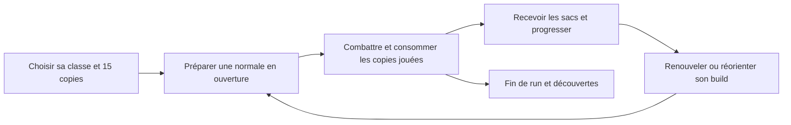

# Refonte complète du mode Cartes — candidat V2

**Une run à cartes consommables, avec des builds qui survivent au renouvellement des copies et des combats où le placement économise des ressources.** La préparation fixe ici un candidat cohérent à implémenter : règles, contenu, parcours, sauvegarde et réception. Elle ne prétend pas avoir déjà mis ces règles dans Godot.

Version `2.0.0-design.1`, 26 septembre 2026. Base Git `c6ab5a72c1789e4cc285300c9bbae9c78524fa05`. Les travaux locaux de sélection, sprites et VFX sont préservés. Les versions antérieures des études restent des références historiques ; leurs variantes concurrentes ne s'additionnent pas à ce contrat.

## Le jeu proposé



| Élément | Décision retenue |
|---|---|
| Run | 20 profondeurs, 12 rencontres, niveau maximum 12 |
| Départ | 15 normales, maximum trois copies par famille, 40 or |
| Tour | Quatre PA, trois PM, remplissage de main jusqu'à cinq |
| Préparation | Jusqu'à 30 cartes ; une normale préparée dans la main initiale, facultative |
| Consommation | Copie jouée détruite après engagement valide ; copie inutilisée conservée |
| Identité | Quatre classes, huit spécialisations ; passif de classe + spécialisation explicitement bornés |
| Progression | Trois familles améliorables pour tous leurs exemplaires présents et futurs |
| Contenu | 48 familles, dont 23 retouchées ; 18 équipements et huit reliques |
| Ressources | Sacs, achats ciblés, trocs et soins ; stocks marchands finis |
| Combat | Relais, sacrifice choisi, retour d'ancre, eau/glace/vapeur et réactions ennemies lisibles |
| Reprise | Après chaque action complète ; nouveau fichier versionné, anciennes runs conservées |

## Ce qui donne une identité à chaque classe

**Assassin : préparer puis choisir la prochaine victime.** Marque et finisseur restent accessibles au départ. Au niveau 4, Exécuteur renforce les seuils de mort ; Relais transmet une marque bornée après une élimination. Le choix porte sur la cible suivante et la fenêtre d'attaque.

**Gardien : choisir ce qu'il engage.** La garde peut être gardée pour encaisser et riposter ou dépensée avec Répercussion. Choc de masse utilise un obstacle fixe. À P40, le couple Garde ferme + Répercussion maximale produit 76 dégâts bruts et conserve 14 garde, contre 60 dégâts et 46 garde pour Garde ferme + Heurt du rempart, hors autres bonus. Les deux choix ont des situations d'emploi.

**Arpenteur : préparer une position de tir et une sortie.** Ancre de repli remplace le gain de PM de classe. Tir de relais échange une partie du dégât contre une pioche conditionnée par le mouvement. La ligne de Pluie de pointes et la croix de Volée demandent des formations différentes.

**Thaumaturge : créer une situation puis décider de sa transformation.** Onde du Léthé apporte de l'eau normale ; givre la fige, braise la transforme en vapeur qui ferme la vision. Le preset standard garde marque et dégâts préparés ; le preset terrain permet d'essayer cette autre manière de jouer dès le départ.

## Ce que nous avons décidé de ne pas empiler

Pas de réserve globale de PA, de nouvelle jauge, de compagnons complets ou de jetons générés dans ce candidat. Pas de six cartes supplémentaires de filtrage/conversion : des cartes existantes changent d'usage. Le transfert de marque devient une spécialisation ; Condensation est écartée. Les prix et pools V1 restent le témoin économique initial.

La main n'est pas agrandie globalement. La fiabilité vient d'une normale préparée et, si le joueur investit dedans, d'une amélioration de rétention. Les rares extraordinaires restent facultatives ; aucun ennemi ne doit exiger une carte précise de cette rareté.

## Un dossier utilisable directement pour le portage

| Document | Usage |
|---|---|
| [Règles fermées](REGLES.md) | Arbitrage des coûts, déclencheurs, durées, ordre, sauvegarde et économie |
| [Catalogue complet](CATALOGUE.md) | Toutes les cartes et améliorations, spécialisations, objets et reliques |
| [Rencontres et calibration](CONTENU_ET_RENCONTRES.md) | Route pédagogique, variantes ennemies, Pâris et hypothèses d'équilibre |
| [Parcours joueur](PARCOURS_JOUEUR.md) | Maquettes textuelles de sélection, combat, bilan et marchand |
| [Intégration](INTEGRATION.md) | Fichiers, adaptateurs, migration, six lots et critères de réception |
| [Manifeste](manifest.json) | Données numériques complètes et identifiants du profil |
| [Vérification](VERIFICATION.json) | Résultats exacts des contrôles du paquet et des microcalculs |

Les scripts [preparer.mjs](preparer.mjs) et [verifier.mjs](verifier.mjs) régénèrent le catalogue et contrôlent les références, la conservation des pools, les presets et des conséquences chiffrées. Les empreintes [verrouillées](SOURCES_VERROUILLEES.json) empêchent d'hériter silencieusement d'une modification de V1.

```powershell
node docs/design/cartes_refonte_v2_2026-09-26/preparer.mjs
node docs/design/cartes_refonte_v2_2026-09-26/verifier.mjs
```

Ces contrôles sont des vérifications de **préparation**, pas des tests du nouveau gameplay. Le fichier de vérification distingue explicitement ce qui a été exécuté et ce qui relève de la mise en place.

## Ordre de mise en place retenu

1. Profil et catalogue isolés, avec IDs stables et accès expérimental.
2. Consommation, ouverture et checkpoint par action.
3. Effets, quatre identités, arrondis et prévision.
4. Progression, butin, transactions et parcours entre combats.
5. Rencontres, salles réelles, IA et Pâris.
6. Parcours public, contrôles complets, observation humaine puis calibration.

L'ancienne sauvegarde ne change pas de règles en cours de partie. Après réception, les nouvelles parties Cartes utilisent V2 ; les anciennes restent restaurables. Les sprites et la présentation en cours servent ce parcours, sans imposer de refaire la direction artistique.

## Appuis et limites

Ce candidat consolide [la V1 consommable](../consumable_v1/REGLES_V1.md), [l'audit des cartes](../spell_comparison_2026-09-25/AUDIT_ET_PRIORITES.md), [la critique et ses calculs](../gameplay_critique_2026-09-25/README.md), [les expériences d'économie/pilotage](../waven_investigation_2026-09-26/suite_02/README.md) et [la lecture des mécanismes WAVEN](../waven_coeur_du_jeu_2026-09-26/README.md).

Les paramètres de départ sont tranchés pour rendre l'implémentation possible. Leur plaisir et leur difficulté restent à mesurer : les anciens taux de victoire ne valident pas V2. Priorités de calibration : premiers combats, coût du sacrifice de garde, valeur du repli, preset Terrain, protections ennemies, pression et renouvellement du stock.
