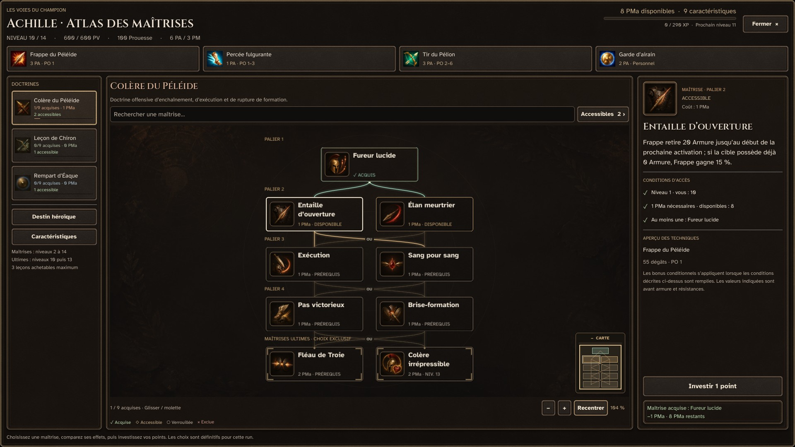
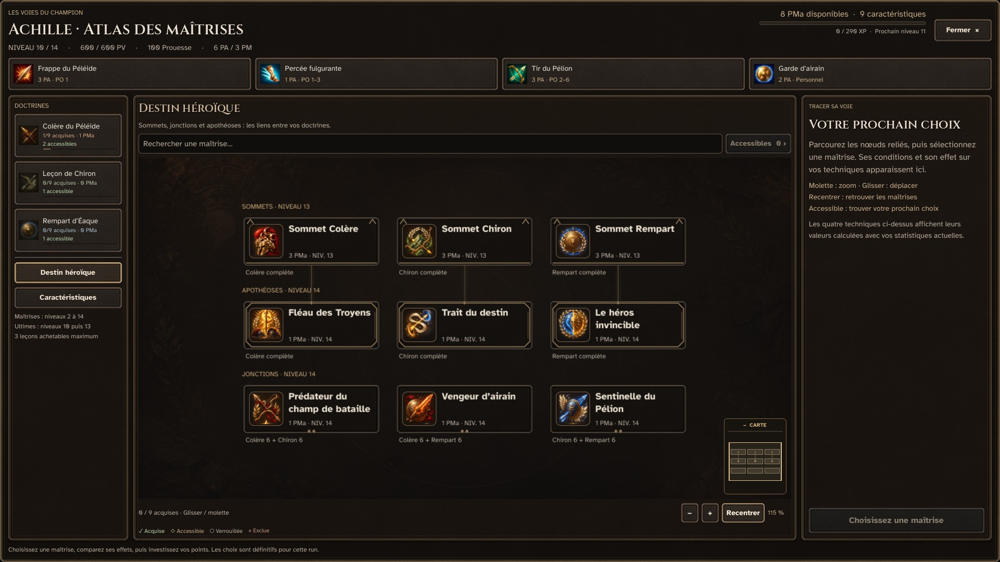

# L’atlas des maîtrises — bibliothèque visuelle v2

La bibliothèque remplace les pictogrammes génériques des 36 maîtrises d’Achille. Chaque effet possède une illustration peinte distincte, utilisée à la fois dans le graphe et la fiche d’inspection. Les quatre caractéristiques disposent aussi de leur propre illustration. Aucun coût, prérequis ou effet de combat n’est modifié.

## Bibliothèque livrée

| Planche | Contenu | Lecture visuelle |
| --- | --- | --- |
| `wrath_sheet.png` | 9 maîtrises de Colère | Bronze, cuivre et rouge ; enchaînement, brèche, élimination et riposte |
| `chiron_sheet.png` | 9 maîtrises de Chiron | Sauge, ivoire et argent ; portée, placement, contrôle et trajectoires |
| `aeacus_sheet.png` | 9 maîtrises du Rempart | Bronze et bleu ; absorption, orientation, stabilité et protection |
| `heroic_sheet.png` | 3 sommets, 3 jonctions, 3 apothéoses | Or et laurier ; spécialisation, combinaison des techniques et destin héroïque |
| `attributes_sheet.png` | Vitalité, Puissance, Résolution, Sagesse | Cœur, poing armé, bouclier, chouette et parchemin |

Les cinq PNG originaux font 1 254 × 1 254 pixels. Les cellules mesurent 418 × 418 pixels pour les maîtrises, 627 × 627 pour les caractéristiques. Les sources ne sont pas retouchées lors de l’intégration : Godot utilise 40 ressources `AtlasTexture`, avec mipmaps et filtrage linéaire pour garder un rendu stable pendant le zoom.

Chemin des images : `asset/ui/progression/mastery_atlas/icons_v2/`.

Chemin des ressources individuelles : `asset/ui/progression/mastery_atlas/icons_v2/resources/<identifiant>.tres`.

[Manifeste : identifiants, noms, cellules, motifs, sources et SHA-256](../../tools/mastery_atlas_art/manifest.json).

[Prompts exacts et provenance des images, créées avec l’outil intégré image_gen](../../art/source/mastery_atlas/icons_v2_prompts.md).

## Interaction et progression

- Une mini-carte repliable affiche tous les nœuds, leurs états et le cadre actuellement visible. Elle démarre repliée lorsque la marge disponible ne permet pas de laisser les cartes dégagées ; le choix manuel reste conservé pendant la navigation. Clic, glissement et flèches du clavier déplacent la vue, sans sélectionner ou acheter une maîtrise.
- Les maîtrises ultimes, sommets, jonctions et apothéoses ont des ornements vectoriels distincts, nets à toutes les échelles.
- Une acquisition réussie déclenche une révélation lumineuse de 1,3 seconde. Le shader est piloté par la progression réelle, sans horloge autonome ; l’effet disparaît en mode de mouvements réduits.
- Les doctrines affichent le nombre de maîtrises acquises, les points investis, les choix accessibles et une barre de progression réelle.
- La fiche montre une illustration agrandie avec type, état et coût. Une légende explique les états sans masquer les commandes.
- La confirmation d’investissement indique le nom, le coût et le solde ; celle d’une caractéristique indique ses valeurs avant/après.

Le retour à une doctrine retrouve la dernière maîtrise inspectée. Un achat conserve le zoom et la position de la caméra. La consultation reste sans mutation de la progression ou de la sauvegarde.

## Réutilisation dans Godot

```gdscript
const ART = preload("res://ui/progression/champion/mastery_atlas_art.gd")
var texture := ART.node_icon(&"achilles_wrath_opening_slash")
var attribute := ART.attribute_icon(&"wisdom")
```

Le catalogue partage les ressources déjà chargées et renvoie `null` pour un identifiant inconnu. Les ressources `.tres` peuvent aussi être utilisées directement dans l’éditeur. Pour reconstruire les régions après une modification explicite du manifeste ou des planches :

```powershell
python tools/mastery_atlas_art/build_resources.py
```

Le script ne dessine pas et ne rééchantillonne pas les images. Il lit leurs dimensions, produit les `AtlasTexture` et active les mipmaps dans les fichiers d’import existants. Importer les PNG dans Godot une première fois si leurs fichiers `.import` ne sont pas encore présents.

## Vérification

Les suites du codex, du graphe, de l’intégration dynamique, de la bibliothèque et de la mini-carte passent : 35 tests, 1 446 assertions. Elles couvrent les 40 régions uniques, leur correspondance au catalogue réel, le raccord des 36 nœuds à leur fiche, les quatre caractéristiques, la navigation et la consultation sans achat. La revue native `tools/champion_progression/review_dynamic_mastery.gd` passe 251 contrôles et produit 20 captures en 1 280 × 720 et 1 920 × 1 080 : acquisition réelle, mouvements réduits, mini-carte, doctrines, maîtrises avancées et intégration dans la sélection Catabase. Le profil, la progression et les sauvegardes du joueur restent inchangés. Les résultats complets sont conservés dans `artifacts/dynamic_mastery/`.

## Captures dans le moteur

Captures du scénario de vérification isolé, sans modification du personnage du joueur.




