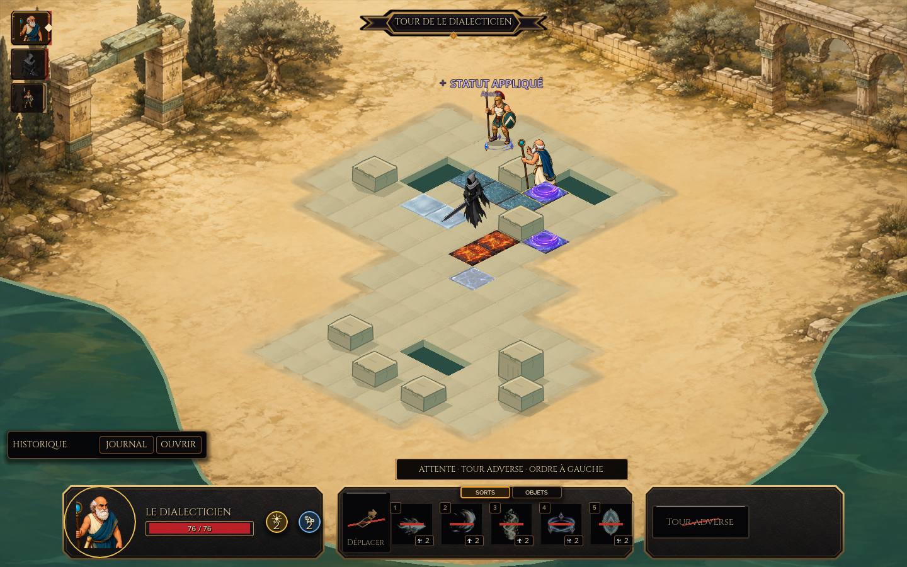

# Le Dialecticien — adversaire complet en sprites

Le Dialecticien est un mage ennemi à l'apparence d'un philosophe grec : crâne dégarni, barbe blanche, chiton ivoire, drapé bleu pétrole bordé de bronze, parchemin à la ceinture et bâton à orbe cyan. Sa silhouette reste humaine et lisible sur les cinq maps. Son profil de présentation utilise un facteur de base de 1,58, modulé par la présentation de chaque carte et cohérent avec Achille, y compris lorsque la nouvelle map ne possède pas encore de profil spécifique au mage. L'ombre de contact reste ancrée sous ses pieds.

## Accès en jeu

Depuis la sélection de personnage, choisir la cinquième carte **Achille — L'Épreuve du Dialecticien**, puis **Incarner Achille** et **Continuer**. Cette aventure contient un combat contre le mage et un spectre au **Gué du Léthé**, dans une salle autonome dérivée de la nouvelle map. Le héros commence normalement au niveau 1, avec ses statistiques et ses quatre sorts de départ.

La rencontre et la partie sont des ressources distinctes. Le mage est également découvert par le catalogue d'ennemis du Studio. La sélection affiche désormais les cinq cartes sans chevauchement et utilise le titre réel de chaque aventure.

La salle conserve les 114 cellules et les obstacles du Léthé. Elle ajoute huit dalles permanentes : trois d'eau, deux de glace, deux de lave et une d'eau électrifiée, ainsi qu'une paire de vortex bidirectionnels. Les départs sont sûrs ; un chemin ordinaire permet aussi de rejoindre les ennemis. Le mage peut choisir le portail près de sa position initiale pour obtenir une meilleure case de lancement.

La [disposition reproductible](../../tools/philosopher_sprite_pipeline/README_trial_terrain.md) est assemblée par les services de placement et de projection du Studio. Le générateur écrit seulement la salle de cette épreuve et vérifie que la map source demeure intacte ; la campagne Catabase conserve ses propres ressources.

Le parcours normal a été validé : depuis sa case de départ (9,7), le mage marche vers le portail (9,6), ressort en (7,4) pour 1 PM, puis lance Aporie et Axiome à quatre cases pour 4 PA. Les deux gestes démarrent une fois le bandeau de tour fermé ; aucun sort du joueur ni aucune modification de statistiques n'est nécessaire à cette preuve.
## Sorts et décisions

Le mage possède **76 PV, 4 PA et 3 PM**. Il peut lancer deux sorts à 2 PA dans une activation. Son IA privilégie un soin utile, se défend au contact, protège les alliés menacés, entrave les ennemis puis attaque. Si nécessaire, elle cherche une case de lancement accessible et revalide les actions au moment de les exécuter.

| Sort | Effet réel | Geste et effet sprite |
| --- | --- | --- |
| Axiome | 16 dégâts magiques, portée 2–5 et ligne de vue ; le projectile respecte aussi les terrains qui bloquent les projectiles | Bâton projeté vers la cible ; trait cyan et bronze, puis impact confirmé |
| Réfutation | 8 dégâts au contact et repousse d'une case, une fois par activation | Paume de refus ; onde de pression orientée vers la cible |
| Maïeutique | Rend 22 PV au mage ou à un allié, portée 0–4 ; disponible une activation sur deux | Geste d'accueil ; rubans verts et feuilles d'olivier sur le bénéficiaire |
| Aporie | Retire 2 PM à la prochaine activation de l'ennemi, portée 2–4 ; disponible une activation sur deux | Geste de contrôle ; anneau violet lié au statut réel |
| Égide du Logos | Accorde 20 bouclier au mage ou à un allié, portée 0–4 ; expire au début de la deuxième activation suivante du bénéficiaire | Garde au bâton ; protection cyan et bronze liée à cette source de bouclier |

Les soins ne se déclenchent que sur un patient réellement blessé. Le mage évite de gaspiller une protection déjà suffisante ou de renouveler inutilement une entrave. Après une poussée, il ne suppose pas la position future de la cible à travers les collisions ou les vortex.

Le fonctionnement détaillé est décrit dans [le contrat de gameplay](philosopher_mage_gameplay_v1.md). La correction de durée des boucliers permet une véritable expiration après plusieurs activations, avec conservation des sources parallèles et compatibilité des anciens snapshots.

Le mage compare les coûts PM et les dangers des terrains permanents et temporaires. Il quitte une case nocive avant son premier sort, préfère un détour sûr et recherche une poussée qui exploite une vraie dalle dangereuse. Une paire de vortex est évaluée depuis sa sortie connue ; pour un réseau aléatoire, toutes les sorties doivent être sûres et chaque sort prévu doit être légal depuis chacune. Le tirage du portail appartient uniquement au moteur de combat.

L'eau applique Mouillé et la glace Gelé : un PM de moins au prochain tour, sans glissade physique automatique. La lave inflige ses dégâts et Brûlure ; une entrée forcée dans l'eau électrifiée provoque Choc et saute une activation. Axiome et Réfutation restent sacrés : ils ne créent ni conduction de foudre, ni fonte, ni vapeur.

## Animations et rythme

**32 clips**, soit huit familles dans les quatre orientations. Les sources comportent 128 dessins ; 124 dessins distincts sont référencés après exclusion de quatre poses dont la prise du bâton était incohérente.

| Famille | Poses | Durée et lecture |
| --- | ---: | --- |
| Repos | 1 | Pose stable, sans glissement ni lecture automatique |
| Marche | 7 | Alternance d'appuis pilotée par la distance réellement parcourue |
| Attaque | 4 | 0,64 s ; libération à 0,32 s, vol de 0,20 s avant les dégâts |
| Soin | 4 | 0,80 s ; effet à 0,40 s |
| Contrôle / répulsion | 4 | 0,72 s ; effet à 0,36 s |
| Protection | 4 | 0,64 s ; effet à 0,32 s |
| Coup reçu | 4 | 0,24 s ; réaction brève, ne coupe pas un sort déjà engagé |
| Défaite | 4 | 0,52 s puis fondu de 0,12 s ; une seule notification de fin |

Les sprites et leurs accessoires sont entièrement dessinés. Le runtime fait défiler les poses, déplace la racine avec l'unité et contrôle les transitions. Il respecte la pause, évite les doubles marqueurs sur une frame longue et termine les attentes lors d'une annulation ou d'un changement de scène.

Les effets utilisent six animations de quatre dessins et cinq icônes de sorts. Le vol commence à la libération, l'impact correspond aux dégâts résolus, et les auras suivent leur bénéficiaire. Le contrôle disparaît avec son statut ; Égide disparaît quand son propre bouclier est épuisé ou expiré. La disparition d'une autre source de bouclier n'efface pas Égide, et inversement.

Le lancement du premier geste ennemi attend désormais la fermeture réelle du bandeau de tour. L'anticipation et la libération du sort restent visibles ; un simple délai arbitraire ne peut plus laisser partir l'animation sous le bandeau. Une annulation ou une fermeture de scène termine également cette attente sans dépenser les PA.

## Sources et fabrication

L'art a été produit avec l'outil intégré **imagegen**, puis assemblé mécaniquement. Les prompts exacts et les sources natives RGBA sont conservés dans le projet :

- [Sources et prompts du personnage](../../art/source/characters/philosopher_mage/sprites_v1/README.md).
- [Sources et prompts des effets](../../art/source/vfx/philosopher_mage/sprites_v1/README.md).
- [Pipeline du personnage](../../tools/philosopher_sprite_pipeline/README.md) et [pipeline des effets](../../tools/philosopher_sprite_pipeline/README_effects.md).
- [Sprites utilisables en jeu](../../assets/characters/philosopher_mage/sprites_v1/philosopher_sprite_frames.tres) et [effets utilisables](../../assets/vfx/philosopher_mage/sprites_v1/effects.tres).

Chaque feuille possède une seule échelle. Les racines des poses sont mesurées au sol, indépendamment de la pointe du bâton. Les planches de dos sont dessinées séparément. Les quatre poses rejetées restent archivées, mais leur texture n'est jamais utilisée dans les clips : le geste valide précédent est maintenu à leur place.

Le pipeline vérifie la transparence, les frontières, les références et les SHA des sources et des atlas. Les régions d'atlas sont comparées octet pour octet. Le nettoyage des effets est limité à 774 pixels de frontière d'alpha 1, sans toucher les pixels intérieurs.

## Validation et captures

Le [rapport de validation](philosopher_mage_validation_v1.json) contient les résultats exécutés et les mesures. Le [harness reproductible](../../tools/philosopher_sprite_validation/README.md) vérifie huit situations dans les quatre directions : attaque, contrôle, protection avec absorption, soin personnel, soin allié, approche, répulsion et défaite.

Ces combats utilisent les entrées de jeu normales et les décisions réelles de l'IA. Les fixtures initiales de placement et de progression sont annoncées : niveau 2 pour préparer une blessure de soin par de vrais coups, niveau 10 pour produire une réaction puis une mort sans modifier les PV en combat. Elles ne prétendent pas être des campagnes complètes. Le parcours d'accès à l'aventure est vérifié séparément, avec sa RunData enregistrée, son niveau 1 et sans fixture de combat.

La matrice finale de 32 combats a été relancée après les modifications d'IA et de présentation. Une [matrice de terrain](../../tools/philosopher_sprite_validation/TERRAIN_VALIDATION.md) ajoute 24 combats : lave, eau, glace et paire de vortex sur chacune des cinq maps ; détour autour du feu, sortie d'une case nocive, eau électrifiée et réseau aléatoire complètent la Cour des Sources. Elle observe les déplacements de grille réels, les dégâts, statuts, PA/PM, portées de sorts après téléportation, textures des dalles et pivots du personnage.

Ces 24 scénarios déclarent leurs dalles avant le combat sur des copies mémoire. Ils ne prétendent pas que ces dalles existent déjà dans les cinq salles de campagne. L'épreuve jouable du Léthé possède séparément ses huit dalles enregistrées et sa paire de portails ; son parcours depuis la sélection est contrôlé avec les ressources publiées et sans mode de test direct. Après le déploiement, le probe demande un vrai Fin du tour et exige que le mage entre volontairement dans le portail puis lance un sort légal depuis la sortie réelle, une fois le bandeau fermé.

L'agrégateur refuse tout rapport définitif tant que les deux matrices, les tests et le parcours de production ne sont pas terminés sans erreur. Les anciennes mesures restent historiques et ne sont pas recomptées. Les captures complémentaires sont séparées des runs de cadence. Les GIF conservent les timestamps des captures, sans accélération ni ralenti ajouté.

Les vérifications terminées comprennent **56 combats sur 56** (32 cas de kit et 24 cas de terrain), **221 tests Godot sur 221** répartis en 20 scripts, **4 968 assertions**, et **17 tests Node sur 17** pour les atlas et les icônes. Les 32 combats du kit observent les cinq sorts, huit soins effectifs de 22 PV et quatre défaites avec suppression de la vue. Les pivots et le repos ne présentent aucun déplacement mesuré ; les quatre animations de mort terminent entre 641 et 646 ms.

| Capture réelle | Situation montrée |
| --- | --- |
| [Téléportation au Gué du Léthé](philosopher_mage/media/philosopher_teleport_v1.gif) | Le mage traverse la paire puis lance depuis sa sortie |
| [Réfutation vers la lave](philosopher_mage/media/philosopher_lava_v1.gif) | Poussée, dégâts de lave et Brûlure sur la Porte des Cendres |
| [Réfutation vers la glace](philosopher_mage/media/philosopher_ice_v1.gif) | Poussée sur la glace, puis Gelé dans le Temple du Serment Noir |
| [Soin du spectre allié](philosopher_mage/media/philosopher_heal_ally_v1.gif) | Blessure par de vrais coups, puis 22 PV rendus par le mage |
| [Protection du spectre allié](philosopher_mage/media/philosopher_shield_v1.gif) | Égide réellement accordée et absorbant une attaque |

Godot conserve des diagnostics d'objets, textures/RID, ressources en usage et du pool VariantPools à la fermeture. Ils sont consignés séparément des erreurs de script et ne sont pas présentés comme corrigés par ce chantier.
