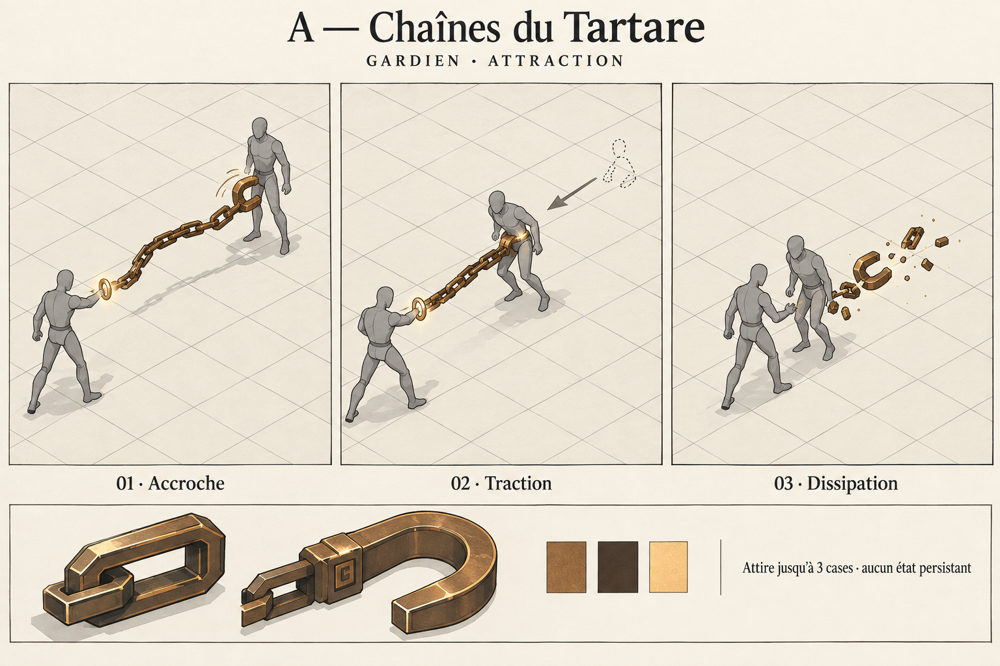
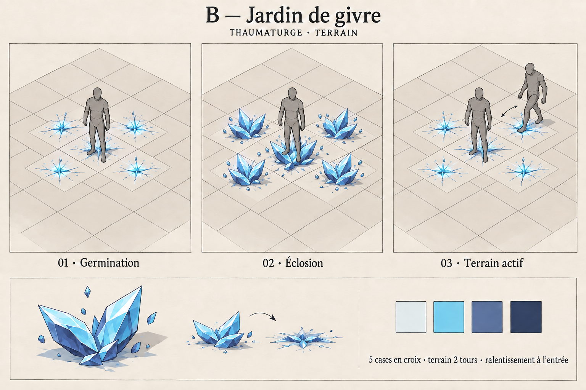
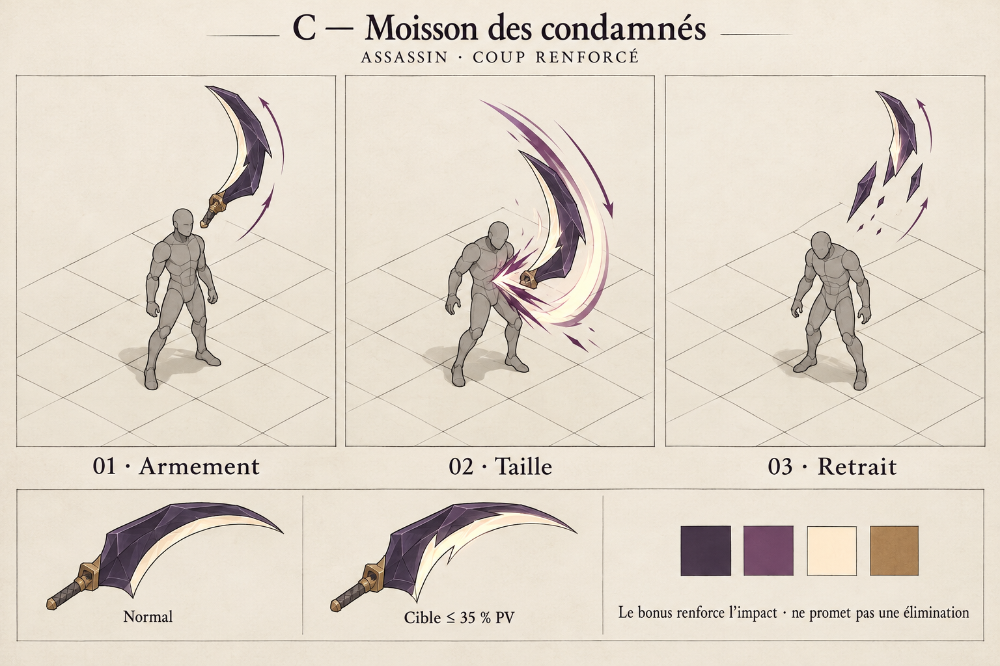
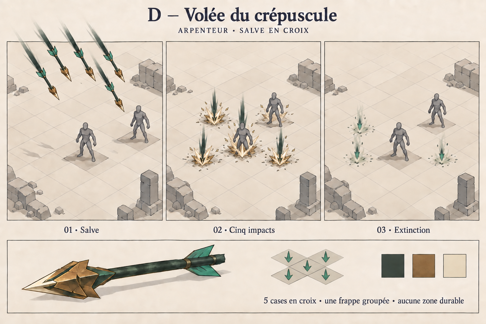

# Projets VFX approuvés — run Cartes

27 septembre 2026. **Les quatre propositions A, B, C et D sont approuvées par Paolo ; production engagée.**
Approbation : « Ok je valide ces choix, tu peux commencer leur production ».
Les illustrations sont des intentions dessinées, pas des captures du moteur,
des atlas d'animation ou la garantie d'un rendu final identique.

Demande de Paolo : dessiner le sort en perspective avant production pour lui
faire valider le projet. Suite de travail : planche → choix et corrections →
validation explicite du dessin → modèle et poses Blender → essai Godot avec
les règles réelles → appréciation en combat. Un changement majeur de silhouette
après validation appelle une nouvelle proposition dessinée.

Les quatre cartes existent dans la run Cartes historique. Cette proposition ne
change pas leurs règles et ne constitue pas une transposition vers Cartes V2.
Sentence du rempart et Bastion vivant restent les pilotes précédents.

## A — Chaînes du Tartare (`g_hook`)

**Geste : accrocher, tendre, ramener.** Une manille de bronze à gros maillons
part du lanceur, accroche la cible à hauteur de taille puis se tend dans le sens
de l'attraction. Après l'arrêt réel, les maillons s'ouvrent et disparaissent.
Bronze chaud, ombres brunes, petit accent ivoire au contact.

- Règle existante : 2 PA, portée 2–4, dégâts physiques et attraction de 3 cases
  au maximum, selon les cases et obstacles autorisés par le moteur.
- Intention temporelle : accroche brève d'environ 0,15–0,25 s ; tension pendant
  le déplacement réel ; retrait en environ 0,2 s. Ces valeurs sont à tester,
  pas un délai supplémentaire de gameplay décidé par le dessin.
- Production envisageable : un modèle de manille et de maillon, quelques poses
  cel, chaîne ajustée à la distance dans Godot. Complexité moyenne : il faut
  suivre les deux unités et respecter un déplacement partiel ou bloqué.
- Aucun lien durable, immobilisation ou dommage supplémentaire suggéré.

## B — Jardin de givre (`t_glacier`)

**Geste : cinq rosettes qui éclosent puis s'abaissent.** Trois ou quatre pétales
de glace anguleux par case. Le pic atteint le genou ; le terrain maintenu reste
à la cheville, afin de laisser lire les unités. Bleu porcelaine, cyan et indigo.

- Règle existante : 3 PA, portée 1–4, croix de rayon 1, cinq cases au maximum
  sur les cases éligibles. Terrain de 2 tours ; entrer applique Engourdi
  pendant une activation avec une réduction de PM de 2 à la valeur de base.
- Intention temporelle : croissance de 0,35–0,5 s, tassement vers 0,7 s ; forme
  basse maintenue jusqu'à l'expiration ou au remplacement réel du terrain.
- Production envisageable : un modèle de rosette animé, décliné sur les cases
  réellement affectées ; nappe plate et deux éclats à l'entrée. Complexité moyenne.
- La forme n'est ni un obstacle solide, ni une prison de glace. Un état sur
  l'unité garde un signe compact, distinct de la surface sous ses pieds.

## C — Moisson des condamnés (`a_reap`)

**Geste : une seule lame, une seule taille oblique.** Une harpé sombre apparaît
à côté de la cible et dessine un arc tranchant. Corps violet obsidienne, fil
ivoire, petite attache de bronze. La lame s'efface dans le sens de sa course.

- Règle existante : 3 PA, portée 1–2, frappe d'une cible ; bonus de Prouesse
  lorsque les PV de la cible sont à 35 % ou moins. Ce n'est pas une mise à mort
  garantie et aucun état durable n'est ajouté par le sort.
- Intention temporelle : armement d'environ 0,15 s, taille nette autour de
  0,3 s, retrait avant 0,8 s, à raccorder à la résolution réelle.
- Deux intensités : le bonus confirmé élargit le fil clair et ajoute une entaille
  d'impact ; il ne multiplie pas le nombre de lames ou de coups visibles.
- Production envisageable : une lame Blender, un arc cel et une variante de
  contact. Complexité faible à moyenne ; meilleur candidat pour un pilote rapide.
- Pas de silhouette de Faucheuse, crâne, âme arrachée, mort forcée ou saignement
  durable annoncé visuellement.

## D — Volée du crépuscule (`r_scatter`)

**Geste : une salve qui frappe cinq points d'un même mouvement.** Flèches
courtes à pointes larges en bronze, empennages jade et corps vert sombre.
Les contacts sont compacts ; le poids vient de leur synchronisation.

- Règle existante : 3 PA, portée 2–5, croix de rayon 1, ennemis seulement.
  Aucun terrain durable. Les cinq points dessinés décrivent l'empreinte du
  sort, pas cinq cibles touchées garanties.
- Intention temporelle : formation d'environ 0,2 s, impact groupé autour de
  0,4 s, extinction avant 0,9 s. Un contact de sol n'annonce pas des dégâts
  sur une case vide ou sur un allié.
- Production envisageable : une flèche instanciée sur les cases réelles et un
  contact cel commun. Complexité faible à moyenne ; cadrer les projectiles
  sur la grille et préserver la lisibilité avec plusieurs ennemis.
- Les cinq flèches disparaissent ; elles ne deviennent ni pieux, ni pièges.

## Ce que la validation doit décider

La silhouette et le volume du sort, sa taille relative au personnage, la palette,
le geste principal, l'intensité du contact et la place occupée par ce qui persiste.
Les durées ci-dessus sont des intentions à essayer, non des mesures effectuées.
Les dessins gardent une caméra trois-quarts élevée et des dalles carrées projetées
en losanges, afin de juger le dessus, les côtés et les recouvrements.

Les règles ont été lues dans `core/expedition/card_ecosystem_catalog.gd`,
`class_card_catalog.gd`, `class_card_modifier.gd` et `card_ecosystem_effects.gd`.
Les dessins ont été demandés à l'outil imagegen intégré. Les prompts exacts sont
dans [prompts.json](prompts.json), avec les corrections dans [retouches.json](retouches.json).
Les planches B et D retenues corrigent l'empreinte dessinée, D corrige aussi la
flèche supplémentaire de la première proposition. Les échos visibles sur le
dernier dessin de D représentent une extinction déjà engagée.
Pas de génération CLI, de nouveau rendu Blender,
de modification du gameplay ou de test moteur nécessaire pour ces propositions.
