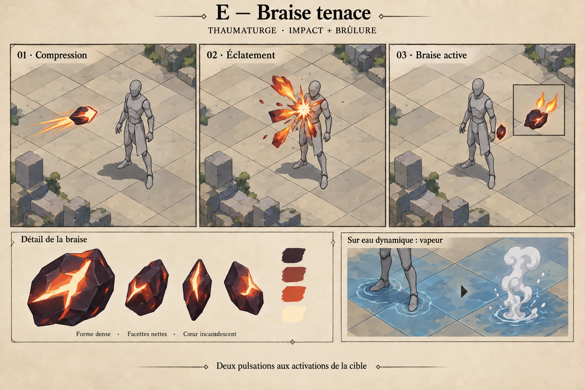
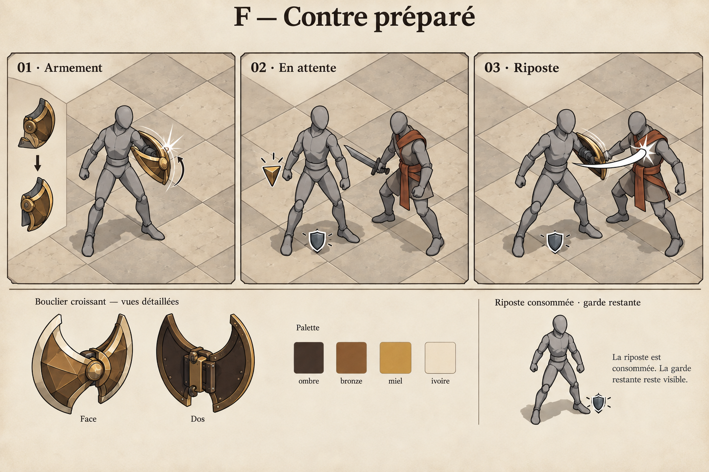
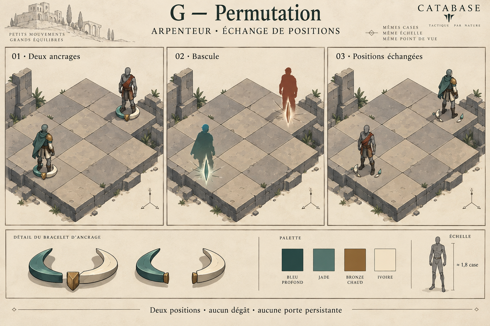
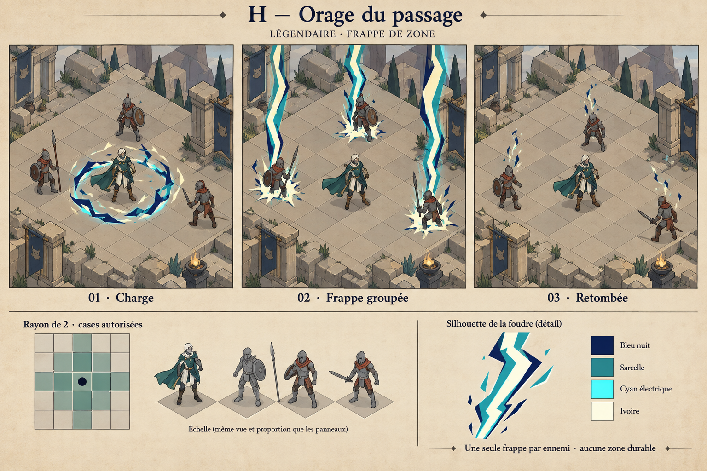

# Propositions VFX E–H — run Cartes actuelle

27 septembre 2026. **H / Orage du passage, G / Permutation et E / Braise tenace produits. F / Contre préparé reste proposé.**
Suite E : « Ok on passe au vfx suivant », puis « continue l'intégration ».
Approbation G : « Ok lance la création de permutation ».
Approbation reçue : « créé orage du passage de la manière possible, on veut des belles couleurs, de beaux effets ».
Suite aux quatre sorts historiques déjà produits, ce lot utilise les identifiants
du catalogue consommable actuel. Il ne renomme ni ne remplace les productions
précédentes. Les sections suivantes conservent les intentions de la passe de
dessins ; les productions et validations sont suivies dans `docs/ai/`.

Les planches sont des intentions dessinées en perspective, générées avec
l'outil imagegen intégré. Ce ne sont pas des captures Godot. Mannequins et décors
servent à lire les volumes ; ils ne proposent pas de nouveaux personnages ou maps.
Les timings ci-dessous sont des hypothèses d'animation à éprouver en jeu,
pas des mesures ni des délais de gameplay déjà implémentés.

## E — Braise tenace (`cc2_t02`)

**Geste : une braise dense éclate, puis couve.** Projectile court en charbon
facetté, fissures vermillon et cœur crème. Un éclatement unique ouvre quelques
flammes anguleuses au torse. Une petite braise latérale annonce ensuite la brûlure.
Elle s'ouvre brièvement à chaque dégât périodique confirmé.

- Règle lue : normale, Thaumaturge, 2 PA, portée 1–3 ; dégâts magiques
  de 0,55 P puis brûlure de 0,18 P au début de deux activations de la cible,
  hors modificateurs. P désigne la Prouesse.
- Terrain : seule une eau **dynamique** éligible se transforme en vapeur qui
  bloque la vision pendant une phase ennemie, deux avec l'amélioration.
  Une case sèche ne devient pas un feu. L'état et la surface ont des vies séparées.
- Timing proposé : compression 0,10 s, trajet jusqu'au contact vers 0,25–0,40 s
  selon la distance, éclatement 0,12 s, extinction du gros effet avant 0,65 s.
  Chaque tick aurait une pulsation d'environ 0,15 s, sans rejouer le projectile.
- Échelle : projectile environ un poing ; éclatement au plus une demi-hauteur
  de cible ; braise persistante d'environ un dixième de sa hauteur.
- Production : un charbon Blender avec deux poses ouvert/fermé ; contact cel
  de 6–8 poses, lecteur de trajet et état compact. Vapeur : petit clip séparé
  attaché à la case réellement transformée. Difficulté estimée : moyenne.
- Réapplication : mettre à jour le même signe. Le code conserve le maximum de
  puissance/durée de l'état ; le dessin ne doit pas multiplier les braises.
  Retirer le signe quand l'état disparaît ou que la cible meurt.

## F — Contre préparé (`cc2_g05`)

**Geste : assembler, tenir, rendre le coup.** Deux pièces de bronze s'emboîtent
en un croissant, puis se résorbent. Un petit coin de bronze indique la riposte
armée ; la garde restante dispose de son signe distinct. Au déclenchement, le
croissant revient pour un revers sec vers l'attaquant concerné.

- Règle lue : élite, Gardien, 2 PA, sur soi ; 0,9 P de garde et une riposte
  de 0,5 P. L'amélioration porte la garde à 1,15 P, sans changer la riposte.
- Déclencheur exact actuel : le héros survit à une attaque ennemie classée
  `cc2_attack` et son attaquant se trouve à distance de Manhattan 1.
  La riposte est consommée une fois ; ce n'est pas une attaque au lancement,
  ni une réponse aux dégâts périodiques ou aux ennemis éloignés.
- Échéance : l'attente expire au prochain début de tour du héros. La garde peut
  être consommée avant ; elle ne dépend pas du maintien du jeton de riposte.
  Les représailles de classe/relique sont d'autres effets, à ne pas confondre.
- Timing proposé : emboîtement en 0,20 s et retrait vers 0,45 s ; attente sans
  boucle lumineuse ; revers de 0,10–0,15 s au déclenchement réel, retrait 0,20 s.
- Échelle : croissant transitoire d'une demi-hauteur de héros, contact compact
  sur le torse adverse. Les pieds ne glissent pas et aucune poussée n'est suggérée.
- Production : un croissant en deux pièces, poses d'emboîtement, arc de revers,
  jeton compact et badge de garde existant. Difficulté estimée : moyenne ; la
  précision vient surtout du raccord au bon événement de riposte.

## G — Permutation (`cc2_r08`)

**Geste : deux agrafes se ferment, les places s'inversent.** Une paire d'arcs
jade et ivoire cerne chaque paire de pieds. Les deux agrafes se ferment
simultanément en une fente brève, puis s'ouvrent sur les positions échangées.
Le vêtement jade du héros et l'écharpe rouille adverse rendent l'échange lisible.

- Règle lue : rare, Arpenteur, 2 PA, portée 1–5, 1–6 améliorée ; échange du
  héros avec un ennemi valide. Boss exclus. Aucun dégât propre à la carte.
- Timing proposé : ancrages 0,18 s, fermeture 0,10 s, échange visuel raccordé
  au déplacement réellement accepté, réouverture et retrait avant 0,60 s.
- Volume : chaque agrafe reste dans sa case et monte au plus à la cheville.
  La fente est un passage instantané, pas un portail qui reste jouable.
- Production : deux pièces courbes Blender, clip de fermeture et d'ouverture,
  deux instances synchronisées. Le masquage très bref des sprites peut éviter
  une nouvelle animation corporelle. Difficulté estimée : moyenne.
- Deux unités seulement, aucun clone, aucun trajet dessiné entre les cases.
  Les dégâts éventuels d'autres systèmes ne sont pas un impact de Permutation.
  Une commande refusée n'affiche ni échange ni arrivée réussie.

## H — Orage du passage (`cc2_l01`)

**Geste : comprimer l'orage, abattre la décharge.** Une couronne basse et brisée
se contracte autour du héros. De larges lames de foudre ivoire, cyan et bleu nuit
s'abattent ensemble sur les ennemis réellement atteints. Une seule attaque
par cible ; les fragments de foudre s'éteignent aussitôt après.

- Règle lue : légendaire partagée, 3 PA, centrée sur soi ; 1,1 P magiques,
  1,25 P améliorée, dans un rayon de Manhattan 2. L'empreinte théorique comporte
  13 cases avec le centre ; les limites, l'éligibilité et la ligne de vue filtrent
  les cases réelles. Le héros et ses alliés sont exclus des dégâts.
- Les trois ennemis dessinés ne fixent pas le nombre de cibles du sort.
  Aucun éclair de dégât sur une case vide ; si personne n'est touché, la charge
  se dissipe sans inventer trois impacts. Une cible tuée reçoit son contact
  d'après les faits de résolution, même si sa vue disparaît ensuite.
- Timing proposé : charge 0,25–0,30 s, éclair plein tenu 0,07–0,10 s,
  contact et fragments 0,20–0,35 s ; fin autour de 0,85–0,95 s.
- Intensité : foudre plus épaisse et anticipation plus marquée que les cartes
  normales. Le poids vient du contraste et de la simultanéité. Aucun changement
  de météo, arrêt du jeu, flash plein écran ou terrain électrifié.
- Production : une lame de foudre en 6–8 poses cel, une couronne basse,
  un contact commun et un nombre d'instances égal aux impacts confirmés.
  Hauteur à éprouver au zoom normal, environ 1,5–2 hauteurs de personnage.
  Difficulté estimée : moyenne ; cadrage et occlusions avec plusieurs ennemis.

## Lisibilité, validation et suite

Les effets persistants proposés remplacent la présentation de **leur propre
état** ; ils ne s'ajoutent pas à une aura et à un second emblème déjà visibles.
Les repères de braise/riposte dessinés à côté du corps sont à ranger dans la
présentation compacte des états. Un seul exemplaire par état, durée réelle,
pas de pulsation sans événement et pas de recouvrement du visage.

Priorité proposée : **E / Braise** pour éprouver impact + état + tick ; puis
**H / Orage** pour éprouver la puissance légendaire et les impacts multiples.
F et G complètent avec un événement différé et un déplacement simultané.
La validation porte sur silhouette, palette, dimensions et geste ; les règles
ci-dessus restent celles du jeu. Après approbation : modèles/poses Blender,
exports via le Studio, intégration dédiée `cc2_*`, capture au zoom de combat et
vérification des déclencheurs, durées, refus, cumul, expiration et reprise.

Provenance : [prompts exacts](prompts.json), [retouches](retouches.json),
[extrait du catalogue](cartes_sources.json), [empreintes des sources](source_hashes.json).
Sources : `data/cards/consumable_v2/catalog.json` et les fichiers
`core/expedition/consumable_card_{spells,modifier,effects,turns,terrain}.gd`.
Le contrat mécanique a été lu dans le code ; cette passe ne constitue pas une
nouvelle validation runtime du catalogue. Aucun test moteur requis pour ces
nouveaux dessins et documents seuls.
