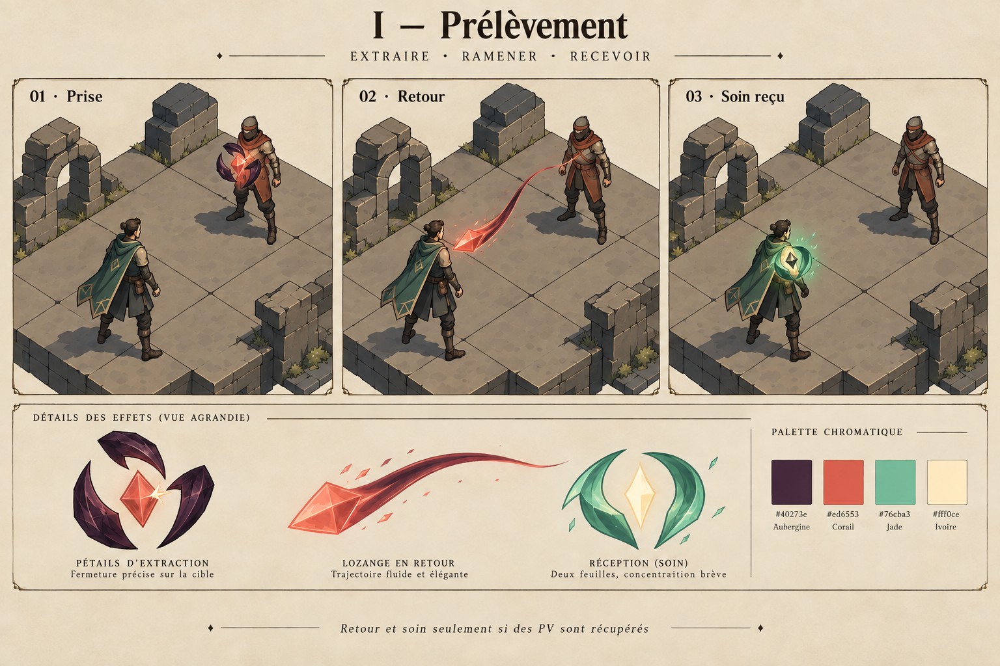
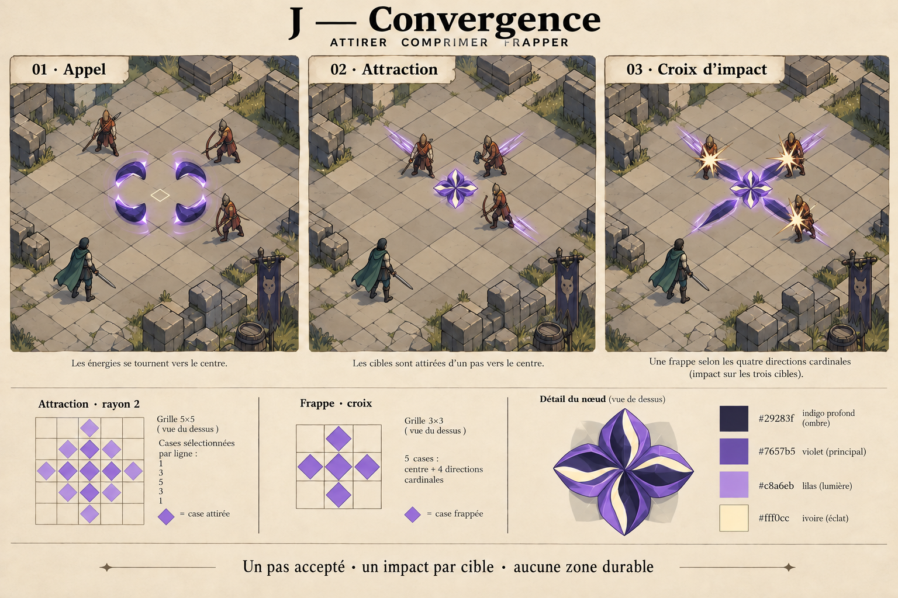
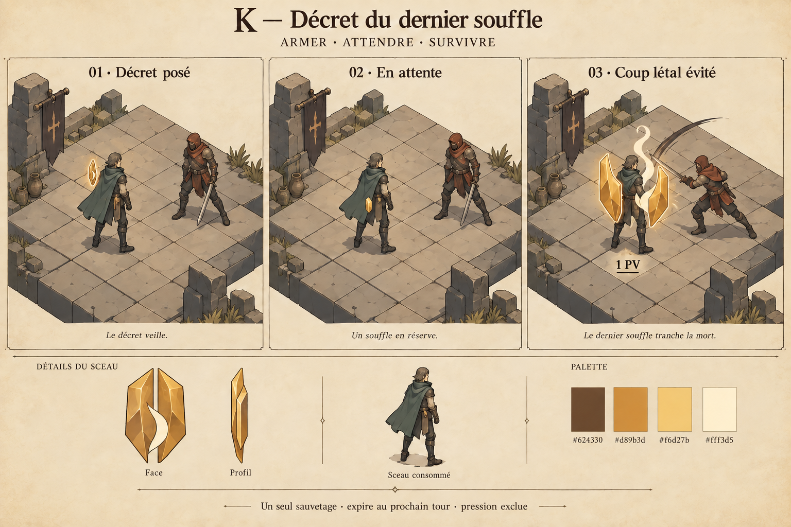

# Prochains projets VFX — F, I, J, K

Propositions du 27 septembre 2026 pour la **run Cartes consommable actuelle**.
Braise tenace, Permutation et Orage du passage sont déjà produits. Le projet
F du lot précédent reste disponible ; I–K sont de nouvelles intentions.
Les images sont des dessins générés avec l'outil imagegen intégré, pas des
captures Godot ni des animations déjà intégrées. Les personnages servent
d'échelle. La validation artistique précède la production, selon le processus
demandé par Paolo. Cette passe ne modifie pas le jeu.

## F — Contre préparé · `cc2_g05`

**Assembler un croissant de bronze, le ranger, puis rendre un seul coup.**
On reprend la planche existante : deux pièces emboîtées et un revers à bord
ivoire. Après l'armement, seul un petit coin de bronze indique la riposte.
La garde possède son signe distinct. Aucun grand bouclier permanent.

- Élite Gardien, 2 PA, sur soi. Garde 0,90 P, 1,15 P améliorée ; riposte 0,50 P.
- Le code exige une attaque ennemie `cc2_attack`, un héros encore vivant et
  l'attaquant à distance de Manhattan 1. Une seule riposte, pas au lancement.
  Le jeton expire au début du prochain tour du héros. La garde suit sa propre vie.
- Timing à éprouver : emboîtement 0,20 s, retrait vers 0,45 s ; repos immobile ;
  revers 0,12 s, contact et retrait 0,20 s. Aucun déplacement des pieds.
- Production estimée : un croissant en deux pièces, clip de revers et jeton.
  Raccord spécifique à la riposte consommée, sans confondre les représailles
  de classe/relique. Difficulté moyenne.

## I — Prélèvement · `cc2_t07`

**Prendre à la cible, ramener au héros, refermer le soin.** Une pince composée
de trois pétales aubergine détache une goutte facettée corail. Elle revient
par un ruban étroit et se résorbe en deux feuilles de jade au torse du héros.
L'extraction est sèche, le retour fluide, la réception brève et douce.

- Élite Thaumaturge, 2 PA, portée 1–3. Dégâts magiques 0,75 P, 0,90 P améliorée.
  Base du soin : 50 % des **PV réellement retirés**, puis modificateurs de
  soin et plafond des PV du héros. La garde absorbée et le surplus létal ne
  sont pas des PV prélevés.
- Le retour et l'éclosion de jade exigent un soin effectivement reçu. À PV
  pleins, l'extraction s'éteint sur la cible ; aucun faux soin. Absorption
  intégrale : pas de goutte extraite. Cible tuée : garder son point de contact
  initial pour le retour. Aucun état durable ni lien restant entre les unités.
- Timing proposé : prise 0,12 s, retour 0,22–0,32 s selon distance, réception
  0,18 s. La séquence de présentation ne décale pas l'application des PV.
- Échelle : pince inférieure à une demi-hauteur de cible ; une seule goutte,
  réception d'environ un tiers de torse. Palette aubergine, corail, jade, ivoire.
- Production : trois composants simples, 8–10 poses d'extraction, ruban de
  trajet, 6 poses de réception. Lire séparément les faits de dégâts et le soin
  propre à la carte, sans agréger un éventuel vol de vie d'équipement.
  Difficulté moyenne ; bon prochain pilote après Braise.

## J — Convergence · `cc2_t08`

**Rassembler un nœud de force, rapprocher, ouvrir une croix.** Quatre pétales
violets se replient sur un petit noyau ivoire au centre visé. Des traits courts
suivent les déplacements acceptés ; le nœud s'ouvre ensuite en quatre lames
alignées avec la grille. Les contacts appartiennent aux cibles atteintes.

- Rare Thaumaturge, 3 PA, portée 1–4, 1–5 améliorée. Dégâts magiques 0,80 P.
- Deux géométries distinctes : les ennemis vivants à distance de Manhattan
  ≤2 du centre sont candidats à une attraction d'une case ; les dégâts sont
  ensuite résolus sur la **croix de cinq cases**, filtrée par les règles de
  ciblage. La planche montre trois ennemis de distance 2 ramenés à distance 1.
- L'attraction choisit un axe cardinal dominant, traite les plus proches
  d'abord puis leur identifiant. Blocage, occupation et bord de grille peuvent
  empêcher le mouvement. La présentation lit chaque déplacement réel ; elle
  n'invente pas de glissade, de trajectoire diagonale ou de regroupement parfait.
- Aucun contact de dégâts sur case vide ; le noyau central reste une forme
  d'anticipation. Un ennemi attiré hors de la croix finale n'a pas d'impact
  inventé. Aucun terrain durable, cyclone ni aspiration continue.
- Timing proposé : appel 0,22 s ; attraction raccordée à la présentation du
  déplacement réel ; ouverture 0,10 s, extinction en 0,25 s. La résolution
  doit garder l'ordre attraction → frappe, sans ralentir les règles de combat.
- Production : quatre pétales réutilisés, une pose comprimée, un contact cel
  et des traits de déplacement. Difficulté moyenne à élevée : plusieurs
  cibles, murs, occupations et décès à vérifier. C'est le projet spectaculaire
  de cette sélection, avec une emprise limitée à la véritable zone.

## K — Décret du dernier souffle · `cc2_d01`

**Sceller une promesse, puis casser le sceau pour sauver un souffle.** Un
cartouche facetté d'or et d'ivoire se forme à l'épaule. Il devient un petit
jeton immobile. Quand le Décret intervient, il s'ouvre en deux plaques d'ambre
et un trait de souffle ivoire, puis disparaît. Le héros reste debout.

- Divine partagée, 3 PA, sur soi. Le premier impact létal admissible laisse
  **1 PV** et consomme le Décret. L'attente expire au début du prochain tour
  du héros. La version améliorée ajoute 0,60 P de garde, distincte du Décret.
- La pression est exclue. Le code ne limite pas le sauvetage aux coups de
  mêlée : le dessin avec un ennemi adjacent illustre un cas, pas la totalité
  des déclencheurs. Une brûlure létale admissible doit utiliser le même sauvetage
  sans dessiner un attaquant fictif. Un coup non létal ne brise pas le sceau.
- Ce n'est ni un soin, ni une résurrection, ni une invulnérabilité pour tout
  le tour. Un second impact peut tuer. L'expiration sans déclenchement efface
  simplement le jeton. Reprise : restaurer ce jeton sans rejouer le sauvetage.
- Timing proposé : tracé 0,25 s, retrait avant 0,55 s ; signe d'attente compact ;
  rupture franche 0,10–0,15 s puis souffle et extinction 0,30 s. Le grand effet
  n'existe qu'au sauvetage, sans flash plein écran ni déplacement du héros.
- Production : cartouche et deux morceaux Blender, 8–12 poses de fracture,
  souffle cel et jeton. Difficulté plus élevée : exposer à la présentation le
  fait exact de consommation du Décret ; constater seulement « PV = 1 » ne
  prouve pas son déclenchement. Aucun changement des règles de survie.

## Choix et passage en production

Ordre conseillé : **I / Prélèvement**, puis **F / Contre préparé**, puis
**J / Convergence** ; K après validation du raccord au sauvetage. I apporte
un retour d'énergie et un soin après les derniers pilotes d'impact/déplacement.
J est préférable si l'on veut d'abord un sort de zone plus spectaculaire.

Les timings et dimensions sont des hypothèses à vérifier à la caméra normale.
Les petits jetons dessinés près du corps rejoindront le rail compact des états
en jeu ; ils ne s'ajouteront pas aux icônes existantes. Chaque effet devra
vérifier refus, absorption, décès, déclenchement réel, expiration et reprise.
Les sources seront produites dans Blender puis exportées via le Studio,
comme Braise. Pas de nouvelle animation corporelle requise pour ces intentions.

Provenance : [prompts exacts](prompts.json), [retouches J et K](retouches.json),
[retouche I](retouche_prelevement.json), [images finales](images.json),
[cartes lues](cartes_sources.json), [empreintes des sources](source_hashes.json).
Le contrat a été lu dans le code
actuel ; cette passe de dessins ne constitue pas une nouvelle validation runtime.
