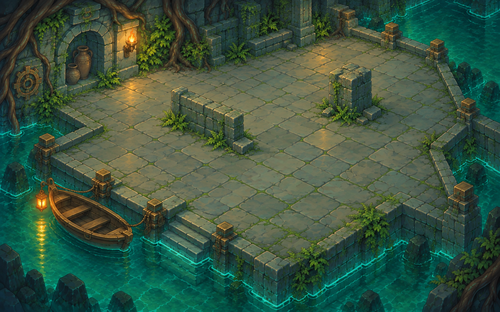

# Léthé — cinq escales de début de run

## Direction fixée avec l'utilisateur

Le choix de la barque au Seuil engage sur **cinq maps consécutives**, en comptant
Les traces du Léthé comme la première (étapes II à VI). Le trajet est unique :
aucun embranchement ou croisement pendant ce tronçon. Une éventuelle jonction se
prépare après la cinquième escale ; son lieu reste à définir.

La barque est le moyen de locomotion et le fil conducteur, présent dans chacune
des cinq maps. Garder son identité : petite coque brune, proue relevée, trois
bancs, cordage et lanterne ambrée. Elle transporte Achille entre les escales ;
elle n'est pas un accessoire ajouté indépendamment dans chaque décor.

Les cinq lieux restent aquatiques et modestes. L'évolution vient de la forme
des berges, des usages anciens et de l'usure, sans escalade monumentale.
Les deux références de style sont l'Autel des serments et l'Étal du passeur :
grandes dalles, blocs simples, contours peints, palette froide et lumières
chaudes localisées. Le Seuil sert de référence pour la barque et le raccord.

## Séquence proposée, une peinture à la fois

Les noms après la première salle sont des noms de travail, non intégrés au jeu.

| Escale | Lieu | Évolution mesurée | Continuité |
| --- | --- | --- | --- |
| 1 — II | Les traces du Léthé | Petit quai abrité, maçonnerie encore entretenue, eau calme | Même barque que le Seuil ; départ par le chenal visible |
| 2 — III | La berge des racines | Berge plus étroite, racines qui écartent quelques dalles | Même eau, même hauteur de quai, nouvel amarrage |
| 3 — IV | L'amarrage des amphores | Ancien point de ravitaillement, quelques récipients et traces de passage | Une halte peut garder le rythme de repos du début de run ; sa fonction reste à fixer |
| 4 — V | Le petit canal | Berges maçonnées qui canalisent le fleuve, pavage plus humide | Le canal annoncé à l'escale précédente devient le sujet du lieu |
| 5 — VI | La berge usée | Quai plus ancien, quelques dalles affaissées, ouverture vers la suite | Toujours la barque et le même fleuve ; annoncer la jonction sans changer brutalement de biome |

Le trajet entre les maps s'effectue en barque. Proposition d'interaction :
débarquer pour la rencontre, puis remonter dans la barque pour poursuivre vers
l'unique escale suivante. La navigation libre en bateau n'est pas encore un
système défini ou implémenté. Les ennemis ne sont pas remaniés dans ce cadrage.

## Proposition visuelle de la première escale

Une seule salle travaillée, révisée en v2 avec l'outil image_gen intégré après
la demande d'une véritable aire de combat. Références originales
fournies directement au générateur, ainsi que le Seuil pour la seule barque.
Prompt exact de l'édition : [PROMPT-v2.md](concepts/lethe_01/PROMPT-v2.md).

La v2 agrandit la berge pavée pour séparer l'arrivée et la rencontre. Un muret
et un pilier décentrés proposent des contournements ; leur effet sur les lignes
de vue reste à implémenter et tester. La niche, les lumières chaudes et les
racines conservent le style du lieu. La barque est amarrée sur le côté gauche,
hors de l'aire de combat. Le chenal continue à droite.
Cette proposition reste à apprécier avec l'utilisateur avant les autres salles.
L'emprise tactique, l'échelle réelle d'Achille, le point de débarquement et la
zone de clic de la barque seront réglés à l'intégration. Aucune collision ni
dalle jouable n'est déduite des pixels de cette peinture.

## État technique

Mise à jour : la map existante **Les traces du Léthé, étape II**, est désormais
adaptée séparément par la [pipeline de combat](../../tools/lethe_map_review/README.md).
Sa peinture de production provient du guide géométrique réel ; les images de
concept ci-dessus sont conservées comme archives. Cette intégration ne construit
pas encore les quatre escales suivantes ni leurs liaisons.

Le graphe de production actuel n'assure pas encore ces cinq escales exclusives.
Il construit ses liens par répartition des indices de voies et miroir de graine.
Le nouveau tronçon doit être affecté par identités stables, avec une seule sortie
interne par escale et aucun accès latéral avant la fin, indépendamment du miroir.
Son intégration exigera une gestion explicite de la version des parcours et des
sauvegardes ; ne pas réécrire silencieusement une run en cours.

Le cadrage initial de ce document ne changeait ni les liaisons ni les ressources
de combat. Les vérifications de l'intégration ultérieure sont consignées dans
le dossier de revue lié ci-dessus. Les quatre peintures suivantes ne sont pas générées.

### Révision du 12 septembre : Les lances oubliées

La salle de l'étape III, **Les lances oubliées**, a été confirmée par l'utilisateur
et reprise avec une peinture aquatique dédiée, la barque et le style Émeraude.
Elle constitue le second arrêt existant après Les traces du Léthé ; son nom de
production est conservé. Voir [l'intégration et les validations](../../tools/lethe_lances_review/README.md).
La géométrie et les rencontres sont conservées. Cette reprise visuelle ne
construit pas encore le tronçon exclusif de cinq escales décrit ci-dessus.

### Révision du 12 septembre : La stèle des noms

La halte existante de l'étape IV, **La stèle des noms**, possède maintenant
sa propre rive funéraire, un saule, des pierres de mémoire immergées et un
relief de Charon. La même barque prolonge le fil du fleuve. Achille approche
la stèle pour le récit, puis repart par l'amarrage. Voir
[la halte et ses validations](../../tools/stele_names_review/README.md).

Cette création remplace visuellement la halte de récit déjà présente dans le
parcours ; elle n'applique pas le nom provisoire « L'amarrage des amphores »
ni les nouvelles connexions proposées dans le cadrage initial.

### Révision du 12 septembre : Les roseaux du tireur

La salle de combat existante de l’étape V, **Les roseaux du tireur**, reçoit
une berge pavée ouverte dans les roseaux, après La stèle des noms. La même
barque à trois bancs, son cordage et sa lanterne ambrée maintiennent la
continuité du fleuve. La ressource est `route_6d5efdb88ff0`, atteinte sur
`d05_1` avec la graine 2401. Voir [la pipeline de cette salle](../../tools/lethe_reeds_review/README.md).

La création sépare une base peinte sèche, assez large pour soutenir les
112 cellules de sol, et l’eau des fosses dessinée par le moteur selon la
géométrie canonique. Le contour réel non convexe du bord supérieur sec et
la poche centrale servent au contrôle de support. Les retouches ont utilisé
des guides opaques pour supprimer entièrement les encoches qui laissaient
des pointes de dalle au-dessus de l’eau ou des faces verticales. Les marges
requises de 30 pixels natifs sur le sol et de 20 pixels aux rives sont conservées.

L’audit indépendant de la peinture finale valide les 112 cellules, avec une
marge minimale de 31,0049 pixels natifs. Les tests unitaires du parcours et la
non-régression de l’oracle partagé sur Les lances oubliées sont également
consignés dans le dossier de revue. La validation GPU finale de cette nouvelle
salle est encore en cours : elle mesure six régions du décor, dont deux témoins
de pierre fixes, à huit instants et dans deux formats. Les règles de combat,
les cellules de fosse et les déplacements restent ceux de la salle existante.
